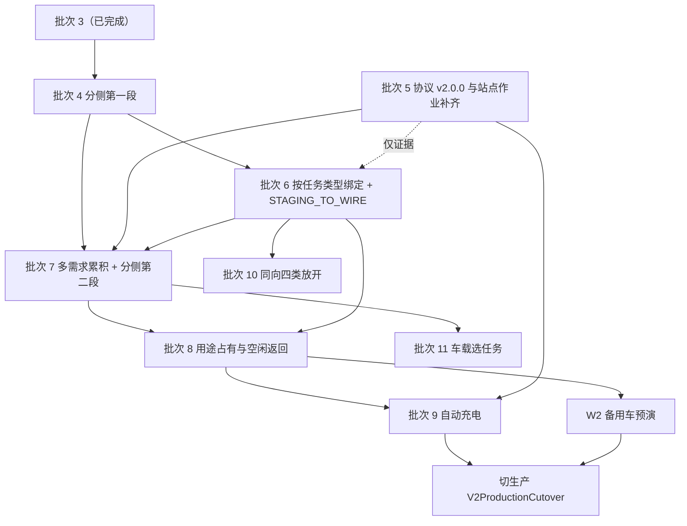

# 8005 完整产品实施范围与顺序规格（第二版）

| 项 | 值 |
| --- | --- |
| 状态 | **已批准**（2026-09-15） |
| 批准人 | 用户（Zhengyu Shao）一人 |
| 产出 | [Wayfinder 地图 program#64](https://github.com/trytoreachpeak0/8005-agv-program/issues/64)：票 65～73、80 |
| 日期 | 2026-09-15 |
| 覆盖 | 需求基线 `v1.1.0` 全部 348 条，加 `CP-0002` 新增的 7 条，共 355 条 |
| 取代 | [第一版规格](../../.scratch/8005-full-product/full-product-scope-and-sequence-specification.md)（2026-09-04 批准）批次 4 起的全部内容；批次 0～3 仍以第一版为依据 |

**批准的范围就是本规格，不含 `CP-0002`。**需求变更提案与本规格是两次独立批准（第 12.2 节节点 1 与节点 2）。
`CP-0002` 批准之前，任何新批次都不开工。

---

## 0. 这份文档是什么，不是什么

**是**：客户 2026-09-14 提出「前后仓位分侧」之后，完整产品从批次 4 起的范围与顺序判定。它给出 355 条需求逐条的批次归属、
批次间依赖、生产从 MVP 切到 v2 线的时点与方式、协议下一个版本的内容、切片归属、验收出口与证据要求，
以及每个批次拿去分票时从哪里取范围、冲突边界怎么划。

**不是**：实施计划、日历排期、代码、需求基线修订或协议发布。本规格不改 `requirements/baselines/`，不动
`requirements/current-baseline.md`，不发协议版本，不写代码。

**与第一版的关系**：

- 批次 0～3 已完成，本规格只压缩成一张表并引用第一版与各批次的出口证据（第 3.1 节），不重述、不重开。
- 批次 4 起以本规格为准。第一版里批次 4 起的结论，凡本规格需要的都已重写进来；本规格没有提到的，不再作为依据。
- **批次编号换了含义**，引用时必须说清是哪一版：第一版的批次 4 是六类任务，本规格的批次 4 是仓位分侧；第一版的批次 8
  是自动充电，本规格的批次 8 是空闲返回。已关闭的旧票 control-server#46～#57 标题里的「批次4-NN」都是第一版的批次 4。
  经核查，`8005-agv-control-server` 全部远端分支的 `evidence/` 下没有任何 `batchId` 为 `batch-4` 及以后的证据，所以证据目录里
  不存在旧编号与新编号撞车。
- 第一版正文不改，只在开头加一行取代指针。

**「v2」这个词有三种意思，不要混**：「v2 线」是完整产品的代码线（服务端 `fp/v2-impl`、车载端 `w2g/fp-v2-impl`）；
`protocol-v2.0.0` 是批次 5 要发布的协议版本；`ProtocolVersion 2` 是现行 `protocol-v1.0.0` 里的协议整数版本。

**批准的性质**：本规格由用户一人批准。车载端与仓位模拟器两个仓库的原负责人 Kun Wang 的项目已于 2026-09-08 由用户接手，
不再有第二方评审或签名环节。

**每条结论都能追溯到一张已解决的票**，追溯写在每节末尾；逐条推理、被推翻的预设留在票里。

---

## 1. 身份绑定

### 1.1 需求基线

| 项 | 值 |
| --- | --- |
| 现行版本 | `v1.1.0`，`requirements/baselines/current-requirements-v1.1.0.md` |
| Baseline SHA-256 | `5fe4b701a46b5d16818bcbfdd65748a8dcc774efab0583673daa53e08236fb53`（按 git blob 计，汇编时复核一致） |
| content commit | `f2691893f7835a3d8035ba7dba6070e8dbc85b14` |
| tag | `requirements-baseline-v1.1.0` |
| 条目数 | 348 |
| 待批提案 | `CP-0002`，目标 `v1.2.0`，新增 7 条、修订 15 条 |

> **2026-09-15 补记**：需求基线已升到 `v1.3.0`（`CP-0002`、`CP-0003` 均已批准）。本表是汇编时的状态，现状见第 19.1 节。

**tag 远端缺失，汇编时已补推。**`requirements-baseline-v1.1.0` 在本机存在（注释 tag，指向上表 commit），`git ls-remote`
在远端却查不到。用户 2026-09-15 同意后原样推送，没有移动或重打。推送后远端的 tag 对象是 `25f8f2f0`，解引用为 `f2691893`。

### 1.2 本规格引用的证据

| 项 | 值 |
| --- | --- |
| 355 行实施剖面 | [`docs/specs/full-product-implementation-profile-v2.tsv`](full-product-implementation-profile-v2.tsv) |
| 剖面 SHA-256 | `dae126679969ef51035d8a129b8a2d93a396428f0565aa1ee39302b7fdc33fec`（git blob） |
| 剖面形态 | 355 行加 1 行表头，13 列；git blob 228,091 字节、LF 行尾（本机工作树因 `core.autocrlf=true` 是 CRLF，直接对工作树算哈希对不上） |
| 第一版剖面 | `.scratch/8005-full-product/evidence/full-product-implementation-profile-draft.tsv`，SHA-256 `aa5b1117…ac34`，未改动，仍是批次 0～3 的依据 |
| 需求变更提案 | [`requirements/change-proposals/CP-0002.md`](../../requirements/change-proposals/CP-0002.md)（待批准） |
| 设计决定 | [`ADR-cross-0059`](../adr/cross/0059-front-rear-slot-groups-judged-server-side.md)（`proposed`） |
| 术语 | 根目录 `CONTEXT.md` |
| 票据决议 | 地图 program#64 各票的定案评论，见第 17 节 |

本规格自身的 SHA-256 不写在正文内，记在 [program#73](https://github.com/trytoreachpeak0/8005-agv-program/issues/73) 的决议评论里。

### 1.3 协议

| 项 | 值 |
| --- | --- |
| 现行 | `protocol-v1.0.0`，注释 tag 指向 `9f22db8`，2026-09-12 发布，`APPROVED_RELEASE`；`releaseVersion 1.0.0`、`ProtocolVersion 2`、`profileId AGV_FULL_PRODUCT` |
| 下一版 | `protocol-v2.0.0`，批次 5 发布，内容见第 6 节 |

*追溯：program#72、program#80、本票汇编时实测。*

---

## 2. 全量 355 条剖面

### 2.1 呈现方式：引用而不复制

355 条的逐条归属只在 TSV 里，本规格引用它的路径与哈希，理由同第一版 2.1：抄一份就多一份真相。

### 2.2 列结构

前 11 列与第一版相同，新增最后两列：

| # | 列 | 含义 |
| --- | --- | --- |
| 1 | `RequirementId` | `REQ-NNNN` |
| 2 | `Title` | 基线标题（`CP-0002` 批准前仍是 `v1.1.0` 的标题） |
| 3～7 | `OriginalScope`、`MvpFinalClassification`、`ControlServerImpact`、`OnboardHmiImpact`、`SharedProtocolImpact` | 同第一版 |
| 8 | `FullProductCluster` | 业务簇，新增 `FP-C15 前后仓位分侧` |
| 9 | `ClusterBasis` | 归簇依据 |
| 10 | **`Batch`** | 本规格的实施批次 |
| 11 | `Batch0FormNote` | 批次 0 判定在什么形态下成立 |
| 12 | **`PreviousBatch`** | 第一版剖面里的批次；新增条目记 `—` |
| 13 | **`ChangeProposal`** | 承载该条修订或新增的提案：`CP-0001`、`CP-0002` 或空 |

`Batch` 的取值：`BATCH-0`｜`BATCH-2`｜`BATCH-3`｜`BATCH-4`｜`BATCH-6`｜`BATCH-7`｜`BATCH-8`｜`BATCH-9`｜`BATCH-11`｜`DEFERRED`｜`OUT-OF-SCOPE`。

**没有 `BATCH-1`、`BATCH-5`、`BATCH-10`，这是对的。**这三个批次都没有需求条目载体：批次 1 是协议冻结面落地，批次 5 是
协议 `v2.0.0` 与站点作业补齐，批次 10 是同向四类任务放开。只按 TSV 行排批次会把它们整个漏掉，所以第 3.3 节单列无条目载体的工程。

### 2.3 计数（汇编时实测）

| `Batch` | 条数 | 与第一版的关系 |
| --- | --- | --- |
| `BATCH-0` | 116 | 第一版 117，`REQ-0191` 移到批次 4 |
| `BATCH-2` | 14 | 不变，已完成 |
| `BATCH-3` | 26 | 不变，已完成 |
| `BATCH-4` | 8 | `REQ-0191`（原批次 0）、`REQ-0208`／`0210`（原批次 6）、`REQ-0349`～`0353`（新增） |
| `BATCH-6` | 17 | 第一版批次 4 整批 |
| `BATCH-7` | 17 | 第一版批次 6 的其余 15 条，加 `REQ-0354`／`0355`（新增） |
| `BATCH-8` | 10 | 第一版批次 5 整批 |
| `BATCH-9` | 19 | 第一版批次 8 整批 |
| `BATCH-11` | 6 | 第一版批次 7 整批 |
| `DEFERRED` | 22 | 不变 |
| `OUT-OF-SCOPE` | 100 | 不变 |
| **合计** | **355** | |

**闭合式是三项相加**：批次 0 的 116，加待排期的 139，加范围外的 100，等于 355。**待排期 139 已经包含延后的 22**
（批次 2～11 共 117，加延后 22）。第一版对应的数字是 117＋131＋100＝348；把延后再单独加一次是错的。

逐行迁移（`PreviousBatch → Batch`）：

| 迁移 | 条数 |
| --- | --- |
| `BATCH-0 → BATCH-0` | 116 |
| `BATCH-0 → BATCH-4` | 1 |
| `BATCH-2 → BATCH-2` | 14 |
| `BATCH-3 → BATCH-3` | 26 |
| `BATCH-4 → BATCH-6` | 17 |
| `BATCH-5 → BATCH-8` | 10 |
| `BATCH-6 → BATCH-4` | 2 |
| `BATCH-6 → BATCH-7` | 15 |
| `BATCH-7 → BATCH-11` | 6 |
| `BATCH-8 → BATCH-9` | 19 |
| `DEFERRED → DEFERRED` | 22 |
| `OUT-OF-SCOPE → OUT-OF-SCOPE` | 100 |
| `— → BATCH-4` | 5 |
| `— → BATCH-7` | 2 |
| **合计** | **355** |

### 2.4 业务簇分布（汇编时实测）

| 簇 | 条数 | 批次 |
| --- | --- | --- |
| `FP-B0` 批次 0 候选（MVP 已覆盖） | 117 | 0（116）＋ 4（`REQ-0191`） |
| `FP-C1` 自动充电桩调度与充电失败治理 | 19 | 9 |
| `FP-C2` 多车与多任务调度 | 18 | 2（`REQ-0207`）＋ 4（`REQ-0208`／`0210`）＋ 7（其余 15） |
| `FP-C3` 车载 Worklist 选任务模式 | 6 | 11 |
| `FP-C4` 空闲返回与等待点 | 10 | 8 |
| `FP-C5` AGV 归档恢复与身份连续性 | 7 | 3 |
| `FP-C6` 账号权限与密码治理 | 8 | 延后 |
| `FP-C7` 配置生效治理与回滚 | 14 | 3 |
| `FP-C8` 看板与观测 | 3 | 3 |
| `FP-C9a` 六类任务执行与公共站点绑定 | 8 | 6 |
| `FP-C9b` 公共站点绑定运维治理 | 9 | 6 |
| `FP-C10` 人员认证与账号 | 8 | 延后 |
| `FP-C11` RIoT 订单命令面与故障隔离 | 10 | 2 |
| `FP-C12` 维护开门模式 | 6 | 延后 |
| `FP-C13` 建单前置门禁与目录可用性 | 3 | 2 |
| `FP-C14` 审计留存与导出 | 2 | 3 |
| **`FP-C15` 前后仓位分侧** | **7** | 4（`REQ-0349`～`0353`）＋ 7（`REQ-0354`／`0355`） |
| `OOS-MI-1` Inspector E 信息架构 | 30 | 范围外 |
| `OOS-MI-2` AreaFilterProfile 编辑与实时同步 | 26 | 范围外 |
| `OOS-MI-3` MesIngest 服务与外部可读目录 | 18 | 范围外 |
| `OOS-MI-4` GONE 明细与存储边界 | 26 | 范围外 |
| **合计** | **355** | |

`REQ-0191` 留在 `FP-B0` 簇而移到批次 4，是因为它本是批次 0 条目，只是 v2 线上的实现退化成硬编码前缀
（`Batch0FormNote`：「AREA 执行白名单退化为 `Area.StartsWith('N')`」），而开门侧指派要并进它的分区归属表。

*追溯：program#72 的产物（PR #81）、program#80（PR #82）、本票汇编时实测（第 15 节）。*

---

## 3. 实施批次与依赖图

### 3.1 批次总表

| 批次 | 主题 | 条目 | 状态与依据 |
| --- | --- | --- | --- |
| **0** | MVP 已覆盖 | 116 | 已完成。引用第一版第 2、13.3 节与 MVP 规格 `.scratch/wire-to-gate-mvp/handoff/mvp-specification.md`，不重验。v2 线上缺的三项由批次 5 补齐（第 3.3 节） |
| **1** | 协议 v2 候选生成与 G1 | 0 | 已完成（2026-09-08）。`.scratch/8005-batch-2/batch-1-exit-verification.md`；之后发布为 `protocol-v1.0.0`（2026-09-12） |
| **2** | 轨 A 两端 v2 实现与 `FP-IS-00`～`07` 重证；轨 B 调度地基 | 14 | 已完成（2026-09-09 宣告，2026-09-14 关闭）。第一版 8.3 的执行记录与各次补记、`.scratch/8005-batch-2/README.md`。唯一欠账是票 19 急停演练：2026-09-14 晚改为在备用车 agv02 上做缩减版、不再等生产切换，因 agv02 离线暂时搁置（`.scratch/8005-batch-2/issues/19-w1-emergency-stop-drill.md`） |
| **3** | 治理面单端工程 | 26 | 已完成（2026-09-13）。`8005-agv-control-server` `fp/v2-impl` 上的 `docs/batch-3-v2-exit-report.md`、control-server#18；W1 证据在分支 `feat/w1-unattended` 的 `evidence/field/20260913-W1-three-vehicle-qualification/`（W1 做在生产 v0.3.0 库上，见第 14 节第 6 项） |
| **4** | 分侧第一段：推翻 I8 | 8 | `FP-C15` 5 ＋ `FP-C2` 2 ＋ `FP-B0` 1 |
| **5** | 协议 `v2.0.0` 与站点作业补齐 | 0 | 无条目载体，与批次 4 并行 |
| **6** | 按任务类型绑定与 `STAGING_TO_WIRE` | 17 | `FP-C9a` 8 ＋ `FP-C9b` 9 |
| **7** | 多需求累积与分侧第二段 | 17 | `FP-C2` 15 ＋ `FP-C15` 2 |
| **8** | 车辆用途占有与空闲返回 | 10 | `FP-C4` 10 |
| **9** | 自动充电 | 19 | `FP-C1` 19 |
| **W2** | 备用车预演（现场窗口） | — | 第 8.4 节 |
| **切生产** | `V2ProductionCutover`（现场窗口 W3，四阶段） | — | 第 8.4 节 |
| **10** | 同向四类任务放开 | 0 | 无条目载体 |
| **11** | 车载 Worklist 选任务 | 6 | `FP-C3` 6 |
| **延后** | 三个整簇 | 22 | `FP-C10` 8 ＋ `FP-C6` 8 ＋ `FP-C12` 6 |
| **范围外** | MesIngest 四簇 | 100 | `OOS-MI-1`～`4` |

**切换路径**是批次 4～9 加 W2，走完即可切生产。批次 10、11 不在切换路径上。

**两条划分理由必须记住**：

1. **分侧拆成两段。**第一段（批次 4）推翻不变量 I8「仓位可互换」，让派车按需求的区域号选前侧或后侧仓位；第二段
   （`REQ-0354` 按侧装满与持货等单、`REQ-0355` 让站）建在「一趟车带多条需求」之上，而 v2 线今天一趟只带一条，所以随批次 7。
2. **第一版批次 6 不拆**，整批进切换路径。MVP 线已经在生产上用多需求旅程、持货超时、按业务键抑制与自动充电；
   v2 线缺这些，切过去就是倒退（program#67 查到的事实）。

### 3.2 依赖图

每条边都归约到一条被推翻的不变量、一条协议前置、一条切片 `prerequisites`、一条需求依赖或一条现场前置，没有「先做更稳妥」：

| 边 | 理由 |
| --- | --- |
| 4 ← 3 | I8 推翻建在批次 3 的服务端仓位配置权威（推翻 I7）之上；开门侧指派复用批次 3 的受治理配置与不可改写审计地基（program#70 定案 4、program#68 决议 2） |
| 6 ← 4 | 批次 6 的验收要有「送往前侧机台的需求在派工待送点装入前侧」场景，场景要先有分侧（program#70 定案 1） |
| 6 ← 5 | **仅证据边**：`FP-IS-10`／`11` 的门禁要绑 `protocol-v2.0.0`；实施不等批次 5 |
| 7 ← 5 | 按派车范围录入子批次需要协议改动：`v1.0.0` 的 `expectedSublot` 是单值、`SublotSubmitted` 必带 `demandId`，表达不了一站多需求 |
| 7 ← 4 | `REQ-0354` 按侧装满要先推翻 I8 |
| 7 ← 6 | `REQ-0202` 的任务类型优先级带要有 `STAGING_TO_WIRE`（它单独处于最高带） |
| 8 ← 7 | `VehiclePurposeClaims` 表由批次 7 建（先只用搬运一种用途），批次 8 加空闲返回用途；重构顺序 B3 → B1＋B4 |
| 8 ← 6 | `REQ-0204` 改为「每个任务类型一个 `FixedTaskStation`」，要先有按任务类型绑定的抽象 |
| 9 ← 8 | `REQ-0178` 清桩用等待点集合；正常充满后离桩要靠取得新用途，其中一条是空闲返回；等待点与站点独占是同一原语 |
| 9 ← 5 | 充电周期要协议 `v2.0.0` 补回的 `chargingCycleState` 与 `batteryState` 的 `MANDATORY_CHARGE` |
| W2 ← 8 | 预演内容含空闲返回与等待点独占；另需现场前置（等待点测绘、派工待送取货站点） |
| 切生产 ← 9、W2 | 见第 8.4 节进入门槛 |
| 10 ← 6 | 同向四类用批次 6 建好的规则与绑定机制 |
| 11 ← 7 | 票 02 的 B3 → B5；切片 `FP-IS-09 ← FP-IS-08`（没有多需求计划就没有可选的任务） |

**已经满足的旧边**（前置批次已完成，照录以免被当成遗漏）：第一版的「4 ← 3」（看板先于 `REQ-0340`、配置快照先于
`FP-C9b`）现由批次 3 满足；「6、8 ← 2 轨 B」（路网引擎、命令面、单 worker 按车串行）现由批次 2 满足。

**撤销的旧边**：

- **「6 ← 5」**（第一版的多停靠计划依赖用途占有）没有不变量理由：票 02 只写了顺序，票 12 Q3 的理由是「租约表主键在多停靠之后必废，
  避免同一张表改两次」，属于少返工的偏好。MVP 线已在没有用途占有与站点独占的情况下做出多需求旅程。现改为批次 7 直接建
  `VehiclePurposeClaims`，同一张表不改两次的目的仍然达到。
- **「8 ← 7 仅证据边」**：它实际表达的是 `FP-IS-13 ← FP-IS-12`，现在由「9 ← 8」承担。

**可并行的**：批次 4 与 5 从第一天并行。批次 10 在批次 6 出口后、批次 11 在批次 7 出口后即可开工，与切换路径并行；
program#72 把它们排在切生产之后，是因为它们不是切换前置，现场放开也只能在生产跑上 v2 之后做。

**严格串行链**：`3 → 4 → 7 → 8 → 9 → 切生产`，另有 5 与 6 汇入 7。它由不变量推翻顺序决定，不可重排。

### 3.3 无条目载体的工程

| # | 工程 | 批次 |
| --- | --- | --- |
| 1 | L2 合成装置补仓位分组：种子 `FRONT`／`REAR`、分区归属表（含开门侧列）导入、按组断言目标仓位 | 4 |
| 2 | 车载端把前后两排仓位分开显示（纯界面，不改协议） | 4 |
| 3 | 协议 `v2.0.0` 六项改动、G1、发布（第 6 节） | 5 |
| 4 | 两端实现 `v2.0.0`；`FP-IS-00`～`07` 与 `FP-IS-14`、`15` 在 `v2.0.0` 上重过门禁 | 5 |
| 5 | ADR-cross-0058 在 v2 线落地（无人值守时站点自行收敛，只有状态未知才需要恢复） | 5 |
| 6 | 到站无货的出口（ADR-cross-0046、ADR-cross-0055） | 5 |
| 7 | 录入后拒收：操作员录入子批号后服务端拒收（BR-013，协议消息 `SublotRejected`） | 5 |
| 8 | `STAGING_TO_WIRE` 启用（推翻 I6） | 6 |
| 9 | `VehiclePurposeClaims` 建表，先只用搬运一种用途（`REQ-0290` 行仍在批次 8） | 7 |
| 10 | program#61 中绑在多需求结构上的 D 类提交按 `v2.0.0` 重做（例如 `8be28b1c`、`946d460d`、`770447f5` 的 store 部分），不移植 | 7 |
| 11 | 车载端旅程腿数与清单项数上限对齐（`v1.0.0` schema 已是腿 9 条、清单 8 项，车载端入站校验更严，见 onboard-hmi#61） | 7 |
| 12 | 车载端与看板显示持货等单剩余期限与让站原因（字段由批次 5 进协议） | 7 |
| 13 | 同向四类（`DIE_TO_WIRE_STAGING`、`DIE_TO_OVEN`、`WIRE_TO_OPTICAL`、`WIRE_TO_NITROGEN`）放开 | 10 |
| 14 | 备用车预演（W2）与生产切换（W3） | 现场 |

### 3.4 批次内的顺序约束（不得倒置）

| 约束 | 批次 |
| --- | --- |
| 分区归属表（`REQ-0191`，含开门侧列）先于按组选仓 | 4 |
| 协议 `v2.0.0` 发布先于两端绑定新身份出证 | 5 |
| `FP-C9a` 先于 `STAGING_TO_WIRE` 放开 | 6 |
| `REQ-0289`（专用等待点登记）先于 `REQ-0293` | 8 |
| `REQ-0171`（独占充电桩名册）先于 `REQ-0170`（改派） | 9 |

### 3.5 每个批次的现场前置与投运参数

| 批次 | 现场前置 | 投运前须批准的参数 |
| --- | --- | --- |
| 4 | 查 MVP 生产库里 5～8 个花篮的需求占比（不挡开发，见第 5.1 节）；一个停靠位够不着两侧机台的站点，由现场在 RIoT 地图上拆成两个站点（地图维护规矩，系统不检查） | 分区归属表的开门侧列：每个纳入执行的区域号一个 `FRONT` 或 `REAR` |
| 5 | 无 | 无（协议发布批准见第 12.2 节） |
| 6 | 在 `mapId` 25 上建派工待送取货站点，并按 `mapId + STAGING_TO_WIRE` 绑定、做现场用途核对（`REQ-0338`） | 无 |
| 7 | 无 | `REQ-0198` 每区途中追加最大允许值；`REQ-0203` 防饥饿阈值 |
| 8 | 测绘不少于投运车辆数的等待点进 RIoT 地图，不得用站点 212「充电准备点1」 | `REQ-0289` 等待点登记 |
| 9 | 无新前置（站点 211「充电点1」已在用；另两个桩没有安装证据） | `REQ-0171` 名册先只登记 211；`REQ-0282` 的 `ChargingPolicyVersion` |
| 10 | 同向四类各自的公共站点在 `mapId` 25 上建站并按任务类型绑定（今天图上的公共站点只有「关卡」） | 无 |
| 11 | 无 | 无 |

> **2026-09-19 补记**：现场地图是 RIoT 的 26 号，本表与全文各处的 `mapId` 25 读作 26，见第 21.5 节。

*追溯：program#72 决议 1～16 与新批次表、program#70 第二、三节、program#68 决议 1、program#80 决议 1、本票定案。*

---

## 4. 重构与增量的分类与排序规则

### 4.1 判据与不变量

判据不变：**推翻一条有代码或契约位置的现行架构不变量即为重构**，不看改动大小。

| 不变量 | 内容 | 推翻于 | 识别于 |
| --- | --- | --- | --- |
| I1 | 车辆占用必由 Demand 引起 | 批次 8（B1） | 票 02 |
| I2 | 单车单 journey | 批次 2（B2，已完成） | 票 02 |
| I3 | 单 Demand 两段固定行程 | 批次 7（B3） | 票 02 |
| I4 | 站点无独占 | 批次 8（B4） | 票 02 |
| I5 | 车载对 Demand 只读 | 批次 11（B5） | 票 02 |
| I6 | 站点任务类型准入必在装货腿检查并冻结 | 批次 6 | 票 13 |
| I7 | 车载持有并声明自身仓位配置，服务端只记录不裁决 | 批次 3（已完成） | 票 05 |
| **I8** | **仓位可互换，任何仓位服务任何站点** | **批次 4** | **program#70** |

**I8 的代码与契约位置**（control-server `fp/v2-impl` @ `d39983d7`）：

- `Runtime/Dispatch/Criteria/SlotCapacityCriterion.cs:77-82` 从全部空仓按编号升序取前 N 个，不看站点与侧。
- `Runtime/JourneyRuntimeEngine.cs:1395-1401`、`:1418-1425` 的空仓事实只含编号。
- `Runtime/Dispatch/DispatchAdmission.cs:69-76` 派车所见的 `AvailableSlots` 是 `int[]`。
- `Persistence/SlotConfigurationAuthorityStore.cs:223` 种子写 `number <= 4 ? "LEFT" : "RIGHT"`，`Runtime/` 下对 `SlotPosition` 零读取。
- 站点上没有开门侧事实：`Application/Ports.cs:247` 的 `RiotMapStation` 只有 id 与名称，AREA 由 `MapStationResolver.cs:73-81` 从站名切出。
- 契约位置：`REQ-0208` 按整车仓位数量判容量。

**推翻范围**：派车准入改为在该需求 AREA 端点指派的 `SlotPosition` 分组内取仓，组内仍按编号升序；派车链接入分区归属表里的开门侧
与车辆当前生效仓位模型里各仓的 `SlotPosition`（取服务端权威，不取车报）；种子与已落库值 `LEFT`／`RIGHT` 改为 `FRONT`／`REAR`。
**不动**协议与车载端开门执行；仓位配置指纹继续不含 `SlotPosition`。

判重构的依据：选仓改的是分配核心「从哪些空仓里取」，不是资格链上可独立求值的通过／拒绝谓词；派车链还要接入两份今天没有来源的事实。

**`FP-C15` 七条的归类**：`REQ-0352`（按组取仓、不跨组）是 I8 推翻的直接载体，与 `REQ-0208` 的修订一起属重构；
`REQ-0349`、`0350`、`0351`、`0353` 是建在 I8 推翻之上的增量；`REQ-0354`、`0355` 是建在 I3 与 I8 推翻之上的增量。

### 4.2 排序规则

规则不变：**每条增量不早于它所依赖的那条不变量的推翻。**

**重构内部顺序改为 `I7 → I8 → I3 → (I1＋I4) → I5`**，落到批次即 `3 → 4 → 7 → 8 → 11`；I6 在批次 6 独立推翻。
第一版的 `B2 → (B1＋B4) → B3 → B5` 随「6 ← 5」撤销而作废（第 3.2 节）。

两条纠正仍然成立：充电依赖的是等待点而不是多车调度（`REQ-0178`）；需求条目里没有任何一条要求「系统支持多辆车」。

*追溯：program#70 第二节、program#72 决议 2、第一版第 4 节。*

---

## 5. 各业务面的范围决定

每一面写清做什么、不做什么；「不做」只有延后与范围外两种形态（第 11 节）。

### 5.1 前后仓位分侧（`FP-C15`，批次 4 与 7）

**起因**：客户 2026-09-14 反映，多仓位 AGV 车身宽、机台间距窄、停靠点离取料位太近，只有一侧仓门够得着机台边的架子。于是八个仓位
分为前侧（1～4 号）与后侧（5～8 号），每个区域号的机台只能用其中一侧。条文见 `CP-0002` 新增项一～七，设计理由见 ADR-cross-0059。

**做**：

1. **分组沿用 `SlotPosition`**，取 `FRONT`（1～4）与 `REAR`（5～8），来自整车仓位模板，不新建「侧」字段，不在代码里按仓号区间写死。
2. **开门侧按区域号指派**，是 `DispatchZoneAreaAssignment` 的必填列；以区域号为键，因为站点会删除重建而区域号稳定。整表原子导入，
   配置表自身有错整份拒绝；每次导入形成新版本并留快照与不可改写审计；不停车生效；回滚是把旧内容再导入一次。
3. **需求在分配目标仓位时冻结所用的指派版本**，装货与卸货都按冻结版本。
4. **开哪一组只由需求的区域号决定，与停靠哪个站点无关。**同一站点可以挂前后两侧的区域号：车身长，停在两台机台之间时前半段对着一台、
   后半段对着另一台。车辆在一次停靠内为各需求分别开各自那一组，服务端不按站点检查一致性，所以运行时没有开门侧配置错误——
   某个区域号的侧填反，系统看不出，首次真实作业时暴露，导入修正版补救。
5. **机台站点装与卸都约束**；关卡、烘箱、三光、氮气柜、派工待送等公共站点两组都能开。在公共站点装送往机台的货时，装进目的区域号那一组。
   服务端在派车时为整条需求一次选定目标仓位，这两条由同一条选仓规则满足。
6. **一条需求不跨组。**花篮数超过单侧物理仓位数（今天是 4）的需求没有车能装，按 `StructuralDispatchBlock` 立即告警、不派车、人工送；
   仓位临时禁用造成的不足属于正常积压。
7. **装满按侧判断，没装满就原地持货等单**（批次 7）。每一侧分别判断是否装满；两侧都装满才算车辆装满，不再等新单，已承诺的单照常装完，
   离开计划里最后一个装货停靠之前冒出能装入的单仍接。只要还有一侧没装满，包括整辆车一条候选都没有，车辆就停在最后装货的站点持货等单，
   直到装满、持货超时或让站。只有「其余准入全过、只因车上货占了这一侧而装不下」的候选才构成这一侧装满。
8. **让站**（批次 7）：别的车被承诺以这个站为下一停靠（装或卸都算）的那一刻，等单的车结束等单、不再接单、前往卸货；不打断任何阻断离站的状态，
   等其安全收敛并通过离站安全核验后才动；等单的车不取得派车优先权。
9. **车辆能服务的分区都禁止途中追加时不等单**，装完当前计划即走。所以各分区的途中追加最大允许值是持货等单生效的投运参数。
10. **只在服务端判断，不改协议。**分侧的拒绝原因只在服务端记录、在看板展示，不经 `blockingFacts` 下发（`ErrorCode` 是封闭枚举）。

**不做**：

- **车载端按站点校验开门侧**：要改协议并作废两端门禁证据，而开错门的后果是取不出产品、人工处理，是效率问题不是安全问题。
- **看板「暂停某个区域号」操作**（本票用户定）：没有需求条目承载；开门侧配错的补救是导入修正版。以后要做，先经需求变更提案新增条目。
- **MVP 线实现分侧**：只做 v2 线，生产在切到 v2 时获得这项能力。
- **系统建模一个站点内的多个停靠位**：够不着两侧时由现场拆站。

**两处有意的行为变化，验收时不得当作倒退**：

- **持货等单**：MVP 装完当前计划即去关卡（`LoadingClosedReason = NO_FURTHER_CARGO`），从不等单。理由是提高仓位利用率——后期一辆车要承接多个任务，运力又不足。
- **5～8 个花篮的需求改为人工送**。仓库里没有子批号料盒数的真实分布，这类需求的比例未知，所以列为批次 4 的现场前置去查，不挡开发。

**能力开关豁免**：分侧约束无法单独关闭（关掉就会开错门），不适用第 8.7 节「每个能力一个开关」。

**第一版旧票复用时去掉的口径**（program#80）：旧票 control-server#49 里「站点开门侧不一致时按站点不派车」、control-server#54 里
「目录刷新后重判开门侧一致性」都不再做。

> 2026-09-18：第 4 条「车辆在一次停靠内为各需求分别开各自那一组」之后，两组仓门同样一次只开一扇、先前侧后后侧，见第 20 节。

*追溯：program#65、program#68、program#70、program#71、program#80、本票定案。*

### 5.2 多车与多需求累积（`FP-C2`，批次 7；`REQ-0207` 批次 2 已完成；`REQ-0208`／`0210` 批次 4）

**做**：多停靠计划与途中追加换序按完整能力实施；持货超时；按业务键抑制；分侧第二段；`VehiclePurposeClaims` 先只用搬运一种用途。

承袭第一版 5.1 的定案，本图未重议：

- 选车走档 β（真实路径成本加零容差）；防饥饿机制实施而阈值留给现场；`REQ-0185` 复用 `AdmissionPolicy` 版本化。
- 唯一性从租约表下移到 `OrderIntents`；`REQ-0328` 取集合 B 且仅限未取货。
  **2026-09-23 补：本服务端的在途单在 RIoT 里被取消、人工清除在途单 `FAILED` 引起的故障，这两种情形都不释放、不改派，同车同需求重建，见第 23 节。**
- 途中追加的边际成本用计划锚（自插入位的前一站起算），是精确值不是近似；可达性权威在自建路网图；`REQ-0197` 两半合并成一行。
- 一站多需求时 `OperationSession` 每条需求一个（票 03 Q11，`protocol-v1.0.0` 的 `CurrentStopWorklistSnapshot.items[]` 已带 `operationSessionId`）。
  **`CONTEXT.md` 的 `OperationSession` 词条仍写「为一次到站建立……可连续处理多个 Sublot」，与之不一致**，登记为第 14 节待办，批次 7 分票时统一。
  **批次 7 分票时改为「每次到站一个」，本条作废，见第 22.2 节第 1 条。**

本图新增：

- **持货超时**按 ADR-cross-0057：自第一个 `LoadBatch` 安全闭环起算，默认 30 分钟，不因新增停靠重置；ADR-cross-0057 的「装满」定义由
  ADR-cross-0059 按侧取代（`REQ-0354`）。
- **按业务键抑制**随 `REQ-0155`／`0156`／`0211`。
- **MVP 的实现不移植，按 `protocol-v2.0.0` 重做。**MVP 线多需求累积与第一版定案有 7 处不同形（租约唯一性、充电占用、停靠目的类别、
  `OperationSession` 粒度、推进模型、换序、协议），搬到 v2 缺 `JourneyStops`／`JourneyDemands` 等 4 张表并要改主键（program#67）。

**不做**：无延后条目。

*追溯：program#67、program#72 决议 1～3、9、第一版 5.1。*

### 5.3 六类任务执行与固定站点绑定（`FP-C9a`／`FP-C9b`，批次 6 与 10）

**做**：六类 MES 运输任务共用一套配置驱动的规则与绑定机制；批次 6 建齐机制并对 `WIRE_TO_GATE`、`STAGING_TO_WIRE` 投运，批次 10 放开同向四类。

- **固定站点绑定键改为 `mapId + TASK_TYPE`**，每个任务类型每张 Map 最多一个 Station。同一 Station 被多个任务类型绑定视为配错，
  部署与启动期校验拒绝；确需复用须以新的现场证据重新批准。单车位占用仍按 Station 计。
- **暂停可疑绑定按 `Map + TASK_TYPE`**，只停该任务类型，不连带其它。
- **产品不再维护 `PublicStationFunction`**。任务类型规则只记固定端是起点还是终点；协议同名字段保持为空。
- **缺绑定、该任务类型不投运**，原因只在服务端与看板，不经 `blockingFacts` 下发；旧票 onboard-hmi#53 的「显示准入阻断原因」断言取消。
- **`STAGING_TO_WIRE` 单列于同向五类之后**：推翻 I6，且 `BuildRouteEvidenceId` 两个同类型参数互换编译期不报错、幂等重放会失配，属风险隔离。
  分侧规则按需求唯一的 AREA 端点定组、与方向无关，所以它不需要跨腿携带侧信息。
- **清洗完工送焊线、氮气柜送焊线或键合都是 `STAGING_TO_WIRE`**，只有派工待送一个取货点；不新增任务类型、不改协议、不加 MES 查询。
  派工待送卸货、派工待送取货、氮气柜是三个互不重合的站点。
- 治理取乙档（数据模型加 fail-closed 校验为 `FP-C9a`，版本化、暂停、回滚、审计为 `FP-C9b`），`REQ-0336` 两级管理员仍延后。

**已知风险，登记不处理**：焊线2 出柜送机台维持「由 `STAGING_TO_WIRE` 覆盖」，但它的 MES 条件是 `step IN ('焊线','键合') AND task='入站'`，
焊线2 的 step 名是 `焊线2`，按字面捞不到。若投运后发现焊线2 的批次没有生成任务，修法是请工厂 IT 把 `焊线2` 加进这一分支的 step 条件。

**不做**：无延后条目（`REQ-0336` 部分延后见第 11 节）。

*追溯：program#66、program#69、program#70、第一版 5.4。*

### 5.4 车辆用途占有与空闲返回（`FP-C4`，批次 8）

**做**：B1 用 `VehiclePurposeClaims`（主键 `VehicleKey`，批次 7 已建）取代租约，`Purpose` 四值一次定全
（`TRANSPORT`／`CHARGING`／`CLEARING_MAINTENANCE`／`IDLE_RETURN`）；B4 取 `(MapId, StationId)` 复合键、一行两状态、离点证据释放；
空闲返回作为一个停靠进入计划，停靠带 `StopPurposeCategory`（`BUSINESS`／`WAITING_POINT`／`CHARGER`）。

本图新增：

- `REQ-0204` 改为每个任务类型一个 `FixedTaskStation`，单车位占用按 Station 计。
- **等待点数不少于投运车辆数。**理由（program#72）：桩少于车时，等待点少于车辆数会互锁——3 车 1 桩 2 等待点，A、B 占着两个点，
  C 在桩上充满想去等待点，A 电量到线要去充电，两边互等。投运车辆数大于 1 时，登记等待点少于投运车辆数，服务端拒绝以该配置启动；
  单车投运不受此校验。
- `mapId` 25 上今天没有任何等待点，测绘是批次 8 投运与 W2 的前置；站点 212「充电准备点1」不得登记为等待点。

承袭第一版 5.5：离点确认证据组合是实施决策，不表述为需求；`byDefaultMissions` 是 URL 路径段不是请求体字段。

*追溯：program#70 第四节、program#72 决议 7～8、第一版 5.5。*

### 5.5 自动充电（`FP-C1`，批次 9）

**做**：全链路自动化、清桩闭环、备用桩改派，19 条一条不延后。

承袭第一版 5.2：分配核心与用途占有共用但排序键不合并；充满不主动腾桩；名册走受控预置配置；名册为空退化到 `ManualChargingHold` 且不静默；
充电订单不是单段 move，而是 `move(目标桩) + act(78, param1=1)`。

本图改写的事实与决定：

- **现场只有一个在用的桩**：站点 211「充电点1」。另两个桩没有安装证据（第一版写的「三个桩物理上还没安装」作废）。基线 `FP-C1`
  按集合建模，名册只登记一个桩合法。
- **v2 线今天没有自动充电**，电量低即拒单；MVP 充电失败时原地挂起、充完停在桩上。
- **不允许人工充电替代自动充电**：切换与投运都按基线完整做充电与等待点。`REQ-0171` 名册为空时退化到 `ManualChargingHold` 的行为照常实现，
  它是故障兜底，不是运营方式。
- **L2 争用证据改为「1 桩 3 车争用、充满让桩」**（第一版是 2 桩 3 车）。

*追溯：program#72 查到的事实与决议 7、第一版 5.2。*

### 5.6 协议 `v2.0.0` 与站点作业补齐（批次 5）

见第 6 节与第 3.3 节第 3～7 项。补充两点：

- **与 [program#56](https://github.com/trytoreachpeak0/8005-agv-program/issues/56)（ADR-cross-0058 收尾转出的 12 条隐患）的关系**：那张图在 MVP 线的跟进分支上修，
  不进 v2 线。批次 5 在 v2 线落地 ADR-cross-0058 时，分票者要先读那张图的已定结论，别把已查出的隐患再实现一遍。
- **program#61 的 B 类修复**（MVP 线的现场修复，不绑多需求结构）只挡切生产，不挡批次 5 开工；但它们与批次 5 改同一批文件，冲突边界见第 18.2 节。

### 5.7 治理面、路网引擎与命令面（批次 2、3 已完成；`FP-C6`／`FP-C10` 延后）

第一版 5.3、5.6、5.7 的结论不变。两条仍须立住：

- **完整产品没有任何人员认证。**人机界面上只允许 fail-safe 方向的动作（暂停、收紧、阻断）；恢复、激活、回滚、投运走受控预置配置加版本化审计。
  开门侧指派走 FieldOps 整表导入，符合这条规则。
- **本期唯一的人机界面仍是 `REQ-0268` 的看板**。

### 5.8 维护开门模式（`FP-C12`，延后）与跨 Map 运输（范围外）

第一版 5.8、5.9、13.2 的结论不变。

### 5.9 界面

地图「界面」待定项在本规格里这样落地（program#72 决议 10：界面怎么显示留到批次里定）：

| 界面项 | 批次 | 分票时要定的 |
| --- | --- | --- |
| 车载端把前后两排仓位分开显示，含混挂站点同一张清单里前后两侧的需求怎么区分 | 4 | 布局与标识 |
| 车载端与看板显示持货等单剩余期限与让站原因 | 7 | 布局与文案；字段由批次 5 进协议 |
| 看板「暂停区域号」 | 不做 | —（第 5.1 节） |

*追溯：program#68 对其它票的影响、program#72 决议 10、本票定案。*

---

## 6. 协议 `v2.0.0`（批次 5）

### 6.1 为什么一次攒齐、为什么是主版本

协议发布会作废受影响的 G1／G2／G3 与 L2 证据，每发一次都要全部重跑，所以六项改动攒进一次发布。六项都是 `required`、`type` 或语义变更，
按 `docs/release-governance.md` 属 breaking，必须 `ProtocolVersion` 与 release 主版本同升。

### 6.2 身份

| 项 | `v1.0.0`（现行） | `v2.0.0` |
| --- | --- | --- |
| `releaseVersion` | `1.0.0` | `2.0.0` |
| `ProtocolVersion` | 2 | 3 |
| `profileId` | `AGV_FULL_PRODUCT` | 不变 |
| schema `$id` URI 段 | `agv-full-product/v2` | `agv-full-product/v3`（随 `ProtocolVersion`） |
| tag | `protocol-v1.0.0` | `protocol-v2.0.0` |

### 6.3 六项改动

| # | 改动 | 为什么 |
| --- | --- | --- |
| 1 | ADR-cross-0058 的站点离站期限字段 `stationDepartureDeadlineAt` 与错误码 `OPERATOR_TIMEOUT` | `v1.0.0` 没有；已发布的 `v0.3.0` 有。一并回答 protocol#10「收不收」：收 |
| 2 | 按派车范围录入子批次 | `expectedSublot` 单值、`SublotSubmitted` 必带 `demandId`，一站多需求时表达不了 |
| 3 | `LoadCancellationResult.slotResults` 允许空列表，并补向量 | 现为 `minItems: 1`，表达不了还没装货就取消 |
| 4 | `SublotRejected` 补向量，并加拒收原因错误码 | 录入后拒收今天没有向量 |
| 5 | 补回 `chargingCycleState` 与 `batteryState` 的 `MANDATORY_CHARGE` | 票 06 定过，发布版里没有，也查不到删除记录 |
| 6 | 持货等单期限与让站原因字段 | 车载端显示持货等单与让站所需；界面怎么显示在批次 7 定 |

停靠目的 `CHARGER`／`WAITING_POINT`、`STAGING_TO_WIRE`、充电的两对确认消息 `v1.0.0` 已经具备，不在改动之列。
**分侧约束不进协议**（第 5.1 节）。

### 6.4 批准与发布

- **一名批准人**：产品负责人本人，或经他对**这一次发布**授权的 AI agent，attestation 如实记 `approverKind` 与 `authorizedBy`；**CI 不能批准**。
  program#72 与 program#73 票面写的「双人签名门禁」已过时：协议治理 2026-09-08 起改为一人，2026-09-12 起可由授权 AI 批准，`protocol-v1.0.0` 即如此发布。
- 推送协议仓不需要通知任何人，但 commit message 与切片看板要写明碰了哪些 `FP-IS-*`、作废了哪些证据。

### 6.5 证据作废与重证

`v2.0.0` 发布后，一切绑定 `protocol-v1.0.0` 身份的门禁与 L2 证据不再是现行证据。批次 5 出口要在 `v2.0.0` 上重新成立：

- `FP-IS-00`～`07`（批次 2 轨 A 的切片）四道门禁；
- `FP-IS-14`、`FP-IS-15`（批次 3 的切片）四道门禁；
- CI 上全部既有 L2 场景连续三次通过。

这不是重开批次 2、3：它们的完成结论不变，只是它们的证据在新协议身份上重新出一份。批次 4 若先于批次 5 出口，其 L2 证据绑 `v1.0.0`，同样随此重跑。

### 6.6 向量归属

新增向量按 `definition.scope` 挂到现有切片，**不新增切片**；每条归哪一片在批次 5 分票时定，并由既有的「`vectorId` 在实现仓有同名具名测试」架构测试机械绑定。
向量从未被机械执行这一点不变（第一版 6.5：弱绑定，如实记录）。

*追溯：program#72 查到的事实与决议 10、11、`docs/release-governance.md`、`CONTEXT.md` 的 `ConformanceRunIdentity`、本票定案。*

---

## 7. 切片家族 `FP-IS-NN`

### 7.1 升到 `v2.0.0` 后沿用编号

**16 个编号原样沿用，全部在 `v2.0.0` 身份上重过门禁**（本票用户定）。当初 `W2G-IS` 换成 `FP-IS` 的真实理由是名实不符（完整产品不再只是
WIRE_TO_GATE）与旧 schema 把切片数锁死在 8 个；这两条这次都不成立。两代证据由 `ProtocolReleaseIdentity` 区分，与编号无关（票 07 的 1.2 已论证）。
`CONTEXT.md` 的 `IntegrationSlice` 与 `IntegrationSliceFamily` 词条已随本规格改写：大版本换代指全家族在新身份上重过门禁，编号只在范围或名实改变时换前缀。

### 7.2 家族与批次

| id | seq | prereq | `definition.scope` | 面 | 批次 |
| --- | --- | --- | --- | --- | --- |
| `FP-IS-00` | 0 | — | `SESSION_HANDSHAKE_RECOVERY_AND_SNAPSHOT` | FP-B0 | 2 轨 A（5 重证） |
| `FP-IS-01` | 1 | 00 | `DEMAND_ACCEPTANCE_AND_TO_PICKUP` | FP-B0 | 2 轨 A（5 重证） |
| `FP-IS-02` | 2 | 01 | `STATION_PICKUP_AND_MULTI_SLOT_LOAD` | FP-B0 | 2 轨 A（5 重证） |
| `FP-IS-03` | 3 | 02 | `PREDEPARTURE_SAFETY_AND_RESULT_RECONCILE` | FP-B0 | 2 轨 A（5 重证） |
| `FP-IS-04` | 4 | 03 | `DESTINATION_BATCH_UNLOAD` | FP-B0 | 2 轨 A（5 重证） |
| `FP-IS-05` | 5 | 00 | `CONNECTION_LOSS_SAFE_FINISH` | FP-B0 | 2 轨 A（5 重证） |
| `FP-IS-06` | 6 | 00 | `RELIABLE_DELIVERY_AND_RESULT_REPLAY` | FP-B0 | 2 轨 A（5 重证） |
| `FP-IS-07` | 7 | 00 | `EXCEPTION_RECOVERY_AND_MANUAL_RETURN` | FP-B0 | 2 轨 A（5 重证） |
| `FP-IS-08` | 8 | 04 | `MULTI_STOP_JOURNEY_PLAN` | FP-C2 | **7** |
| `FP-IS-09` | 9 | 08 | `ONBOARD_WORKLIST_SELECTION` | FP-C3 | **11** |
| `FP-IS-10` | 10 | 01 | `TASK_TYPE_ADMISSION_FAIL_CLOSED` | FP-C9a | **6** |
| `FP-IS-11` | 11 | 10 | `REVERSED_DIRECTION_JOURNEY` | FP-C9a | **6** |
| `FP-IS-12` | 12 | 04 | `WAITING_POINT_IDLE_RETURN` | FP-C4 | **8** |
| `FP-IS-13` | 13 | 12 | `AUTOMATIC_CHARGING_CYCLE_AND_CLEARANCE` | FP-C1 | **9** |
| `FP-IS-14` | 14 | 00 | `SLOT_CONFIGURATION_ACTIVATION` | FP-C7 | 3（5 重证） |
| `FP-IS-15` | 15 | 00 | `ONBOARD_ALARM_SNAPSHOT` | FP-C8 | 3（5 重证） |

**核对**（`protocol-v1.0.0` 的 `integration-slices/index.json` 实读）：`vectorIds` 引用合计 34，去重 31；`sequence` 0～15 连续，
`prerequisites` 一律指向更小的 `sequence`。**每个切片的前置切片所在批次都不晚于它自己的批次**：08←04（5 → 7）、09←08（7 → 11）、
10←01、11←10（同批）、12←04（5 → 8）、13←12（8 → 9）、14／15←00。

「面」与「批次」两列只写在本规格里，不进 `index.json`——重新排期不应变成一次协议变更。

### 7.3 门禁模型不增不减，现场验收不进门禁

门禁仍是四道：`G1`／`CONTROL_SERVER_G2`／`ONBOARD_HMI_G2`／`G3`。现场窗口有自己的证据目录（第 8.4 节）。

### 7.4 无切片的十一类工作

以下工作没有切片，排期与验收时不能靠切片计数覆盖：

| # | 工作 | 无切片的理由 |
| --- | --- | --- |
| 1 | `FP-C2` 的多车并发（B2 那一半） | 保形向量是单会话格式，结构上不可表达 |
| 2 | `FP-C5` AGV 归档恢复与身份连续性 | 单端 |
| 3 | `FP-C9b` 公共站点绑定运维治理 | 单端；其线上后果 fail-closed 准入已由 `FP-IS-10` 覆盖 |
| 4 | `FP-C6` 账号权限与密码治理 | 延后 |
| 5 | `FP-C10` 人员认证与账号 | 延后 |
| 6 | `RouteGraphSnapshot` 引擎 | 单端（服务端↔RIoT） |
| 7 | 看板本体（`REQ-0268`／`REQ-0269`） | 单端（服务端↔人） |
| 8 | `FP-C11` RIoT 订单命令面与故障隔离 | 单端 |
| 9 | `FP-C13` 建单前置门禁与目录可用性 | 服务端内部门禁 |
| 10 | `FP-C14` 审计留存与导出 | 服务端内部留存 |
| **11** | **`FP-C15` 前后仓位分侧** | **只在服务端判断，协议里没有分侧的消息面**；门禁只能证明「没坏」，证不出「按侧开门」。证据由 L2 场景承担（第 8.3 节批次 4、7），本票用户定 |

`REQ-0354`／`0355` 的行为发生在 `FP-IS-08` 的旅程里，批次 7 的 `FP-IS-08` 门禁照常要过，但它不替代分侧的 L2 场景。

*追溯：第一版第 7 节、program#72、本票定案。*

---

## 8. 验收边界与证据要求

### 8.1 三层测试模型

L1 进程内测试、L2 半实物、L3 现场，模型不变，见 `docs/wire-to-gate-test-automation.md` 与 `8005-agv-control-server/scripts/l2/README.md`。
L2 有合成与真装置两套，不可互换：合成对端没有 IO、journal、操作员与本地时钟判定；真装置的车载端与仓位模拟器绑死。

**分侧取证的现状**（汇编时查实）：`scripts/l2/` 与 `tools/` 下没有任何 `SlotPosition`、`FRONT`、`REAR` 相关的种子或断言，两套装置都没有仓位分组的概念。
但既有脚本已能从服务端库读出选中的目标仓位（`StationOperations.TargetSlotsJson`），真装置还能读模拟器里每个仓的物理状态，补场景在技术上可行（第 3.3 节第 1 项）。

### 8.2 每个批次的默认出口

三条同时成立，与第一版 8.2 相同：

1. **L1 绿**，且新能力有新增覆盖，逐项对照而不是比总数。
2. **L2 绿**：该批次的新场景在 CI 上连续三次通过，三份证据各自独立，`assertions.json` 的 `identity` 含 `protocolReleaseIdentity` 与 `batchId`（如 `batch-4`）。
3. **门禁绿**：该批次绑定的切片（若有）四道门禁全 PASS，`gate-result.json` 绑定精确的 `ProtocolReleaseIdentity`。

无切片的工作只有前两条。**不得「不触发即通过」**：自然运行取不到的判据必须指定可复现的替代证据来源（第 8.5 节）。

### 8.3 逐批次验收出口

| 批次 | 出口 |
| --- | --- |
| **0～3** | 已完成，见第 3.1 节。批次 3 的 `FP-IS-14`／`15` 与批次 2 的 `FP-IS-00`～`07` 在批次 5 重证 |
| **4** | 默认三条（无切片）＋ 下列 L2 场景：① 选中的目标仓位落在需求区域号指派的那一组，组内按编号升序，种子为 `FRONT`／`REAR`；② 所需组空仓不足时即使整车空仓够也不派车，归正常积压；③ 花篮数超过该组物理仓位数时立即形成 `StructuralDispatchBlock` 告警、不派车，仓位临时禁用造成的不足不告警；④ 分区归属表导入的五类配置错误（侧取值非法、缺侧、区域号重复、格式错、分区不存在）各自整份拒绝（负向证据）；⑤ 导入新版本不停车生效，已冻结的在途需求仍按旧版本开门，导入预览列出开门组会变的在途需求；⑥ 未纳入分区归属的区域号静默跳过、不报警；⑦ 同一站点挂前后两侧区域号时，先后两趟各开各组，服务端不告警、不阻断 |
| **5** | 默认三条 ＋ `protocol-v2.0.0` 发布（G1 在发布态通过、attestation 一名批准）＋ `FP-IS-00`～`07`、`FP-IS-14`、`FP-IS-15` 在 `v2.0.0` 上四门禁全 PASS ＋ CI 上全部既有 L2 场景在 `v2.0.0` 上连续三次通过 ＋ ADR-cross-0058、到站无货出口、录入后拒收各有 L2 场景 ＋ 新增向量各有同名具名测试 |
| **6** | 默认三条 ＋ `FP-IS-10`、`FP-IS-11` 四门禁 ＋ 机制判据：① 缺绑定时 fail-closed 正确拒绝且不连带其它任务类型；② 绑定完备时正确放行（双 Fake）；③ `REQ-0187` 唯一性跨任务类型；④ 同一 Station 被两个任务类型绑定时启动期拒绝；⑤ 按 `Map + TASK_TYPE` 暂停不连带；⑥ 送往前侧机台的 `STAGING_TO_WIRE` 需求在派工待送点装入前侧（后侧同理）。出口报告须如实写明：`mapId` 25 上的公共站点今天只有「关卡」，验收期只有 `WIRE_TO_GATE` 能真实触发，**不写「六类都跑通」** |
| **7** | 默认三条 ＋ `FP-IS-08` 四门禁 ＋ 合成多车 L2：① 前侧装满后后侧照常接单，两侧都装满才不再等单；② 零候选时原地持货等单直至持货超时（L2 用缩短的持货超时取证，出口报告写明所用值）；③ 另一辆车被承诺以该站为下一停靠时立即让站，且让站不打断开着仓门、录入中等阻断离站的状态；④ 车辆能服务的分区都禁止途中追加时不等单（负向）；⑤ 超大需求、被其它门禁挡住的候选不触发装满；⑥ 判定装满后到离开最后一个装货停靠之前仍接能装入的候选，持货超时与让站之后不再接单；⑦ 按业务键抑制 ＋ **真装置 L2**：混挂站点一次停靠前后两侧各一条需求，装货各开各组，卸货时两组同开，模拟器物理仓位状态与目标仓位一致。持货等单与让站**不得「不触发即通过」** |
| **8** | 默认三条 ＋ `FP-IS-12` 四门禁 ＋ L2：等待点独占一行两状态、离点证据释放；投运车辆数大于登记等待点数时拒绝启动（负向） |
| **9** | 默认三条 ＋ `FP-IS-13` 四门禁 ＋ L2「1 桩 3 车争用、充满让桩」＋ 名册只登记一个桩可正常运行 ＋ 无已批准 `ChargingPolicyVersion` 的车辆不得投运（负向）＋ 名册为空时退化到 `ManualChargingHold` 且不静默 |
| **10** | 默认三条（不新增切片，fail-closed 准入已由 `FP-IS-10` 覆盖）＋ 同向四类各一条 L2：缺绑定不投运、绑定完备后走完一趟，含 AREA 端点按侧取仓 |
| **11** | 默认三条 ＋ `FP-IS-09` 四门禁 |

### 8.4 现场窗口与证据目录

窗口按现场前置就绪排，不按批次号排。首次涉及车辆自主行为的运行有人全程跟随；**任何会让车动或发出急停的运行，每一次都要用户在对话里单独授权**，
现场有人盯着、物理急停可按。

| 窗口 | 门槛 | 内容 | 出口判据 |
| --- | --- | --- | --- |
| **W1 车辆资格** | — | 已于 2026-09-13 在生产 v0.3.0 库上完成三车逐仓 IO 核对 | 已 PASS（第 3.1 节） |
| **W2 备用车预演**（本票用户定） | 批次 8 出口；等待点已测绘并登记；派工待送取货站点已建站并绑定 | 在 agv02／agv03 上，用独立的 v2 服务端实例与假 MES（`tools/ControlServer.FakeMesIngest`）：① 分侧开门，含混挂站点一次停靠前后两侧各一条需求；② 一趟 `STAGING_TO_WIRE` 按目的机台装侧；③ 多需求持货等单与两车让站；④ 空闲返回与等待点独占 | 每项完整走通一次、无需人工处置；首次自主行为有人全程跟随 |
| **W3 生产切换** `V2ProductionCutover` | 第 8.4.2 节 | 四阶段 S1～S4 | 第 8.4.2 节 |

#### 8.4.1 W2 的边界

- **不含自动充电**：唯一在用的充电桩 211 由生产的 agv01 占用。充电首次上线仍在 W3 的 S1，有人全程跟随。预演前备用车电量由现场在系统外补足，
  这不算「以人工充电替代自动充电」。
- **四样共享资源必须隔离**（工作区规则 2026-09-14）：不接生产 MesIngest；换端口与库目录，不在 factory01 上跑；RIoT 上只对 agv02／agv03
  建单、发订单命令或急停，绝不对 agv01；避开 agv01 经过的路段与生产高峰。
- **W2 不是门禁**。发现缺陷修在所属批次的代码里，重跑预演；证据只增不改。

#### 8.4.2 W3 生产切换

**进入门槛**（全部满足）：

1. 批次 4～9 出口达成，W2 通过。
2. `CP-0002` 已批准，需求基线为 `v1.2.0`。
3. program#61 的 B 类修复全部合入 v2 集成分支，其 Q4～Q6 有结论。
4. 批次 2 票 19 急停演练完成（2026-09-14 晚改为在备用车 agv02 上做缩减版，可以在切换之前任何时候做；「8005 侧只发一次」与停稳组合证据仍以 L2 为准）。
5. control-server#44：已批准硬件事实里的光幕极性常量与生产库对齐（有物为低），改后 `FP-IS-14` 的 G2／G3 在发布身份上重跑。
6. 现场前置与投运参数全部就绪：分区归属表（含开门侧列）；派工待送取货站点绑定；`REQ-0198`、`REQ-0203`；等待点测绘与 `REQ-0289` 登记（不少于 3 个）；
   名册登记 211；`REQ-0282` 充电策略版本；`REQ-0302` 两个值。
7. 切换数据方案已定（第 14 节第 6 项）。

> **2026-09-15 补记**：第 2、3、4 条已变化，并新增第 8 条（control-server#63 急停修复合入、两个急停 L2 场景补跑），以第 19.5、19.6 节为准。

**四个阶段**：

| 阶段 | 放开 | 此阶段首次在生产上跑的能力 | 进入下一阶段的判据 |
| --- | --- | --- | --- |
| S1 | 一台车，一趟只带一条需求（每趟需求上限 1，分区途中追加上限 0） | `WIRE_TO_GATE`、`STAGING_TO_WIRE`、分侧、自动充电（含一个完整充电周期的预占与释放）、空闲返回 | 在跑的每项能力都至少完整走通一次、无需人工处置 |
| S2 | 两台车 | 等待点独占、多车充电争用与清桩 | 同上 |
| S3 | 三台车 | 三车并发（有观察员记录） | 同上 |
| S4 | 开启一车多需求（放开每趟需求上限与分区途中追加上限） | 多需求累积、按侧装满、持货等单、让站 | 同上 |

- **分侧、自动充电、空闲返回从 S1 起同时首次上线**，是 `FieldAcceptanceWindow`「不在同一次窗口叠加多个未验证新能力」的明确例外：分侧无法单独关闭，
  自动充电不允许以人工充电替代。
- **出现安全类异常即停在当前阶段**；当场修不好，回退。**唯一回退是换回切换前的 MVP 部署与数据，不改 MVP 代码**；MVP 线切换后不再开发。
- `REQ-0174` 充电失败码 407802 在首次现场充电失败时补证（验收项，不是投运前置）。
- 第一版的 W2（多车分阶段与等待点）与 W3（完整充电周期与清桩）内容分别并入本节 S1～S3，不再单列。

证据目录沿用第一版 8.4：L2 在 `8005-agv-control-server/evidence/l2/`，门禁在 `evidence/g2/`、`evidence/g3/`，现场窗口在
`evidence/field/<日期>-<窗口号>-<描述>/`（W2 用 `W2`，W3 按阶段用 `W3-S1`～`W3-S4`）。四条保留策略不变：`-EvidenceRoot` 必须是不存在的目录；
红证据不许被绿的重跑覆盖；失败时 stage root 不删；证据目录只增不改。

### 8.5 自然运行取不到的证据

共同点是当前配置凑巧使规则不触发，**不得默认「不触发即通过」**，也都不归入 `证据受限实施`：

| 条目 | 为什么现场取不到 | 证据来源 |
| --- | --- | --- |
| `REQ-0172`／`REQ-0173` 充电排队与预占不可抢占；充满的车占桩饿死低电车 | S1 只有一台车 | L2 合成 1 桩 3 车 |
| `FP-C9a` 机制判据 | 公共站点今天只有「关卡」 | L2（第 8.3 节批次 6） |
| 等待点独占 | 等待点尚未测绘 | L2 取机制；W2 与 W3-S2 做物理验收 |
| 按侧装满、持货等单、让站 | 切换前三个阶段一趟只带一条需求，W2 只有两台车 | L2 合成多车；W2 做一次物理验收 |
| 超大需求结构性阻断 | 取决于 MES 自然出现 5～8 个花篮的需求 | L2 构造 |
| 分区禁止途中追加时不等单 | 投运参数配好后自然不触发 | L2 负向 |

### 8.6 投运前须批准的参数：缺失时的后果不一样

| 参数 | 条目 | 批次 | 缺失或错误时 |
| --- | --- | --- | --- |
| 目录同步周期与最大未确认时长 | `REQ-0302` | 2（已完成） | **硬阻断**：依赖 Map/Station 的业务不得启用 |
| 分区归属表（含开门侧列） | `REQ-0191`／`0349`／`0350` | 4 | **范围限制**：未纳入的区域号静默跳过、不执行不报警；表本身有错时整份拒绝导入（负向证据） |
| 派工待送取货站点绑定 | `REQ-0335` | 6 | **只该任务类型不投运**，不连带其它 |
| 防饥饿阈值 | `REQ-0203` | 7 | **降级**：继续累计等待年龄，不做跨任务类型升级 |
| 每区途中追加最大允许值 | `REQ-0198` | 7 | **范围限制**：零或未配置即本区禁止途中追加，持货等单也不生效 |
| 等待点登记 | `REQ-0289` | 8 | 投运车辆数大于 1 且登记数少于投运车辆数时**拒绝启动**（负向证据） |
| 独占充电桩名册 | `REQ-0171` | 9 | **退化不是阻断**：名册为空退化到 `ManualChargingHold`，不静默 |
| `ChargingPolicyVersion` | `REQ-0282` | 9 | **硬阻断**，逐车判定（负向证据） |

### 8.7 失败与回退

第一版 8.7 的规则保留：批次代码不回退；未通过的能力用受控预置配置关掉，方向必须 fail-safe；已通过的能力留着；**安全类缺陷不允许带病投运**
（`FP-C11` 的三条自动急停、`REQ-0259` 的 IO 完整性门禁、`REQ-0263` 的逐仓核对）；关掉一个能力时必须重新检查它的下游。

本图的变化：

| 能力 | 怎么关 | 下游 |
| --- | --- | --- |
| 分侧约束 | **不可关**（豁免） | — |
| 多需求累积 | 每趟需求上限设为 1 | `REQ-0354`／`0355` 随之不触发 |
| 持货等单 | 分区途中追加上限设为 0 | 让站随之不触发 |
| 空闲返回 | 按第一版口径 | 自动充电依赖它离桩，关掉要一并评估 |

生产切换失败的唯一回退见第 8.4.2 节。

### 8.8 不得含糊的表述

1. **本规格由用户一人批准。**
2. **完整产品的验收证据里没有任何人员认证项**（`FP-C10`、`FP-C6` 延后），不得表述为「权限已在批次 0 验收过」。
3. **`CP-0002` 未批准前**，涉及其条目的证据不得写「符合 `REQ-NNNN`」，只能写「实施形态与基线 `REQ-NNNN` 原文存在一条已知且已记录的偏离，处置见 `CP-0002`」。
   新增的 `REQ-0349`～`0355` 在批准前不在基线里，不得表述为基线条目。
4. **持货等单不是相对 MVP 的倒退**，5～8 个花篮的需求改人工送也不是缺陷；两者都是有意的行为变化。
5. **「v2 线」不等于 `protocol-v2.0.0`**（第 0 节）。
6. **批次 6 的出口不写「六类都跑通」**。
7. **批次 2、3 在批次 5 重证不等于它们被重开**。

*追溯：第一版第 8 节、program#72 决议 13～16、本票定案。*

---

## 9. 需求变更提案 `CP-0002`

| 项 | 值 |
| --- | --- |
| 编号 | `CP-0002` |
| 状态 | **待用户批准** |
| 提出版本 | `v1.1.0` |
| 目标版本 | `v1.2.0`（新增条目并修订既有条目文义 → minor，第 10.4 节） |
| 新增 | 7 条：`REQ-0349`～`0353`（批次 4）、`REQ-0354`／`0355`（批次 7） |
| 修订 | 15 条：分侧 3 条（`REQ-0191`、`0208`、`0210`，批次 4）；固定站点按任务类型绑定 8 条（`REQ-0204` 批次 8；`REQ-0324`、`0334`、`0335`、`0338`、`0340`、`0342`、`0343` 批次 6）；「公共站点功能」措辞 4 条（`REQ-0304`、`0336`、`0337`、`0348`，批次 6，文义不变） |
| 提案边界 | 18 条经核查不需要修订，逐条理由见提案第三节 |
| ADR | 新写 ADR-cross-0059（`proposed`），部分修订 ADR-cross-0041 与 ADR-cross-0057；批准时 0041／0057 的 Status 行加指针 |
| 执行 | 本图不执行，不动基线文件 |

剖面 TSV 的 `ChangeProposal` 列为 `CP-0002` 的正好是这 22 条（第 15 节）。

**何时批**：本规格批准之后、**任何新批次开工之前**（地图 program#64 Notes）。

**`CP-0001` 已于 2026-09-07 批准**，基线升为 `v1.1.0`；它的两条（`REQ-0298`、`REQ-0146`）不再是待批状态。

*追溯：program#71、program#80、`CP-0002.md`。*

---

## 10. 需求变更执行流程

第一版第 10 节的流程已经跑过一次（`CP-0001`），本节沿用，并补上**新增条目**的规则。

### 10.1 提案的形态

一份提案是一个 `CP-NNNN`，含状态、目标版本、逐条修订项（**基线原文 ＋ 建议修订文 ＋ 修订说明**）、**新增条目**（标题行、建议条文、说明，
加共用元数据）与**提案边界**（经核查不需要修订的相关条目及理由）。提案批准前可以继续增改修订项。草稿阶段已被其它票据或剖面引用的新增编号，
撤回时改写而不删除，免得引用错位（`REQ-0353` 即如此）。

### 10.2 谁批

用户一人批准。需求基线是本项目自己的产物，不涉及第二方签名。它与协议发布的批准是两件事（第 6.4 节）。

### 10.3 何时批

在实施图动到该提案所涉条目之前。`CP-0002` 按第 9 节。

### 10.4 批准后做什么

1. 基线头部 `相对上一批准版本的变化` 段：`Added` 下逐条列出新增条目，`Modified` 下逐条列出被修订条目。
2. 被修订条目改三个字段：`Current Requirement` 换成修订文，`Last Meaning Change In` 换成新版本号，`Change Proposal` 换成 `CP-NNNN`；首句改变的条目按提案给出的新标题行替换。
3. **新增条目按编号插在最后一条之后**，元数据按提案给出的共用表填写：`Lifecycle active`；标准 Scope；`Introduced In` 与 `Last Meaning Change In` 为新版本号；
   `Change Proposal` 为 `CP-NNNN`；`Derivation change-proposal-authored`；`AI Involvement` 如实记录（AI 起草的记 `drafted`）；v1.0.0 逐条批准工件特有的字段记
   `none（经变更提案流程批准）`。
4. **版本号按语义递增**：修订既有条目文义 → minor；**新增条目 → minor**（本规格补定）；只改措辞不改文义 → patch；删除或作废条目 → major。
   **一份提案含多类变更时取最高的一级**。`CP-0002` 新增加修订，目标 `v1.2.0`。
5. **按 git blob 内容（LF 行尾）重算 Baseline SHA-256**，追加进 `requirements/current-baseline.md` 的版本→哈希对照表，旧值不删。
6. **打新的 annotated tag `requirements-baseline-vX.Y.Z`** 指向承载修订的 content commit，**并推送到远端**；旧 tag 不动、不移、不删。
7. 提案文件状态改为已批准，记录批准人与日期；相关 ADR 按提案第七节改状态与指针。

### 10.5 一条纪律

不回溯修改已归档的证据去匹配新基线。证据绑定的是它当时的基线哈希；需要重证时建立新运行。

---

## 11. 表述规则：四种合法形态

| 形态 | 定义 | 本规格的实例 |
| --- | --- | --- |
| **延后** | 条目在范围之内但未排入批次，Lifecycle 仍 `active` | 22 条：`FP-C10` 8 ＋ `FP-C6` 8 ＋ `FP-C12` 6 |
| **范围外** | 条目或动作在本规格范围之外 | 100 条 MesIngest；跨 Map 运输；MVP 线实现分侧；看板「暂停区域号」（无条目载体，要做先经变更提案新增条目） |
| **`需求变更待批`** | 条目要实施，而且要按与基线文本不同的形态实施，或基线里还没有；提案批准前不改基线 | 22 条，同属 `CP-0002`：新增 7 条、修订 15 条 |
| **`证据受限实施`** | 门禁与代码路径完整实现，只是判据依赖的外部证据当前不可得而恒走保守分支 | **零实例**，不得造实例 |

三条纪律照旧：延后不得表述为需求作废；`证据受限实施` 没有实例；`需求变更待批` 的条目按正常条目排期，`Batch` 列不因它变化。

部分实施与退化实施的三个实例不变：`REQ-0254`、`REQ-0339`（部分实施），`REQ-0311`（退化实施）；`REQ-0336` 两级管理员仍延后。
否定性需求（`REQ-0273`、`REQ-0326`）写成「本决定明文排除」。

---

## 12. 分工与批准路径

### 12.1 分工

| 仓 | 归属 | 写入方式 |
| --- | --- | --- |
| `8005-agv-control-server` | Zhengyu Shao | 新批次从 `fp/v2-impl` 开分支，PR 合回；不碰 `fp/b2-close` |
| `8005-agv-onboard-hmi` | 开发在我方 | 只在 `w2g/*` 分支上写，PR 进工作分支，2026-09-09 起同意与合并都归我方；从 `w2g/fp-v2-impl` 开分支 |
| `slots-simulator` | 开发在我方 | 同上；本规格不需要多实例 |
| `8005-agv-protocol` | Zhengyu Shao 单独决定 | 推送不需要通知任何人；发布一名批准人（第 6.4 节） |
| `8005-agv-program` | Zhengyu Shao | 基线、提案、ADR、本规格 |

### 12.2 批准路径

| 节点 | 谁 | 批什么 |
| --- | --- | --- |
| 1 | 用户 | **本规格**，即地图 program#64 的终点 |
| 2 | 用户 | **`CP-0002`**：基线升 `v1.2.0` 并推送新 tag；ADR-cross-0059 改 `accepted` |
| 3 | 用户 | 各批次分票与开工（批次 4、5 可同时开工） |
| 4 | 用户本人或其对该次发布授权的 AI | `protocol-v2.0.0` 的发布 attestation；CI 不能批准 |
| 5 | 用户 | 各批次出口宣告 |
| 6 | 用户 | W2 每一次动车运行单独授权 |
| 7 | 用户 | W3 切换开始与每个阶段的推进；安全异常时的回退决定 |

---

## 13. 明账

### 13.1 MesIngest 的 100 条、跨 Map 运输

与第一版 13.1、13.2 相同：MesIngest 100 条归 `8005-mes-ingest`；跨 Map 运输属范围外，放开须先经需求变更处置 `REQ-0193`。

### 13.2 MVP 线

MVP 线（`ControlServer_MVP`／`OnboardHmi_MVP`，`protocol-v0.3.0`）是生产正在跑的版本。本规格不在 MVP 线上实现分侧，不给 MVP 线排新工作；
切生产成功后 MVP 线不再开发，失败时 MVP 部署是唯一回退。[program#56](https://github.com/trytoreachpeak0/8005-agv-program/issues/56) 在 MVP 线的跟进分支上工作，本规格不接管。

### 13.3 批次 2 的遗留：只引用，不接管

以下各自按自己的票推进；其中前三项是切生产的进入门槛：

| 票 | 内容 | 与本规格的关系 |
| --- | --- | --- |
| 批次 2 票 19 | 急停演练，2026-09-14 晚改为 agv02 上的缩减版，因车离线搁置 | 切生产门槛 |
| [program#61](https://github.com/trytoreachpeak0/8005-agv-program/issues/61) | MVP→v2 修复同步 | B 类合入是切生产门槛；绑多需求结构的 D 类由批次 7 重做 |
| control-server#44 | 光幕极性常量与生产库对齐 | 切生产门槛 |
| protocol#10 | `OPERATOR_TIMEOUT` 收不收 | 批次 5 收（第 6.3 节） |
| program#63 | 在途单被报 FAILED 时自动急停这条触发要不要保留 | 与票 19 相关，待定 |
| control-server#58／#59／#60 | G2 的 `assuranceLevel`、格式检查、G3 断言归属表复核 | 批次 5 重证时会碰到 #60 的归属表 |
| onboard-hmi#60／#61／#62 | 接收环 case 标签、入站校验比 schema 严、G3 runner 切片常量 | #61 与批次 6、7 相关（第 18.2 节） |

### 13.4 第一版批次 4 的 13 张作废旧票

control-server#46～#57、onboard-hmi#53 于 2026-09-14 以 `not planned` 关闭。分析可以复用，不再执行。逐张复用判定见第 18.3 节。

### 13.5 本图不产代码

批次 4 起的代码实施、部署与发布归随后的实施图。

---

## 14. 实施图待办登记

以下由本图产生、但不由本图执行：

| # | 事项 | 何时 |
| --- | --- | --- |
| 1 | `CP-0002` 批准、基线升 `v1.2.0`、推送 `requirements-baseline-v1.2.0`、ADR-cross-0059 改 `accepted` 并给 0041／0057 加指针 | 新批次开工前 |
| 2 | 查 MVP 生产库里 5～8 个花篮的需求占比 | 批次 4 投运前 |
| 3 | `mapId` 25 上建派工待送取货站点并绑定 | 批次 6 投运前、W2 前 |
| 4 | 测绘不少于 3 个等待点并登记（不得用 212） | 批次 8 投运前、W2 前 |
| 5 | 名册登记 211；批准 `ChargingPolicyVersion` | 批次 9 投运前 |
| 6 | **切换数据方案**：生产 v0.3.0 库里已有的 W1 逐仓核对结果、已批准硬件事实（含 control-server#44 的极性）与已批准参数，怎样进入 v2 实例的库。注意 `REQ-0263` 规定硬件相关变化要整车逐仓重新核验，不能靠搬记录冒充核验；两条线的迁移链自分叉起各有 5 个独有迁移（program#67）。**本图没有定这件事** | 切生产分票时定 |
| 7 | 统一 `CONTEXT.md` 的 `OperationSession` 词条与票 03 Q11「每条需求一个」 | 批次 7 分票时 |
| 8 | 焊线2 出柜捞不到的风险（第 5.3 节）：投运后若出现，请工厂 IT 补 step 条件 | 批次 6 投运后观察 |

---

## 15. 交叉核验结果

汇编时实测，不照抄票据：

| 核验项 | 方法 | 结果 |
| --- | --- | --- |
| 剖面行数与列数 | `wc -l`；逐行 `awk -F'\t' '{print NF}'` | 356 行（355 ＋ 表头），每行 13 列 ✓ |
| 剖面字节与哈希 | `git cat-file blob HEAD:<path> \| wc -c`、`sha256sum` | 228,091 字节，`dae12667…3fec` ✓ |
| `Batch` 分布 | `cut -f10 \| sort \| uniq -c` | 116＋14＋26＋8＋17＋17＋10＋19＋6＋22＋100 ＝ **355** ✓ |
| 簇分布 | `cut -f8 \| sort \| uniq -c` | 二十一个簇合计 **355** ✓ |
| 批次↔簇 | 逐批次比对 | 批次 4 ＝ 5＋2＋1、批次 6 ＝ 8＋9、批次 7 ＝ 15＋2，其余批次与第 2.4 节吻合 ✓ |
| 编号 | 排序与去重 | `REQ-0001`～`REQ-0355` 有序、无重复 ✓ |
| 与第一版剖面逐行对比 | 按 `RequirementId` 连接 | 共同 348 行；第 1～9、11 列零差异；第 12 列 `PreviousBatch` 与第一版第 10 列 `Batch` 零不一致；新增 7 行全在 `FP-C15` ✓ |
| `ChangeProposal` 列 | `cut -f13 \| sort \| uniq -c` | `CP-0001` 2 行（`REQ-0146`、`0298`）、`CP-0002` 22 行、空 331 行 ✓ |
| `CP-0002` 行↔提案 | 与 `CP-0002.md` 修订项、新增项逐条比对 | 15 条修订、7 条新增，一一对应 ✓ |
| 需求基线 | `git cat-file blob requirements-baseline-v1.1.0:…` 取哈希、数条目 | `5fe4b701…fb53`，348 条 ✓ |
| 切片↔向量 | `protocol-v1.0.0` 的 `index.json` 实读 | 引用 34，去重 31 ✓ |
| 切片前置↔批次顺序 | 逐条比对 | 无矛盾（第 7.2 节）✓ |
| 旧编号批次证据 | `git grep` 全部远端分支 `evidence/` 的 `batchId` | 无 `batch-4` 及以后的证据 ✓ |
| 每处结论可追溯 | 逐节标注 | 地图 program#64 十张票加第一版规格，无孤立结论 ✓ |

---

## 16. 本规格自行定案的设计细节

以下由汇编会话自行定案、未经用户逐条确认，理由与代价一并记录：

1. **规格自身的 SHA-256 记在 program#73 的决议评论里**，不写正文（自指）。
2. **批次 5 出口含 `FP-IS-14`、`FP-IS-15` 重证。**program#72 只写了 `FP-IS-00`～`07`；但 `ConformanceRunIdentity` 规定协议身份一变旧结论即不能沿用，批次 3 的两片同样失效。
3. **`v2.0.0` 的身份值**：`ProtocolVersion 3`、URI 段 `agv-full-product/v3`、`profileId` 不变。依据是 `v1`→`v2` 时 URI 段随 `ProtocolVersion` 变、`profileId` 不带版本号的既有做法。
4. **新增向量挂到现有切片、不新增切片**，具体归属在批次 5 分票时定。
5. **界面项的批次归属**：车载前后两排显示随批次 4，持货等单与让站显示随批次 7。
6. **「等待点数不少于车辆数」落为启动期 fail-closed 校验，只在投运车辆数大于 1 时生效**；单车时 `REQ-0289` 空集合的原有行为不变。
7. **窗口编号**：W2 为备用车预演，W3 为生产切换，按阶段分 `W3-S1`～`S4`；第一版的 W2、W3 内容并入 W3 各阶段。
8. **`FP-C15` 七条的重构／增量归类**（第 4.1 节）。
9. **混挂站点的真装置 L2 放在批次 7，不在批次 4。**本票问答时的设想是批次 4 就做；但批次 7 之前 v2 一趟只带一条需求，「一次停靠前后两侧各一条需求」构造不出来。
   批次 4 改用合成装置证「同站两侧区域号先后两趟各开各组、不告警不阻断」。
10. **需求变更版本号「一份提案含多类取最高一级」，新 tag 必须推送远端。**后者针对本次汇编发现的 `v1.1.0` tag 漏推。
11. **W2 前备用车电量在系统外补足不算人工充电替代。**
12. **批次 4 若先于批次 5 出口，其 L2 证据在批次 5 随全部场景在 `v2.0.0` 上重跑。**
13. **S1～S4 各阶段首次上线的能力清单**（第 8.4.2 节表格第三列）：把第一版 W2、W3 的内容按所需车辆数分到各阶段。

---

## 17. 票据索引

本规格批次 4 起的结论追溯到地图 program#64 的下列票；批次 0～3 与承袭的结论追溯到第一版规格第 17 节的票 01～15。

| 票 | 主题 | 类型 |
| --- | --- | --- |
| [program#65](https://github.com/trytoreachpeak0/8005-agv-program/issues/65) | 前后仓位分侧：业务规则、本图边界与批次 4 作废 | 问答 |
| [program#66](https://github.com/trytoreachpeak0/8005-agv-program/issues/66) | 清洗间、氮气柜流程在 MES 与地图上的实际形态 | 调研 |
| [program#67](https://github.com/trytoreachpeak0/8005-agv-program/issues/67) | v2 线补齐多需求累积的差距 | 调研 |
| [program#68](https://github.com/trytoreachpeak0/8005-agv-program/issues/68) | 区域号开门侧配置的落点、版本化、校验与现场核对 | 问答 |
| [program#69](https://github.com/trytoreachpeak0/8005-agv-program/issues/69) | 清洗、氮气柜流程定性 | 问答 |
| [program#70](https://github.com/trytoreachpeak0/8005-agv-program/issues/70) | 重审第一版批次 4 定案 | 问答 |
| [program#71](https://github.com/trytoreachpeak0/8005-agv-program/issues/71) | `CP-0002` 条文 | 问答 |
| [program#72](https://github.com/trytoreachpeak0/8005-agv-program/issues/72) | 批次 4 起重排 | 问答 |
| [program#80](https://github.com/trytoreachpeak0/8005-agv-program/issues/80) | 撤回站点单侧规则 | 问答 |
| [program#73](https://github.com/trytoreachpeak0/8005-agv-program/issues/73) | 本规格的汇编与批准 | 任务 |

**本票（program#73）汇编时用户定的五项**（2026-09-15）：分侧验收走「无切片加 L2 场景」；切生产前在备用车上预演、不含充电；看板不做「暂停区域号」；
协议升 `v2.0.0` 后沿用 `FP-IS-NN` 编号并改写术语；补推 `requirements-baseline-v1.1.0` tag。

---

## 18. 按批次分票的入口

### 18.1 每个批次从哪里取范围

分票（to-ticket）时，一个批次的范围由以下几处合起来确定，缺一处都会漏：

1. **需求条目**：剖面 TSV 里 `Batch = BATCH-N` 的行；涉及 `CP-0002` 的条目取提案里的建议修订文或新增条文（第 9 节）。
2. **无条目载体的工程**：第 3.3 节里标该批次的项。
3. **业务面定案**：第 5 节对应小节。
4. **依赖与顺序**：第 3.2 节的边、第 3.4 节的批次内约束。
5. **现场前置与投运参数**：第 3.5、8.6 节。
6. **出口**：第 8.3 节对应行；自然取不到的证据按第 8.5 节。
7. **可复用的旧票**：第 18.3 节。
8. **冲突边界**：第 18.2 节。

### 18.2 冲突边界

> **2026-09-15 补记**：批次 4 与批次 5 并行时的边界、真装置 L2 的调试口径、`l2.yml` 由谁加、program#61 B 类的归属已按批次 4／5 分票改写，以第 19.7 节为准。

**通用规则**（来自第一版批次 4 出口票 control-server#57 的冲突边界表，推广到每个批次）：

| 区域 | 规则 |
| --- | --- |
| EF migration 与模型快照 | 每个批次一张建表票独占；其余票零 migration，实测缺列时可追加一个并在出口票登记 |
| 引擎结构 | 结构整理票先行，功能票在其后做局部改动 |
| 运行时配置与 `appsettings.json` | 串行修改；新配置放新文件 |
| FieldOps 动词表、看板、G3 runner | 每个批次各一张票独占，其余票复用 |
| 判据注册表 | 共享，各加一行 |
| L2 | 每票新建自己的场景文件；共享模块要加辅助函数时放新文件 |
| 真装置 L2 与门禁跑批 | 集中在出口票：真装置独占，跑不并行；门禁开销大，不得自行进入，先说清哪道门禁、代价、证明什么，再问用户 |

**批次 4 与批次 5 并行时的边界**：

| 区域 | 批次 4 | 批次 5 |
| --- | --- | --- |
| 派车准入与选仓：`Runtime/Dispatch/Criteria/`、`DispatchAdmission.cs`、`SlotConfigurationAuthorityStore.cs` 种子 | 独占 | 不动 |
| `JourneyRuntimeEngine.cs` | 只动空仓事实两段（`:1395-1401`、`:1418-1425`） | 站点作业收敛、到站无货、拒收等路径 |
| 分区归属表与 FieldOps 导入动词 | 独占 | 不动 |
| 协议包升级、`OnboardMessageProcessor.cs`、G3 runner | 不动 | 独占 |
| EF migration | 各有一张建表票；**后合入的一方在合入前按先合入的迁移重建自己的迁移与快照**，并重跑迁移纪律测试 | 同左 |
| 车载端仓 | 只动显示层（前后两排） | 协议实现、会话客户端 |
| L2 证据的协议身份 | 若先出口，证据绑 `v1.0.0`，在批次 5 出口时随全部场景重跑 | — |

**与批次 2 遗留、program#61 的边界**：

- program#61 的 B 类修复与批次 5 改同一批文件（`OnboardMessageProcessor.cs`、`WireToGateSessionClient.cs`、`RecoveryVectors.cs`、`JourneyRuntimeEngine.cs`）。
  批次 5 分票时先读 program#61 第 4 节的分组顺序，把与本批次改同一文件的 B 类组列为对应票的前置，或并入同一张票；不得重复实现。
- onboard-hmi#61（车载端入站校验比 schema 严：多条清单项、非 `WIRE_TO_GATE` 任务、三条以上的腿都会被判非法）同时挡批次 6（非 `WIRE_TO_GATE` 任务）与批次 7（多条清单项、多腿）。
  批次 6、7 分票时先看它的状态，未关就列为对应车载端票的前置，不在批次票里另做一遍。
- 批次 5 重证时会碰到 control-server#60（G3 断言归属表复核），先看它的结论。

**批次 6 起的边界**：

- **批次 6** 沿用 control-server#57 的冲突边界表与并行波次（P 波零前置：#46、#47、#48、#50、onboard-hmi#53；关键路径 #46 → #51 → #55 → #56 → 出口），去掉已移到批次 4 的 #49。
- **批次 7** 的建表票负责 `VehiclePurposeClaims`、`JourneyStops`／`JourneyDemands` 与 `JourneyRuntimes`／`VehicleDispatchLeases` 的主键改动，一次迁移做完；车载端的腿数与清单上限、持货等单显示归同一张车载端票。
- **批次 8、9** 共用分配核心但排序键不合并：批次 9 在批次 8 的用途与独占原语之上改，不重写。

### 18.3 第一版批次 4 旧票的复用

> **2026-09-19 补记**：归入批次 6 的旧票已按第 21 节合并改写后重开，本表「判定与要改的地方」一列按第 21.2 节读。

| 旧票 | 内容 | 归入 | 判定与要改的地方 |
| --- | --- | --- | --- |
| control-server#49 | AREA 执行范围与调度区归属改为配置（`REQ-0191`） | **批次 4** | 修订后复用：①原设计走 `appsettings.json`、零 migration，现改为受治理的整表导入（快照、审计、不停车生效），要建表；②加开门侧必填列；③去掉「按站点不派车」口径；④原「阻塞于 #46」是同一段站点解析代码先整理后修改的串行约束，不是逻辑依赖，#46 现在在批次 6，改为批次 6 的 #46 在批次 4 之后改同一处；⑤装片区机台区域号以 T 开头（用户 2026-09-13 确认），T 开头区域号的归属与开门侧是现场参数 |
| control-server#46 | 固定站按候选解析、路线证据起终点具名 | 批次 6 | 原样 |
| control-server#47 | 批次唯一建表票 | 批次 6 | 修订：绑定表键 `(mapId, TaskType)`，Station 列可建唯一约束；暂停表键同改；规则表去掉功能列 |
| control-server#48 | `REQ-0187` 唯一性跨任务类型 | 批次 6 | 原样 |
| control-server#50 | 规则与绑定启动期 fail-closed 校验 | 批次 6 | 修订：按任务类型改键与规则表；「同一 Station 不复用」对象从功能换成任务类型 |
| control-server#51 | 同向五类放开 | 批次 6 与 10 | 修订并拆开：批次 6 做终点按「任务类型 → 站点」解析与 `WIRE_TO_GATE` 迁到新机制；同向四类放开归批次 10；不投运原因不经 `blockingFacts` 下发 |
| control-server#52 | 绑定集整图版本化 | 批次 6 | 原样 |
| control-server#53 | 看板立即暂停可疑绑定 | 批次 6 | 修订：暂停按任务类型，卡片按任务类型列出 |
| control-server#54 | 目录变化分类与影响收敛 | 批次 6 | 修订：影响收敛到绑定在变化 Station 上的任务类型；不重判开门侧一致性；不按新目录自动改开门侧 |
| control-server#55 | `STAGING_TO_WIRE` 反向旅程，推翻 I6 | 批次 6 | 修订：取货点为按任务类型绑定的派工待送点，目的地焊线或键合；验收加按侧装货场景 |
| control-server#56 | G3 认领 `FP-IS-10`／`11` | 批次 6 | 原样；门禁绑 `protocol-v2.0.0` |
| control-server#57 | 批次出口 | 批次 6 | 修订：出口按第 8.3 节批次 6 行；冲突边界表去掉 #49 |
| onboard-hmi#53 | 车载端方向与准入阻断显示 | 批次 6 | 修订：按计划显示方向、未知任务类型显示「未知」保留；「显示准入阻断原因」取消；不显示功能名 |

*追溯：program#70 第六节、program#80 对其它票的影响、control-server#49 与 #57 原文、program#61。*

---

## 19. 补记：2026-09-15

**本节记录本规格批准当日之后发生的变化。正文不改；正文与本节不一致处，以本节为准。**正文里只在第 1.1、8.4.2、18.2 节加了指向本节的一句话。

变化有两个来源：

- 需求变更 `CP-0003` 与批次 2 收尾；
- 批次 4、5 分票：用户对分票方案 12 项决策「全部按推荐值处理」。其中决策 10 的推荐经核对，由批次 7 修正为批次 9；决策 7 的 v2 工作区位置按推荐定为 `C:\Users\szy\Desktop\8005-workspace-v2\repos\`。

分票结果：批次 4（第二版）12 张、批次 5 共 36 张，已于同日开票（见第 19.8 节）。

### 19.1 需求基线与提案状态（第 1.1、1.2、9、12.2、14 节）

| 项 | 现状 |
| --- | --- |
| 现行基线 | `v1.4.0`，`requirements/baselines/current-requirements-v1.4.0.md`（2026-09-18 起；此前为 `v1.3.0`） |
| Baseline SHA-256 | `ea3e3b11d131c01a5d4dfee6c7cc3c31eb6fa8205bacf3c505300277f3928d74`（git blob，LF） |
| content commit | `3154c41fd0bef974290bc0f81ee05695f818921b` |
| tag | `requirements-baseline-v1.4.0`（已推送） |
| 条目数 | 359 |
| `CP-0002` | 已批准（2026-09-15，program#85），基线 `v1.2.0`；ADR-cross-0059 `accepted`，ADR-cross-0041／0057 已加指针 |
| `CP-0003` | 已批准（2026-09-15，program#87 草稿、#88 批准与发布）：修订 `REQ-0247`、`REQ-0248`，新增 `REQ-0356`；ADR-cross-0060 `accepted` |
| `CP-0004` | 已批准（2026-09-18，program#112、#114 草稿，#116 批准，#117 落地）：新增 `REQ-0357`，修订 `REQ-0223`、`REQ-0353`、`REQ-0226`；ADR-cross-0061 `accepted`，与 `CP-0005` 合并升 `v1.4.0` |
| `CP-0005` | 已批准（2026-09-18，program#114 草稿，#116 批准，#117 落地）：新增 `REQ-0358`、`REQ-0359`；ADR-cross-0062 `accepted` |

第 12.2 节节点 2、第 14 节第 1 项已完成。正文各处「355 条」按需求基线 `v1.4.0` 读作 359。剖面已同步到 359 行，见第 19.3 节末尾的 2026-09-18 补记。

`CP-0003` 一句话：

- 急停状态回查确认锁住，即视为已停稳（`REQ-0247`）；
- 锁住后监控急停状态，经人工确认由服务端解除的，不重触发（`REQ-0248`）；
- 服务端已登录人员确认原因已消除、车上无货、仓门已关闭并记下身份，且该车订单已终结后，由服务端解除（`REQ-0356`）。

条文以基线为准。

### 19.2 批次 2 的遗留（第 3.1 节批次 2 行、第 13.3 节）

- **票 19 急停演练已完成**（2026-09-15，agv02 上的缩减版，program#84）。RIoT 侧停车有现场与数据双向确认，8005 侧只发一次；七条验收勾五条。证据在 `8005-agv-control-server` `fp/b2-close` 的 `evidence/field/20260915-W1-agv02-reduced-emergency-drill-2/`。
- **program#63 已关闭**：保留在途单 FAILED 触发。用户确认 RIoT 订单只在刚下单时变成 FAILED，所以这条触发实际不会急停行驶中的车。
- **control-server#63 新增为切生产门槛**：它是 `CP-0003` 的实现，包括锁住即停稳、人工确认解除入口、结束本次急停不重触发，并跟改现场兜底文档与白名单第 1.5 节。它独立推进，不并入批次 4、5（决策 11，第 19.6 节）。

第 13.3 节表格按此读：

- 票 19 一行为「已完成」；
- program#63 一行为「已关闭」；
- 另加一行 control-server#63「切生产门槛」。

### 19.3 剖面（第 1.2、2.2、2.3、15 节）

剖面文件 `docs/specs/full-product-implementation-profile-v2.tsv` 本身已改：

1. **新增 `REQ-0356` 行**：`FP-C11`，`BATCH-5`，`PreviousBatch` 为 `—`，`ChangeProposal` 为 `CP-0003`。
2. **`REQ-0247`、`REQ-0248`**：`ChangeProposal` 填 `CP-0003`，`Batch0FormNote` 末尾补一句 `v1.3.0` 的变化；批次仍为 `BATCH-2`。
3. **`Title` 列按 `v1.3.0` 同步 10 行**：
   - `CP-0002` 改过标题的 8 行：`REQ-0204`、`0210`、`0324`、`0334`、`0336`、`0342`、`0343`、`0348`；
   - `CP-0003` 的 `REQ-0247`；
   - `REQ-0298`：`CP-0001` 在 `v1.1.0` 就改过它的标题，汇编时的剖面仍是 `v1.0.0` 的标题，第 2.2 节第 2 列的说明对它不成立。
4. **过时的代码位置更新**：
   - `REQ-0191` 的 N 前缀判断已迁到 `AreaScopeCriterion.cs:21`；
   - `REQ-0208` 的电量判据已迁到 `VehicleDynamicFactsCriterion.cs:89-95`，并补记电量半边的批次（第 19.5 节）。

**`REQ-0356` 为什么挂 `BATCH-5`**：它的实现是 control-server#63，独立推进，是切生产门槛；挂批次 5，是因为批次 5 出口在 `v2.0.0` 上重跑的两个急停 L2 场景要随它改判据（第 19.6 节）。所以第 2.2 节「没有 `BATCH-5`，这是对的」不再成立：`BATCH-5` 有这 1 行，批次 5 的其余工程仍在第 3.3 节。

**计数**（第 2.3 节按此读）：

- `BATCH-5` 1 条；第 3.1 节批次 5 一行的「条目」读作 1；
- 迁移表加一行 `— → BATCH-5`，1 条；
- 闭合式为 116 ＋ 140 ＋ 100 ＝ 356，其中 140 是批次 2～11 共 118 条，加延后 22 条。

**重新核验**（第 15 节按此读）：

| 核验项 | 结果 |
| --- | --- |
| 剖面行数与列数 | 357 行（356 ＋ 表头），每行 13 列 ✓ |
| 剖面字节与哈希 | git blob 229,462 字节，LF 行尾，`632148c0a749e6ca2d4d070dedf916a1573f049419f99d46230a6ec0f69cfa52` ✓ |
| `Batch` 分布 | 116＋14＋26＋8＋1＋17＋17＋10＋19＋6＋22＋100 ＝ **356** ✓ |
| 簇分布 | 仍是二十一个簇，合计 356；`FP-C11` 由 10 条变为 11 条 ✓ |
| 编号 | `REQ-0001`～`REQ-0356` 有序、无重复 ✓ |
| `Title` 列 | 356 行全部等于 `v1.3.0` 基线标题 ✓ |
| 与汇编时剖面（`dae12667…3fec`）比 | 改 13 行（上面第 2～4 条），增 1 行，其余零差异 ✓ |
| `ChangeProposal` 列 | `CP-0001` 2 行、`CP-0002` 22 行、`CP-0003` 3 行、空 329 行 ✓ |
| 需求基线 | `requirements-baseline-v1.3.0` 取哈希 `ac74c78e…`，356 条 ✓ |

#### 2026-09-18 补记：剖面同步到 `v1.4.0`（program#119）

上面是 `v1.3.0` 时的状态。需求基线升到 `v1.4.0`（`CP-0004`、`CP-0005`，program#116）之后，剖面按 `CP-0004` 第七节第 4 条同步：

1. **新增三行**，`PreviousBatch` 均为 `—`，`MvpFinalClassification` 记「不适用（`CP-000N` 新增）」，三个影响列按两份提案与实现票填写：

   | 条目 | 簇 | `Batch` | `ChangeProposal` | 实现 |
   | --- | --- | --- | --- | --- |
   | `REQ-0357` 一次只开一扇仓门 | `FP-C11` | `BATCH-5` | `CP-0004` | onboard-hmi#106（已关） |
   | `REQ-0358` 期待动作超时上报 | `FP-C11` | `BATCH-5` | `CP-0005` | onboard-hmi#109、control-server#142 |
   | `REQ-0359` 服务端人工判故障 | `FP-C11` | `BATCH-6` | `CP-0005` | 待 `protocol-v3.0.0`（program#115） |

2. **`REQ-0223`、`REQ-0353`、`REQ-0226`**：`ChangeProposal` 改为 `CP-0004`（`REQ-0353` 原为 `CP-0002`），`Batch0FormNote` 末尾补一句 `v1.4.0` 的变化；批次不变（`BATCH-0`、`BATCH-4`、`DEFERRED`）。三条标题在 `v1.4.0` 没变，`Title` 列不用改。

**簇与批次的取法**：

- 三条都归 `FP-C11`，不新开簇。它们和 `REQ-0247`、`REQ-0356` 一样是安全门禁条目，Verification Method 同句；新开一个簇要改第 2.4 节「二十一个簇」的整张表，得不偿失。
- `REQ-0357`、`REQ-0358` 挂 `BATCH-5`，理由与 `REQ-0356` 相同：实现在 `protocol-v2.0.0` 上、与批次 5 同期推进。
- `REQ-0359` 挂 `BATCH-6`：它依赖 `protocol-v3.0.0`，而那次发布排在批次 5 出口之后（program#115）。批次 6 是切换路径上紧接的下一批，具体落在哪张票，规划下一批时由调度会话拆定；它不是切生产门槛，之前有重启车载端程序的过渡办法（`CP-0005` 第五节）。

**计数**：`BATCH-5` 3 条，`BATCH-6` 18 条；闭合式为 116 ＋ 143 ＋ 100 ＝ 359，其中 143 是批次 2～11 共 121 条，加延后 22 条。迁移表加 `— → BATCH-5` 2 条、`— → BATCH-6` 1 条。

**重新核验**：

| 核验项 | 结果 |
| --- | --- |
| 剖面行数与列数 | 360 行（359 ＋ 表头），每行 13 列 ✓ |
| 剖面字节与哈希 | git blob 232,430 字节，LF 行尾，`007fd67c40241d628dd602e079aea5d3013948e4a674785c18817fb8925bac5d` ✓ |
| `Batch` 分布 | 116＋14＋26＋8＋3＋18＋17＋10＋19＋6＋22＋100 ＝ **359** ✓ |
| 簇分布 | 仍是二十一个簇，合计 359；`FP-C11` 由 11 条变为 14 条 ✓ |
| 编号 | `REQ-0001`～`REQ-0359` 有序、无重复 ✓ |
| `Title` 列 | 359 行全部等于 `v1.4.0` 基线标题 ✓ |
| 与 `v1.3.0` 时的剖面（`632148c0…fa52`）比 | 改 3 行（上面第 2 条），增 3 行，其余零差异 ✓ |
| `ChangeProposal` 列 | `CP-0001` 2 行、`CP-0002` 21 行、`CP-0003` 3 行、`CP-0004` 4 行、`CP-0005` 2 行、空 327 行 ✓ |
| 需求基线 | `requirements-baseline-v1.4.0` 取哈希 `ea3e3b11…8d74`，359 条 ✓ |

复算剖面哈希：`git cat-file blob HEAD:docs/specs/full-product-implementation-profile-v2.tsv | sha256sum`（口径同上，git blob 内容，LF 行尾）。

### 19.4 协议 `v2.0.0`（第 6.1、6.2、6.3、6.6 节）

**`ProtocolVersion` 维持 3**（决策 1）。

- 它与 MVP 线 `protocol-v0.3.0` 同为 3。同样的撞号以前就发生过：`WIRE_TO_GATE_MVP 0.2.0` 与 `AGV_FULL_PRODUCT 1.0.0` 同为 2，没出过事。
- 协议治理文档与 program 仓 `CONTEXT.md` 的 `ProtocolVersion` 词条要写明三点：
  - 整数只在同一 `profileId` 内单调递增；
  - 比较身份一律用完整的 `ProtocolReleaseIdentity`；
  - 证据与日志总是成对写 `(profileId, ProtocolVersion)`。
- 由 program#90 负责。

**第 6.3 节加第七项**（决策 2，program#95）。第 6.1 节的「六项」读作七项。

- **改动**：三条服务端发给车辆的恢复消息各加一个必填、可为 null 的 `slotOperationAttemptId`，即 `ExceptionRecoverySessionOpened`、`ExceptionRecoverySessionSnapshot`、`RecoveryActionAccepted`。
- **为什么**：v2 线存在 MVP control-server#5 的同一缺口。服务端要求车在 `LoadCompensationRequested` 里给出 attempt，却从不把 attempt 发给车。
- **形状**：照 `protocol-v0.3.0` 的 `dbae7b9`。装货开始前开的恢复会话没有 attempt，填 null。

**第 1 项的车载端语义**（决策 3）：

- 期限到期、仓门已关而货没动时，按 program#55 一直重开；放弃装货的唯一出口是操作员取消。
- v2 车载端不产出 `FAILED`／`OPERATOR_TIMEOUT`。`OPERATOR_TIMEOUT` 照样注册，服务端保留确定失败结算作为防御。
- ADR-cross-0058 决策 1、5 的 2026-09-12 回写，由 onboard-hmi#78（批次5-29）合入时在 program 仓提 PR 改写，作为该票的验收项。

**第 6.6 节向量归属已定**：

- 新增两条向量，都挂 `FP-IS-02`：
  - 第 3 项 `CV-LOAD-CANCELLATION-BEFORE-LOAD`，按 ADR-cross-0046 走四步：取消请求 → 授权 → 空 `slotResults` 的 `ALL_EMPTY` 结果 → `DurableAck`；
  - 第 4 项 `SublotRejected` 的向量。
- 第 5、6、7 项不加向量；`OPERATOR_TIMEOUT` 也不加向量。

### 19.5 批次范围与切生产门槛（第 3.3、5.2、5.6、8.3、8.4.2 节）

**批次 5 多吸收三项**（决策 4～6）。第 3.3 节批次 5 读作多这三项。

**1. program#61 的 B 类修复**：与批次 5 改同一批文件的，作为批次 5 的前置票或并入对应功能票，门禁只重跑一次。第 5.6 节「B 类只挡切生产、不挡批次 5 开工」对这部分不再适用。

| 票 | 并入的 MVP 提交 |
| --- | --- |
| control-server#77（批次5-08） | `e90e924e`（随 `8822a599`）：重连补发的持久报文按首次受理重新确认 |
| control-server#78（批次5-09） | `219b033f`：恢复结果记下后结算它回答的恢复命令；`74019789`：恢复会话按库里的旅程判是否停摆（按 v2 重写）。`369919f5` 已是 A 类，只补残差测试 |
| control-server#81（批次5-16） | `770447f5` 的会话豁免按车过滤行为（按 v2 的 `JourneyRuntimes.DemandId` 关联重写） |
| control-server#82（批次5-17） | `25a298d4`：只判回答当前录入请求的提交 |
| onboard-hmi#69（批次5-14） | `004891f`：会话换代时重置安全签名去重；`3ecb490`＋`a56a59d`：补发后照常握手，与服务端 `e90e924e` 成对 |
| onboard-hmi#70（批次5-15） | `6846e98`：重启后结算遗留 attempt；`a696add`＋`86fe0a4`：只确认 CLOSED 快照，与服务端 `219b033f` 同源；`f1077b4` 的行为部分（协议字段部分随第七项由 onboard-hmi#73 补） |
| onboard-hmi#71（批次5-19） | `cd1254e`、`297dd81`＋`5e29f58`：每次发送新 messageId、逻辑 id 不变 |
| onboard-hmi#78（批次5-29） | `1acb018`：取消应答未到时中断结算，不把被取消中止的 attempt 交成 `UNKNOWN` |

- **不进批次 5，仍按 program#61 推进**：带迁移的活性窗口修复 `ef5dad8e`＋`42269d43`；车载端配置挂住那条 `1d584af`。
- **`770447f5` 拆成两半**：会话豁免行为进批次 5（上表）；依赖 `JourneyDemands` 的多需求 store 部分仍按第 3.3 节第 10 项，在批次 7 按 `v2.0.0` 重做。

**2. control-server#42**：旅程阻断原因带开始时间上看板，由 control-server#80（批次5-13）实施，是批次 5 唯一带迁移的票。

**3. 出站报文 schema 门禁**：两端各一张，只检查出站报文，不做入站普查。

- 服务端 control-server#85（批次5-24），车载端 onboard-hmi#74（批次5-25）。
- 依据是 program#61 Q4：原定切生产前针对 `v1.0.0` 在两端重建，现改为批次 5 针对 `v2.0.0` 候选做。

**批次 7、9 的两处归属**：

- **`REQ-0208` 的电量半边放批次 9**（决策 10）。
  - 为什么：「经批准的最低余量」的阈值由 `REQ-0282` 的 `ChargingPolicyVersion` 治理，而 `REQ-0282` 不允许开发默认值。
  - 批次 4 只做仓位半句。批次 4、7、8 的出口报告写明：电量半边未实施；今天比较的是当前电量，只在一趟一单的固定行程下成立。
  - 剖面该行 `Batch` 仍为 `BATCH-4`。
- **`REQ-0210` 的「达到防饥饿阈值后升级告警」**随 `REQ-0203` 在批次 7 做。批次 4 出口报告如实记为部分实施。

**批次 5 出口**（第 8.3 节批次 5 行加两点）：

- 出站 schema 检查在两端各有新增覆盖；
- 两个急停场景按第 19.6 节处理。

**切生产门槛**（第 8.4.2 节按此读）：

- **第 2 条**：需求基线为 `v1.3.0`（`CP-0002`、`CP-0003` 均已批准）。
- **第 3 条**：program#61 的 B 类中，并入批次 5 的随批次 5 出口；其余 B 类合入 v2 集成分支。Q4～Q6 已在 program#61 的 2026-09-15 评论给出结论，其中 Q4 的出站门禁由批次 5 承担。
- **第 4 条**：批次 2 票 19 急停演练**已完成**（program#84）。「8005 侧只发一次」以 L2 为准；停稳按 `v1.3.0` 的 `REQ-0247`，急停锁住即视为已停稳，不再要求组合证据。
- **新增第 8 条**：control-server#63 已合入 v2 集成分支，且 `emergency-stop-single-trigger`、`command-surface-order-hold` 两个 L2 场景在 `protocol-v2.0.0` 身份上按新判据各连续三次通过。

### 19.6 急停修复与批次 5 出口的先后（决策 11）

control-server#63 要改的地方，批次 4、5 都不碰：

- `StopProof`／`VehicleFaultCoordinator`；
- `EmergencyStopSupervisor` 的解除条件；
- 人工确认入口；
- `docs/emergency-stop-field-fallback.md`；
- 另外跟改白名单第 1.5 节，以及钉着白名单哈希的架构测试。

批次 5 出口（control-server#90，批次5-36）的 L2 三连不等它：

- **它已合入**：两个急停场景按新判据跑。
- **它没合入**：照现判据跑，出口报告写明。之后由 control-server#63 合入时，在 `protocol-v2.0.0` 身份上补跑 `emergency-stop-single-trigger`、`command-surface-order-hold` 以及它新增的急停场景，各三遍；改了假 RIoT 或 L2 共享模块时，全部合成场景再各跑一次。这就是第 19.5 节切生产门槛第 8 条。
- **时点接近时**：出口票开跑前，若 control-server#63 已在评审、很快合入，先问用户要不要等。

### 19.7 冲突边界（第 18.2 节）

**批次 4 与批次 5 并行时的边界**，按下表读，取代第 18.2 节同名表：

| 区域 | 规则 |
| --- | --- |
| EF 迁移 | 批次 4 只有 control-server#66 一张建表票，零前置，先合。批次 5 核心零迁移，control-server#80 是唯一建表票，合入前按 control-server#66 的迁移重建自己的迁移与模型快照。两批都在 `Batch3MigrationDisciplineTests.cs` 的 `MigrationsAfterBatch3` 名单加一行，后合入方补上对方那行 |
| `JourneyRuntimeEngine.cs` | 批次 4 占派车发现与受理段：`:198-280`、`:302-440`、`:1520-1554`、`:1590-1616`。第 18.2 节原写的空仓事实两段（`:1395-1401`、`:1418-1425`）核实后不必改。批次 5 占推进段与投影：`:520-640`、`:997-1025`、`:1181-1218`、`:1702-1760`、`:1883-1913`。后合入方 rebase 并重跑全量 L1；批次 4 先合时，control-server#82（读取 `CreatePlan` 冻结的花篮数）重跑一次。行号按 `fp/v2-impl` 2026-09-15 实读 |
| `WireToGateStore.cs` | 两批行段不重叠，后合入方 rebase |
| 派车判据目录、分区归属表、FieldOps 动词表 | 批次 4 独占；批次 5 的录入后重算只调端口，不改判据文件 |
| 协议包、`OnboardMessageProcessor.cs`、G3 runner | 批次 5 独占 |
| L2 编排器 | control-server#71 给所有派车场景加默认前置：八仓事实入库、绑 IO、导入默认分区归属表。批次 5 的新场景按这之后的前置写；合入这项改动的一方负责让已合入的场景仍绿 |
| 假车载端 | 批次 4 只加一处逐仓状态种子；报文构造归批次 5；后合入方重跑全部合成场景 |
| 车载端界面 | onboard-hmi#66 只动仓位区；批次 5 的新提示一律放提示区 |
| `appsettings.json` | 批次 4 零改；批次 5 只改 `ProtocolCandidate` 块 |
| 批次 5 出口三连 | 包含批次 4 已加的场景，以 control-server#71 合入后的编排器为准 |

**通用规则的两处口径**（决策 7、9）：

- **真装置 L2**：「真装置 L2 与门禁跑批集中在出口票」读作**正式证据**集中在出口票。
  - 功能票可以跑真装置 L2 调试：不动车、不发急停，走桌面锁与端口锁排队；调试证据写临时目录，不入库。
  - v2 线的真装置 L2 在 `C:\Users\szy\Desktop\8005-workspace-v2\repos\` 跑，四个仓各自克隆并检出 v2 分支。工作区不存在时，第一张用到它的票停下来请用户授权创建。
  - 门禁仍不得自行进入。
- **CI 清单**：每张新建合成场景的功能票自己在 `.github/workflows/l2.yml` 加一行（`Runs = 1`，`BatchId` 写 `batch-4` 或 `batch-5`）；出口票把本批次场景改为 `Runs = 3` 并调作业超时。

**与 program#61 的边界**：与批次 5 改同一批文件的 B 类修复已并入批次 5，清单见第 19.5 节。第 18.2 节「先读 program#61 第 4 节的分组顺序」照做，并按审计要求排序（③ 排在 ② 之后）。

### 19.8 票与待办

**批次 4（第二版）**：

- control-server#66～#76，其中 #67 是人工票、#76 是出口票；
- 车载端 onboard-hmi#66。

**批次 5**：

- 协议侧 program#89～#97：#96 是候选包，#97 是发布，需用户批准；
- 服务端 control-server#77～#90，#90 是出口票；
- 车载端 onboard-hmi#67～#79。

**仍待办**：

- 本规格改动后的 SHA-256 记到 program#73 的新评论里（第 1.2 节约定规格自身哈希不写正文）。
- program 仓集成分支 `fp/b5-protocol` 与 v2 工作区尚未创建，由第一张用到它们的票请用户授权。

*追溯：`CP-0003`、program#84／#85／#87／#88、program#63、control-server#63、program#61 的 2026-09-15 评论、批次 4／5 分票方案与共享决定（2026-09-15，用户「全部按推荐值处理」）。*

## 20. 补记：2026-09-18 一次只开一个仓门

**本节记录 [program#111](https://github.com/trytoreachpeak0/8005-agv-program/issues/111) 带来的变化。正文不改；正文与本节不一致处，以本节为准。**正文只在第 5.1 节加了指向本节的一句话。

### 20.1 规则

用户 2026-09-18 按现场体感提出：装货、卸货都一次只开一个仓门，另一扇开着的门会碍事、会被误关。取消清空与补偿清空一并纳入。
条文见需求变更提案 `CP-0004`（2026-09-18 已批准）新增的 `REQ-0357`，设计理由见 ADR-cross-0061（`accepted`）。要点：

1. 同一台车任一时刻至多一个仓位处于「已发开锁、尚未闭环」；前一仓达到目标态（装货 `OCCUPIED`，卸货与清空 `EMPTY`，并且
   锁闭、开锁输出已复位）才开下一仓。
2. 顺序：同一指令的目标集合内先前侧（`FRONT`）后后侧（`REAR`），组内按仓位号从小到大。在当前仓位模板（1～4 前侧、5～8 后侧）
   下等于仓位号升序，与协议要求的 `slots` 升序一致，**不改协议**。
3. 前一仓 `UNKNOWN` 时停下，后面的仓不开，整个操作转人工恢复，对账后从下一个未完成仓继续。
4. 适用于装货、卸货、取消清空、补偿清空、纠错重放、故障货物受控取货、安全收尾与操作员手工重开；**维护开门模式例外**
   （用户定），强制机械取出不适用。
5. 服务端冻结完整目标集合、逐仓证据、先持久化再开锁、业务提交粒度都不变。

### 20.2 对各批次的影响

| 项 | 影响 |
| --- | --- |
| 需求基线 | `CP-0004` 与 `CP-0005` 合并批准后升到 `v1.4.0`：`CP-0004` 新增 `REQ-0357`，修订 `REQ-0223`、`REQ-0353`、`REQ-0226`（维护开门的进入条件，program#113 补入），`CP-0005` 另新增 `REQ-0358`（期待动作超时上报）、`REQ-0359`（人工判故障），共 359 条。**已于 2026-09-18 批准**，基线文件 `requirements/baselines/current-requirements-v1.4.0.md`，Baseline SHA-256 与 content commit 见 `requirements/current-baseline.md`（program#116）；tag `requirements-baseline-v1.4.0` 合入后由调度会话打 |
| 第 5.1 节第 4 条 | 「为各需求分别开各自那一组」仍成立，但两组仓门同样一次一扇、先前侧后后侧 |
| 协议 `v2.0.0` | 不改。`supportsBatchUnlock` 恒为 `false`、`FP-IS-04` 的 scope 名 `DESTINATION_BATCH_UNLOAD` 两处措辞留到下一次破坏性发布 |
| v2 车载端 | 已基本是一次一扇；装货途中取消时有一处两扇同开的缺陷，实现票在解冻后第一批开（program#111 评论） |
| v2 服务端 | 不依赖批量开锁，不改 |
| L2／G3 场景 | 没有断言多扇同开的场景，不改；实现票补「一次一扇」的回归用例 |
| 投运参数 | 站点耗时变长，站点离站等待期限（ADR-cross-0055）、ADR-cross-0058 的期限与 `REQ-0203` 阈值按实测重新标定（第 8.6 节） |
| onboard-hmi#104 | 按 ADR-cross-0046 做批量开锁的票，已按本变化关闭，PR #105 未合入 |

### 20.3 已定：维护开门模式与未收敛的业务操作

原列为待定：维护开门模式能否在另一个仓位的业务操作尚未收敛时进入。用户 2026-09-18 定为不能
（[program#113](https://github.com/trytoreachpeak0/8005-agv-program/issues/113)），写进 `CP-0004` 修订项三（`REQ-0226`）。
硬件坏了、装卸收不了尾时统一走异常处置闭环。传感器读数有效却读错、执行器出不了提示循环的那一格，由 `CP-0005`（2026-09-18 已批准）
新增的两条处理，设计理由见 ADR-cross-0062（`accepted`）：

- `REQ-0358`：当前仓位自第一次开锁起累计等待达到门槛（默认 3 个 `OperationTimeout`，6 分钟，重开不清零），车载端经
  `OnboardAlarmSnapshot` 上报 `SLOT_EXPECTED_ACTION_OVERDUE`，HMI 提示已上报，服务端看板新增「期待动作超时」卡片。
  用 `protocol-v2.0.0` 现有消息即可，可以在当前批次做；
- `REQ-0359`：持异常处置权限的管理员在看板上「人工判故障」，服务端下发、车载端中止并把该仓报 `UNKNOWN`，进入已有的异常处置会话。
  需要协议新增 `SlotFaultDeclarationCommand`／`SlotFaultDeclarationResult`，排进下一批 `protocol-v3.0.0`，与 20.2 表中两处协议措辞同批；
- `protocol-v3.0.0` 之前的过渡办法：管理员到车上重启车载端程序，由中断结算把卡住的仓报 `UNKNOWN`（现场规程 5.4）。

`CP-0004` 与 `CP-0005` 已于 2026-09-18 合并批准，同升 `v1.4.0`，共 359 条（program#116）。

*追溯：program#111、`CP-0004`、ADR-cross-0061、onboard-hmi#104、用户 2026-09-18 在调度会话中的答复。*

## 21. 补记：2026-09-19 批次 6 分票

**本节记录批次 6 分票带来的变化。正文不改；正文与本节不一致处，以本节为准。**正文只在第 3.5 节与第 18.3 节各加了一句指向本节的话。

批次 5 出口（control-server#90）已于 2026-09-19 达成。批次 6 按第 18.1 节取范围、按分票规范拆票，用户 2026-09-19 确认方案。

### 21.1 票

追踪 issue：[program#123](https://github.com/trytoreachpeak0/8005-agv-program/issues/123)。

| 层 | 票 | 内容 | 由哪些旧票改写 |
| --- | --- | --- | --- |
| 0 | control-server#158（批次6-01） | 预重构，行为不变：固定站经解析器按任务类型取得，计划与腿抽成计划生成器，路线证据起终点具名 | #46 |
| 0 | control-server#159（批次6-02） | 唯一建表票：规则、`(mapId, TASK_TYPE)` 绑定与整图版本、暂停、需求冻结；预置配置装载与启动期校验 | #47＋#50 |
| 0 | onboard-hmi#115（批次6-03） | 车载端放开非 `WIRE_TO_GATE` 任务的入站校验，按计划显示方向与任务类型 | onboard-hmi#53＋onboard-hmi#61 的一处 |
| 1 | control-server#160（批次6-04） | 按任务类型准入与按绑定解终点，`WIRE_TO_GATE` 迁入新机制，`REQ-0187` 跨任务类型；`FP-IS-10` 服务端半边 | #51（修订）＋#48 |
| 1 | control-server#161（批次6-05） | 绑定集整图版本化：激活、回滚、结果未知对账、审计 | #52 |
| 1 | control-server#162（批次6-06） | 暂停：看板手动收紧与目录变化自动收敛 | #53＋#54 |
| 1 | control-server#163（批次6-07） | `STAGING_TO_WIRE` 反向旅程，推翻 I6；`FP-IS-11` 服务端半边 | #55 |
| 2 | control-server#164（批次6-08） | G3 认领 `FP-IS-10`／`FP-IS-11` | #56 |
| 3 | control-server#165（批次6-09） | 批次 6 出口 | #57 |
| — | control-server#166（批次6-10） | 人工票：`mapId` 26 上建派工待送取货站点并绑定（第 14 节第 3 项；地图号见第 21.5 节）。**2026-09-19 移出批次 6，挂批次 7、不挡出口，见第 22.4 节** | — |

合并旧票的理由：一张票对应一个会话、一轮 CI。同一张表或同一条暂停路径上的两张旧票合成一张；只改一个判据文件的 #48 并入准入票。

### 21.2 分票定下的口径

1. **启动期只拒绝配置本身的错误；「目录新鲜」改为每轮按任务类型判。**第 5.3 节与剖面 `REQ-0338` 行写的是「在部署与启动期执行」。
   - 为什么改：现场地图（RIoT 26 号，第 21.5 节）与生产共用。别处改一个站若让 v2 服务起不来，就会连带所有任务类型，违背 `REQ-0342`「只阻断绑定在该 Station 上的那个 TASK_TYPE」。
   - 怎么做：control-server#159 交付校验函数，control-server#160 每轮在准入里接上它。不满足时只让该任务类型不投运，原因只在服务端与看板。
2. **I6 的推翻口径：站点任务类型准入跟着路线的 AREA 机台端走。**`WIRE_TO_GATE` 在取货端，行为不变；`STAGING_TO_WIRE` 在卸货端。判据由 control-server#160 改，落库一侧由 control-server#163 改。准入快照按操作尝试为主键，不需要新列。
3. **过渡校验。**control-server#159 要求 `WIRE_TO_GATE` 的绑定等于旧配置标量 `gateStationId`，防两份真相分叉；control-server#160 删掉标量时连同这条校验一起删。
4. **预置文件的角色。**control-server#159 合入时，启动装载即激活。control-server#161 起，预置文件只在一张图还没有生效版本时装为第一版，之后换版本只走 FieldOps 激活，重启不覆盖运行期激活的版本。
5. **onboard-hmi#61** 列的三处收窄，批次 6 只放开「只收 `WIRE_TO_GATE`」一处；清单项数与腿数两处留给批次 7。
6. **向量与规格的冲突登记到 `protocol-v3.0.0`。**向量 `CV-TASK-TYPE-ADMISSION-FAIL-CLOSED` 的车载端断言要求显示准入阻断原因，与第 5.3 节「显示准入阻断原因取消」冲突。本批不改协议，由 onboard-hmi#115 登记到 program#115。
7. **真装置。**第 18.2 节「真装置 L2 与门禁跑批集中在出口票」按第 19.7 节读，另加一条：车载端改视图模型或恢复入口的票，合入前在真装置上跑一次恢复场景作为自身的调试证据（onboard-hmi#115）。起因是 onboard-hmi#112：批次 5 出口时才发现恢复入口消失，车载端 CI 看不到。

### 21.3 `REQ-0359` 与 `protocol-v3.0.0`

- **不进批次 6**（用户 2026-09-19 定）。`protocol-v3.0.0` 一发布，全部切片要重过门禁、全部 L2 场景要重跑三连。所以它继续攒在 program#115，到批次 7 分票时看有没有别的协议改动，再定在哪一批发布，争取只重证一次。
- **剖面 `REQ-0359` 行的 `Batch` 仍为 `BATCH-6`**，实现时机随 `protocol-v3.0.0`。先例是 `REQ-0208` 的电量半边（第 19.5 节）。批次 6 出口报告如实写「不在本批」。
- 在此之前，过渡办法不变：管理员到车上重启车载端程序（第 20.3 节，现场规程 5.4）。

### 21.4 挂在批次 6 追踪下的批次 5 遗留

批次 5 的追踪 program#99 已关，下面两张挂到 program#123，不占批次 6 编号：

- control-server#167：`REQ-0358` 期待动作超时链路的真装置场景（批次 5 出口报告第六节第一条剩余风险）。
- control-server#169：恢复动作结果不闭环（强制取出 `FAILED`／`UNKNOWN` 等）时恢复会话停在 `EXECUTING` 的修复（同一节第三条）。用户 2026-09-19 定：会话转 `CLOSED`、带原因码，管理员开新会话；需求与旅程仍阻断，不算处置完成。

### 21.5 现场地图是 RIoT 26 号

用户 2026-09-18 在 control-server#67 更正：本项目所用 RIoT 地图是 **26 号**，不是 25 号。第 3.5、5.4、8.3、14 节等处写的 `mapId` 25 一律读作 26；正文不改。

- control-server#67 的投运前置记录按 26 号核对（209 个站点、337 个区域号）。
- v2 服务端出厂配置 `JourneyRuntime:mapId` 今天仍为 25，关卡站 id 也取自旧图。改到 26 号属切生产配置，不在批次 6；批次 6 的预置绑定文件与 `JourneyRuntime:mapId` 同值（control-server#159）。
- L2 合成装置里的假 RIoT 地图号与现场无关，不随此更正。
- 「图上的公共站点今天只有『关卡』」「图上没有等待点」这类现状描述，是按 25 号写的，用到时按 26 号重新核实。

*追溯：program#123、批次 5 出口报告（control-server `docs/batch-5-v2-exit-report.md`）、program#115、onboard-hmi#61、onboard-hmi#112、用户 2026-09-19 对批次 6 方案的确认。*

## 22. 补记：2026-09-19 批次 7 分票

**本节记录批次 7 分票带来的变化。正文不改；正文与本节不一致处，以本节为准。**正文只在第 5.2 节与第 21.1 节表各加了一句指向本节的话。

批次 6 出口（control-server#165）已于 2026-09-19 达成。批次 7 按第 18.1 节取范围、按分票规范拆票，用户 2026-09-19 确认方案。

### 22.1 票

追踪 issue：[program#127](https://github.com/trytoreachpeak0/8005-agv-program/issues/127)。新票 19 张，另挂遗留 15 张（批次 6 审查后续 control-server#198～#205、onboard-hmi#128～#130、#132，以及 control-server#166、#186、onboard-hmi#61）。

| 层 | 票 | 内容 |
| --- | --- | --- |
| 0 | control-server#206（批次7-01） | 唯一建表票：停靠与需求从属表、用途占有、按业务键抑制、每区派车参数、装货阶段列、按车修订号计数器；两表主键改 `JourneyId`，保留 `DemandId` 锚列；引擎零行为变化 |
| 0 | control-server#209（批次7-04） | 预重构，行为不变：派车轮搬出引擎、分层比较器、仓位账本端口 |
| 0 | onboard-hmi#134（批次7-13） | 车载端承载多需求清单与多停靠计划（清单 8 项、计划 9 腿）；`FP-IS-08` 车载端半边；关掉 onboard-hmi#61 剩余两处 |
| 0 | program#126（批次7-16） | `CONTEXT.md` 的 `OperationSession` 词条按第 22.2 节第 1 条统一（第 14 节第 7 项） |
| 1 | control-server#207（批次7-02） | 预重构，行为不变：「需求→旅程」查找口，终结需求与关闭旅程拆两步 |
| 1 | control-server#214（批次7-09） | 优先级带、等待年龄、防饥饿、标定报表；`REQ-0185` 钉住（第 22.2 节第 5 条） |
| 1 | control-server#216（批次7-11） | FieldOps 每区派车参数导入 |
| 2 | control-server#208（批次7-03） | 预重构，行为不变：按停靠推进 |
| 2 | control-server#210（批次7-05） | 按业务键抑制 |
| 2 | onboard-hmi#135（批次7-14） | 车载端多需求下的操作员入口（第 22.2 节第 6 条） |
| 2 | onboard-hmi#136（批次7-19） | 车载端恢复状态整值写收口到 `UpdateRecoveryStateAsync` |
| 3 | control-server#211（批次7-06） | 多停靠计划与途中追加；`FP-IS-08` 服务端半边 |
| 4 | control-server#212（批次7-07） | 按侧装满、持货等单、持货超时 |
| 4 | control-server#215（批次7-10） | 后续停靠删除换序、释放改派 |
| 5 | control-server#213（批次7-08） | 让站 |
| 6 | control-server#217（批次7-12） | 看板 |
| 6 | control-server#218（批次7-15） | G3 认领 `FP-IS-08` 与真装置混挂站点场景 |
| — | control-server#219（批次7-17） | 人工：每区途中追加上限与防饥饿阈值的标定与批准，不挡出口 |
| 7 | control-server#220（批次7-18） | 批次 7 出口 |

### 22.2 分票定下的口径（用户 2026-09-19 定）

1. **`OperationSession` 每次到站一个，推翻第 5.2 节「每条需求一个」。**第 5.2 节所引「`protocol-v1.0.0` 的 `CurrentStopWorklistSnapshot.items[]` 已带 `operationSessionId`」与事实不符：`v1.0.0`、`v2.0.0` 都只在清单顶层带一个。同一站多条需求逐条串行，不改协议。今天单需求旅程的取货与卸货两个停靠共用一个会话号，批次 7 为逐字保留既有报文而沿用；「每次到站一个」约束以后新产生的停靠。若将来确要每条需求一个，须给 `items[]` 加字段，进 `protocol-v3.0.0`。
2. **`REQ-0198` 的量纲是路径代价增量（毫米，计划锚），不是时间。**出自票 03 Q13（代价派）与票 14 Q5（Round 43 实测自建图代价等于毫米），与基线文字「预计到达终点时间」有出入，属实施口径而非需求变更，`REQ-0198` 仍为 `active`。每区参数表、FieldOps 导入与人工标定都用这个量纲。
3. **每区参数批准前，初始派车只取一条需求**；受理后加入的都算途中追加、受 `REQ-0198` 约束。第 8.4.2 节、第 8.7 节说的「每趟需求上限」本批不单设参数，由这一条加「分区途中追加上限为零或未配置」共同达到：参数未配置时，行为与批次 6 相同，`REQ-0354`／`0355` 不触发。
4. **车辆占用**：`VehiclePurposeClaims` 做权威，与租约同一次保存写、放；租约表与订单表的旧两套占用本批保留（订单占用正常卸货后晚一轮释放，沿用今天），批次 8 退役。
5. **`REQ-0185` 靠分区归属表不收录承载，不改代码。**现场前提：分区归属表不收录共晶、低温共晶机台，RIoT 地图上也不放它们的站点。只删地图站点而分区表仍收录时，需求同样不派车，但会常年报 `AREA_STATION_NOT_FOUND` 结构性告警。control-server#214 用点名 `REQ-0185` 的 L1 钉住分区表这一层。
6. **车载端多需求下的操作员入口**：扫码前取消由操作员在清单里选需求，服务端校验它属于本停靠。这是操作员选择（`REQ-0211`），不违反车载端「不自行发现、选择或绑定需求」的断言：车辆本身不挑。装后纠错，以及同样回落到「最后一次装货」的补偿清空、故障交接入口，只针对本站最后一次装货，界面标出目标子批号。都不改协议、不改恢复状态结构。
7. **离站安全核验**只能带一个 `demandId`：多需求旅程填第一条受理的需求。车载端不拿它比对清单（分票时实读），onboard-hmi#134 开工复核。
8. **卸货开门**：第 8.3 节批次 7 行真装置判据写的「卸货时两组同开」，按第 20 节改为一次只开一扇、先前后后。
9. **两端合入次序**：建议 onboard-hmi#134 先合。它合入前，接真车载端的环境不得配置每区途中追加参数：今天的车载端收到多条清单项或三条以上的腿会以 `PROTOCOL_SCHEMA_INVALID` 断线。

### 22.3 `protocol-v3.0.0`

**不进批次 7，批次 7 出口后单开一个协议批**（用户 2026-09-19 定）。批次 7 没有必须改协议的需求；v3 的实现约 8～12 张票，与批次 7 抢同一批热点文件。单开一批多一轮出口（约 2～3 小时机器时间），换来批次 7 不被协议拖住，W2 仍在 v3 身份上演练。待办仍攒在 program#115、#125；发布那一次仍需用户单独授权。第 21.3 节「到批次 7 分票时再定」由此了结。

### 22.4 control-server#166 与 #186

- **control-server#166**（`mapId` 26 上建派工待送取货站点并绑定）：用户 2026-09-19 定移出批次 6。批次 6 出口报告写明「派工待送取货站点未建，`STAGING_TO_WIRE` 本批只由 L2 证明」。现挂批次 7、`ready-for-human`、不挡出口；它挡的是切生产。
- **control-server#186**（Map 级改名检测）：进批次 7，迁移次序为 control-server#206 → #199 → #186。票尾两项切 26 号图前的只读核实，每项执行前另问用户。

*追溯：program#127、批次 6 出口报告（control-server `docs/batch-6-v2-exit-report.md`）、program 仓 `.scratch/8005-full-product/issues/03-answer.md` Q11 与 Q13、`14-answer.md` Q5、program#115、onboard-hmi#61、用户 2026-09-19 对批次 7 方案的确认。*

## 23. 补记：2026-09-23 故障恢复与订单重建

**本节记录 2026-09-22 夜到 09-23 用户定下的六条规则。正文不改；正文与本节不一致处，以本节为准。**正文只在第 5.2 节加了指向本节的一句话。

这六条改变的是产品行为，此前只记在各票评论与调度看板里。其中「RIoT 里取消在途单后释放改派」「人工清除故障后车上无货则释放改派」两种说法已被推翻；
经全文核对，它们从未写进本规格正文，所以正文除第 5.2 节那一句指针外不用改。被推翻的实现与文案在 control-server 仓，由 control-server#318 一并改（第 23.5 节）。

| 条 | 规则 | 落地 | 推翻的旧口径 |
| --- | --- | --- | --- |
| 1 | RIoT 里取消本服务端的在途单＝误操作，同车同需求自动重建 | 挡住与告警：control-server#316（`80a12868`，已合）；重建：control-server#318（待落地） | 取消后释放改派；取消后等人确认再重建 |
| 2 | 自动重建的三条护栏 | control-server#318（待落地） | —（新增） |
| 3 | 我们车上运行中的外来订单：认出即在 RIoT 取消 | control-server#330（待落地）；落地前由现场人员手动取消 | control-server#330 原票面「只识别、只报警，服务端不取消」 |
| 4 | 人工清除 `FAILED` 故障后，需求留在本车，同车重建 | 清除入口：control-server#299（`ba9cb2d4`，已合，但无货一支是旧口径）；重建与改掉释放：control-server#318（待落地） | 清除后车上无货则释放改派 |
| 5 | 录入请求：同站修订号前进不撤，本站结束才撤 | onboard-hmi#199（PR #200，`1184bb07`，已合） | onboard-hmi#199 票面「修订号更高就撤」；车载端本地检查要求修订号相等 |
| 6 | 旅程收尾后给车发收尾快照，重连后补发 | 旅程收尾：control-server#323（PR #329，`af01fd27`，已合）；本站结束而旅程继续：control-server#324（待落地） | `JourneyStopCursor` 注释「做完最后一条不发——车直接离站」的前提 |

### 23.1 RIoT 里取消本服务端的在途单

**规则。**本服务端自己建的在途单在 RIoT 里变成 `CANCELLED`／`DELETED`，按误操作处理：

- 同一辆车、同一 `DemandId` 自动重建订单；不释放，不改派，不等人确认。
- 重建受第 23.2 节三条护栏约束。每次取消和每次重建都写告警与审计记录。
- 只针对本服务端自己建的单。车上外界建的订单按第 23.3 节处理，系统不因它被取消而报警或重建。

**理由。**用户原话：「直接自己恢复好了，不用人确定，因为一般没人盯着系统」。更早（09-22）用户说明过为什么不改派：RIoT 里取消在途订单多半是误操作。

**落地。**

- control-server#316（PR #321，`80a12868`，已合）：在途单被取消或删除时写阻断原因 `ORDER_ENDED_WITHOUT_ARRIVAL`、告警，这辆车不接新单、不接途中追加；不释放、不改派、不建单。
  会话因本车在途单而未就绪时同样写码。#318 合入后，这一状态是重建之前的过渡。
- control-server#318（待落地）：自动重建。

**推翻了什么。**

- 调度 09-21 在 control-server#299 评论里写的「人在 RIoT 里取消后，cs#215 的释放会照常把需求改派」。两半都不成立：阶段一实读证实当时没有任何东西触发释放，旅程静默停住；用户 09-22 更正取消是误操作、不改派。
- control-server#316 原票面第 3 项「取消后未取货的需求释放改派」，09-22 已改为只挡住报警。
- 09-22 白天的「先挡住报警、人确认后再重建」（确认动作原计划加在 control-server#299 的端点上）。09-22 晚改为自动重建，control-server#299 因此没有做「确认重建」动作。

### 23.2 自动重建的三条护栏

自动重建有三个触发来源，共用同一套机制和同样的护栏：

1. 本服务端的在途单在 RIoT 里被取消（第 23.1 节）；
2. 人工清除「`FAILED` 且车上可能有货」的故障（第 23.4 节）；
3. 人工清除「`FAILED` 且车上没货」的故障（第 23.4 节）。

**护栏。**

1. **延迟**：发现之后等一段时间再建，默认 30 秒，可配置。
2. **车况不允许就不建**：车处于急停、手动模式或故障时不建，等车恢复后再建。车况读的是服务端现有的车辆事实／安全来源，实现时写明读哪个字段。
3. **重复出问题就停**：同一需求在一个可配置的短时间窗口内第二次出问题，就不再自动重建，改为挡住并报警，等人处理。
   取消来源指「再次被取消」；故障来源指「再次 `FAILED` 或被取消」。

**理由**（调度转述，不是用户原话）：延迟给现场人员留出反应时间；连续取消说明有人确实想让车停下。

**需求基线的约束**：`REQ-0239` 下半句要求新单「重新通过正常派车和安全门禁」后才建，所以护栏 2 之外，重建仍要过正常的派车与安全门禁。

**落地。**control-server#318（待落地）。票上要求每条护栏各有一条反向验证（去掉护栏，对应用例变红），并补「真车载端行驶中整段未就绪」形状的 L1。

### 23.3 我们车上的外来订单

**规则。**

1. **只处理能确认跑在我们车上的订单。**
   - 订单在 RIoT 里还在队列中或还没进队列时，看不出指派给了哪台车，一律不读、不报警、不动。
   - 只有订单进入运行态、RIoT 能显示它在哪台车上时，才判断归属。
   - 「我们的车」指本服务端管理的车辆，今天是 `agv02`、`agv03`，按 RIoT `deviceKey`／`id` 认定（工作区的车队登记册 `remote-ops/fleet.md`），不凭名字。
2. **判定不是本服务端建的，就在 RIoT 里取消它**，写告警与审计记录（订单号、车、时间、取消结果）。
3. **是不是自己的单，对照本服务端的 `OrderIntents`／命令审计记录判断。**`upperId` 以 `W2G-` 开头只作辅助信息，不能单独作判据。认不准时不取消，只报警。
4. **防误伤**：发取消前再读一次，确认订单仍在运行、仍在我们的车上；同一订单只发一次取消，取消后仍在运行的，报警等人处理；订单不在我们车上时，服务端绝不发出任何订单命令。
5. 取消后原订单落到什么状态，按 `rcs/riot-behavior-lab/knowledge/` 的实验知识实读后再写判据：经 API 取消与在车上单机取消的结果不同，单机取消会进 9 `HANG`。
6. 外来订单取消完成之前，这辆车不接新活；`OwnMovementOrderExplanation` 不把外来单算作「本车在途单」。

**现状（control-server#330 落地之前）**：服务端不取消任何非自建订单。现场人员先核实是我们的车，再在 RIoT 里手动取消，做法见 control-server 仓 `docs/vehicle-fault-clearance-field-guide.md`。
control-server#330 落地后改由服务端做。

**理由。**用户原话三句：「如果是外界创建的订单直接取消就好了，系统不能被干扰」；「RIoT 里有别的车的订单的，那些不能随便取消那些都是别的区域的车的订单」；
「这些订单在队列中和队列外状态的时候看不出来指派到哪台车了，只有订单运行的时候才能看出来」。

**推翻了什么。**control-server#330 原票面「只识别、只报警，服务端不取消任何不是自己建的订单」（09-22 白天），同日晚改为识别后由服务端取消。

**与需求基线冲突，见第 23.7 节。**

### 23.4 人工清除 `FAILED` 故障之后，需求留在本车

**规则。**人工经 control-server#299 的入口（`POST /api/safety/v1/vehicle-fault-recoveries`，动作 `CLEAR_FAULT`）成功清除在途单 `FAILED` 记下的车辆故障之后，
不论车上有没有货，都是同一辆车、同一需求重建订单，不释放，不改派：

| 情况 | control-server#299 合入时的行为（`ba9cb2d4`） | 现行规则 |
| --- | --- | --- |
| 车上没货 | 释放待装需求，交给别的车；旅程收尾 | 不释放，给本车重建订单继续这一趟 |
| 车上可能有货 | 保留货物绑定，旅程转 `Blocked`（`VEHICLE_FAULT_CLEARED_CARGO_ON_BOARD`），没有让车继续走的入口 | 从车当前位置重建开往卸货站的订单，送完这一趟 |

- 重建套用第 23.2 节三条护栏，每次重建写告警与审计记录。
- 触发点是人工清除成功。调度的说法是：人在现场点了清除，本身就等于确认车已经可以动。
- 清除本身的判据不变（control-server#299）：故障在效；当前单只认 `FAILED`，取消或删除的单单独拒绝，走第 23.1 节；急停闩锁不在；RIoT 报车上无未完成订单。清除不解除闩锁。

**理由。**有货一支，用户原话「清除后自动重建订单送完这趟」。无货一支，用户原话「不改派啊，留在本车上」，没有另说理由。

**落地。**

- control-server#299（PR #326，`ba9cb2d4`，已合）：清除入口。无货一支按旧口径实现。
- control-server#318（待落地）：两支的重建，并改掉 #299 留下的释放路径。具体是：
  - `VehicleFaultRecoveryService.DisposeOfTheJourneyAsync` 里「无货即释放待装需求并收尾旅程」那一段；
  - 随之不再收尾，control-server#323 的来路 7 收尾快照也就不发，护栏 `EveryFileThatCanCloseAJourneySendsTheClosure` 仍要满足；
  - 现场说明 `docs/vehicle-fault-clearance-field-guide.md` 与看板文案里「无货则改派」的说法；
  - 钉住释放行为的用例（`VehicleFaultRecoveryTests` 那几条与 `AClearedFaultThatReleasesTheLastDemandTellsTheVehicleTheJourneyIsOver`），改判据时写明依据是本条。
- 在 #318 合入之前，有货清除后旅程停在 `VEHICLE_FAULT_CLEARED_CARGO_ON_BOARD` 等人处理，看板上可见。

**推翻了什么。**

- 用户 09-22 的「释放出来改派别的车」（control-server#299 评论），即清除后车上无货则释放改派。09-23 由「不改派啊，留在本车上」取代。
- control-server#299 阶段一方案（09-22）里「清除后未取货需求按 cs#215 释放改派，已装货保留货物绑定转人工」。无货一半被上一条推翻；有货一半的「转人工」降为 #318 合入前的过渡状态。

### 23.5 录入请求何时撤销

**规则**（车载端）。

- **同一作业会话、同一站、清单里仍有待做需求时，清单修订号前进不撤录入请求。**这是多需求逐条装的情形。请求比清单新（第 N+1 版请求先到、清单还是第 N 版）时同样接受，按请求的修订号提交。
- **车载端本地提交检查按同样口径放宽**，与服务端 `StopEntryAddress.Covers`（同一站发过的任何一版修订号的提交都受理）一致，判据是同作业会话＋同站点＋仍有需求。
  内容检查仍严格：清单比请求新时，扫的子批必须仍在最新清单里，否则本地以 `SUBLOT_NOT_IN_WORKLIST` 拒绝、不发送。
- **下面几种情形撤掉录入请求**，撤时发操作员事件 `SUBLOT_ENTRY_WITHDRAWN`：
  - 收到一版不旧于录入请求的清单，且 `items` 为空；
  - 收到作业会话不同或站点不同的清单，且修订号严格更高；
  - 同一作业会话的 `LOAD` `SlotOperationCommand` 到达，即装货命令答复了这个请求；
  - 服务端以 `WORKLIST_REVISION_STALE` 拒收，即使收尾清单还没到。
- 本站结束之后才到的录入请求不收。
- 同一判据也用于另外两处：服务端以更新的修订号拒收时，车上清单仍是请求那一站就保留请求、提示重扫；「取消装货（扫码前）」入口在同一空档里保留。

**理由。**用户 09-22 的派工指示把两种情况分开：本站结束要撤；同一作业会话里修订号前进（多需求逐条装）不能撤。审查后用户定「按修法二，放宽本地检查」，否则按钮可按、每次扫码都被本地拒绝。

**落地。**onboard-hmi#199（PR #200，`1184bb07`，已合）。本站结束之后迟到的提交与取消由服务端回 `SublotRejected`／`WORKLIST_REVISION_STALE`，属 control-server#324（待落地）。

**推翻了什么。**onboard-hmi#199 票面第 1 项字面写的「修订号更高就撤」；车载端原来的本地检查要求修订号相等；
用例 `SublotRejectedAfterEntryG2Tests.ARejectionAtANewerRevisionClearsTheEntryRequest` 钉的「修订号更新就清」，已改为 `ARejectionAtANewerRevisionOfTheSameStopKeepsTheEntryRequest`。

**协议字面的一处出入（待定）。**`protocol-v2.0.0` 的 `SublotEntryRequested.expiresOnRevisionChange` 是 `const: true`，schema 没有说明文字，字面读作「修订号一变请求就失效」，与本条「同站修订号前进不撤」不一致。
这条规则不改协议；是否在 `protocol-v3.0.0` 改这个字段的措辞或语义，由用户定。

### 23.6 旅程收尾后给车发收尾快照

**规则**（服务端）。

- 旅程收尾（终结了旅程里最后一条开着的需求，或正常卸完）之后，给车发三张收尾快照，撤掉车上那一站：
  - `CurrentStopWorklistSnapshot`：`items: []`，`operationSessionId` 与 `stationDepartureDeadlineAt` 为 null，`stationId` 取车所在或正驶向的那个停靠；
  - `UpcomingStopPlanSnapshot`：`legs: []`；
  - `VehicleBusinessStateSnapshot`：`activePurpose` 与 `loadingPhase` 为 null。
- 修订号比这条流上发过的每一版都大；下一趟首号一定在收尾号之上。
- 全仓只有一个收尾出口 `JourneyClosure`，架构测试钉住「能收尾的文件都要发」。
- 会话因本服务端自己的在途单而未就绪时照样发。
- **重连补发**：恢复报告答复后，补发这辆车**最近一趟、已收尾、未确认**的收尾快照；这辆车有了下一趟就不再补。
- 不改协议，`protocol-v2.0.0` 能表达这三种空形状。

**理由。**program#86：2026-09-15 `agv01` 上站点等待超时结束了旅程，车上仍挂着那一站，再按取消装货被服务端掐了连接。
重连补发是用户 09-22 定的：v2 车载端把采纳的旅程快照写进本地库、重连前恢复，断一次线清不掉残留。

**落地。**

- 旅程收尾：control-server#323（PR #329，`af01fd27`，已合）。与 onboard-hmi#199（第 23.5 节）配对，缺一不可：本条撤掉清单、计划与装货阶段，扫码入口的撤销在车载端。
- **本站结束而旅程继续**（多需求旅程在某站超时后进持货等单，B 形态）的空清单，以及迟到提交与取消的 `WORKLIST_REVISION_STALE` 应答：control-server#324，待落地。

**推翻了什么。**`JourneyStopCursor` 注释「做完最后一条不发——车直接离站」的前提，被持货等单打破；control-server#324 原票面「v2 车载端重连即清残留、不需要重连补发」，开工核对时已更正。

### 23.7 与需求基线的对照

逐条对照需求基线 `v1.4.0`：

| 条 | 能对上的条目 | 对不上或冲突之处 |
| --- | --- | --- |
| 1 | `REQ-0239` 下半句：原订单已明确终结、相关阻断收敛且任务未终止时，可重新通过正常派车和安全门禁，为同一 `DemandId` 建新 RIoT 移动单，不得改派。`REQ-0166`：`CANCELLED`／`DELETED` 只表示旧订单已终结，后续仍须按其受控终止流程重新判断 | 「取消视为误操作、不等人确认、自动重建」没有条目明写。`REQ-0239` 放在修复续行的语境里，只说「可」 |
| 2 | 车况护栏落在 `REQ-0239`「重新通过正常派车和安全门禁」之内 | 延迟重建、短时二次出问题即停，这两条没有对应条目 |
| 3 | 落地前的现状（服务端只阻断告警、不处理外来订单）与 `REQ-0164` 一致 | **落地后与基线冲突**：`REQ-0148`「取消仅作用于 8005 自己创建并可关联 TransportDemand 的订单」；`REQ-0164`「发现非8005、来源不明或归属不可证明的相关订单时同样阻断并告警，8005不得擅自处理」 |
| 4 | 有货：`REQ-0238`（已装货保持原绑定，修复后由原车继续）与 `REQ-0239` 下半句。`REQ-0166`：`FAILED` 形成派车阻断，须诊断解决，不能直接下下一单，人工清除即那次诊断解决。`REQ-0328`：只在车已不符合资格时释放，清除后留本车与之不冲突 | 无货：`REQ-0239` 标题限「载货车辆」，条文下半句不限载货，读作适用是推断 |
| 5 | `REQ-0218`：终审由服务端以最新修订号做，车载端放宽的只是本地预检。`REQ-0214`：车载界面只从最新清单选需求 | 口径细节没有条目；协议字段出入见第 23.5 节 |
| 6 | 最接近 `REQ-0214`、`REQ-0218`（车载端不得信任旧界面状态） | 没有直接对应条目 |

**两件事已由用户定**（2026-09-23，答复「1 一，2 立」，经调度会话转达），落在变更提案
[`CP-0006`](../../requirements/change-proposals/CP-0006.md)，用户同日批准，需求基线升到 `v1.5.0`：

1. **第 3 条与 `REQ-0148`、`REQ-0164` 冲突 → 出变更提案修订这两条**，control-server#330 不退回「只识别、只报警」。
   `v1.5.0` 的 `REQ-0164` 允许在 RIoT 取消已证明的外来运行订单，0/1 门禁本身不放宽；`REQ-0148` 相应放开取消范围。
   按第 10.3 节，这是 control-server#330 的合入前置，现已满足。
2. **没有对应条目的四处 → 新立需求号**：第 1 条为 `REQ-0360`，第 2 条的延迟与重复即停为 `REQ-0361`，第 4 条（有货无货都留本车）为 `REQ-0362`，
   第 6 条收尾快照为 `REQ-0363`。第 2 条护栏 2 仍落在 `REQ-0239` 之内，不另立。

上表「对不上或冲突之处」一列记的是 `v1.4.0` 当时的情况，保留不改。

### 23.8 与「途中追加只在停站时」的交叉

用户 2026-09-22 定：途中追加（`REQ-0197`）只在车停站时发生（program#133，control-server#286）。本规格正文尚未按此收窄，归 program#133 做，本节不代写。

与本节六条的交叉只有一处：在途单被取消、等待重建期间，车停在路上而不是站上，这时不接途中追加。control-server#316 已实现这一点（带 `ORDER_ENDED_WITHOUT_ARRIVAL` 等停住码时不接追加）。
重建之后车重新行驶，按 program#133 同样不接。

### 23.9 仍未定

- 既有释放触发（任务类型策略、分区策略变更、地图不符）今天仍可能作用于带停住码（`ORDER_HANG`、`ORDER_ENDED_WITHOUT_ARRIVAL`、`ORDER_STATE_UNRECOGNIZED`）的旅程。
  对 `HANG` 单，`CancelPickupOrderAsync` 还会发出取消，与第 23.1 节冲突。由 control-server#318 或 #319 设计重建时一并定（control-server#318 评论，来自 #321 审查）。
- 9 `HANG` 仍按「看得见、会告警、不接新单」处理，不进两级故障模型（control-server#316）；把它纳入完整故障模型，记在 control-server#319。

*追溯：program#135；control-server#318 评论（issuecomment-5779187694、-5780408158、-5787511271）、#316（PR #321）、#330 票面与评论（issuecomment-5779312842）、#299（PR #326）的用户决定评论、#323（PR #329）、#324；onboard-hmi#199（PR #200）与其评论（issuecomment-5778088454、-5779025283）；program#86、#133；需求基线 `v1.4.0`；`protocol-v2.0.0` 的 `SublotEntryRequested.schema.json`。*
