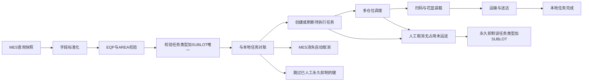
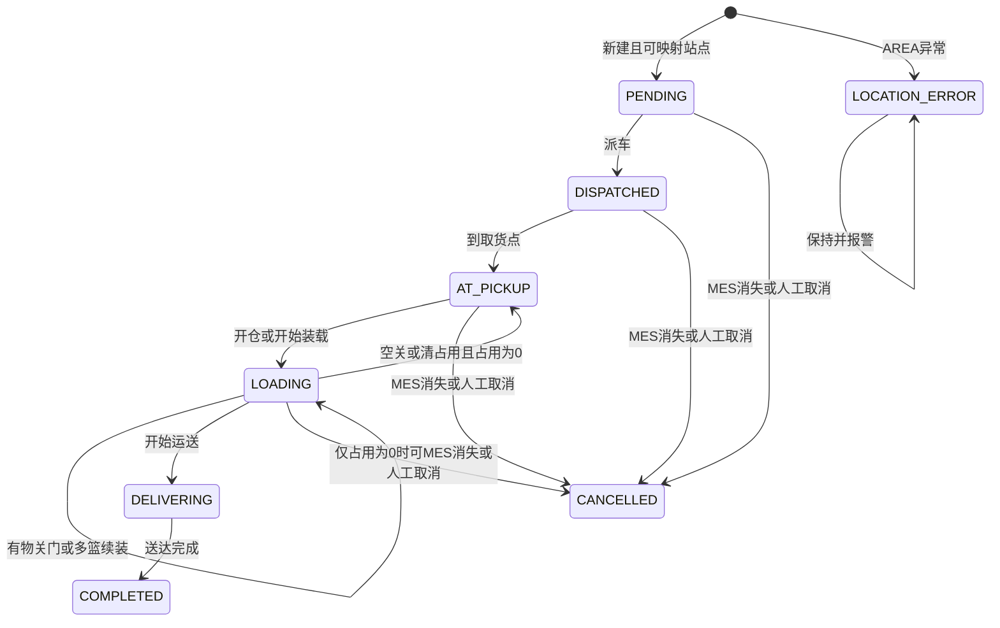
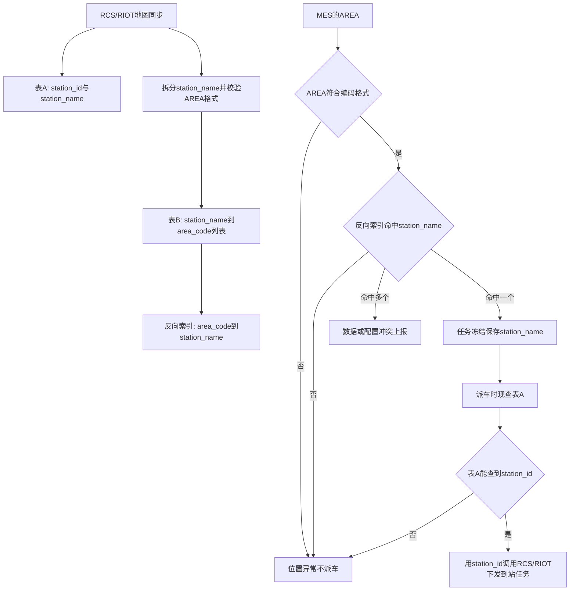

# AGV系统业务与MES任务模型

## 1. 文档用途

本文档是宿迁长电多仓位 AGV 系统后续设计、开发和 AI 协作的业务上下文。内容整合自：

- [`宿迁长电AGV项目MES数据接口需求确认.md`](宿迁长电AGV项目MES数据接口需求确认.md) 中的 MES 查询契约及补充只读查询（料盒数、操作员身份）；
- 需求沟通中已经确认的物理运输流程、幂等规则、人工搬运竞争、多花篮规则，以及当前阶段一车一任务（暂不复合）与取货区域类型卡控。

阅读和实现时应区分以下三类内容：

- **已确认**：可以直接作为系统需求。
- **建议实现**：为满足已确认需求给出的技术设计，可在详细设计阶段调整。
- **待确认**：当前信息不足，开发时不得擅自假定。

原 MES SQL 由客户 IT 提供，默认其业务筛选逻辑正确。系统只消费查询结果，不修改 SQL 对 `入库`、`入站`、`完工`、`STEP` 的使用方式。

## 2. 核心术语

### 2.1 LOT 与 SUBLOT

- 母 `LOT` 对应客户订单下某一类型产品的生产批次。
- 一个母 LOT 会被拆分成多个 `SUBLOT`。
- SUBLOT 格式通常为 `xxxxxxx-x`，例如 `Q26056680-14`。
- 从 SUBLOT 可以识别母 LOT，反向不能确定具体 SUBLOT。
- 现场扫描的是 SUBLOT。
- MES SQL 的数据库原字段名是 `lot`，但其查询值实际代表 SUBLOT，因此接口输出统一称为 `SUBLOT`。

### 2.2 盒子与花篮

- 一个 SUBLOT 包含多个产品盒（料盒）。
- 一个花篮可以装多个料盒。
- 一个 SUBLOT 可能对应一个花篮，也可能对应多个花篮。
- IT 通过 [`QUERY_ID: SUBLOT_BOX_COUNT`](../queries/sublot-box-count/) 按 SUBLOT 查询 `max_box_count`（最大料盒数）；结合任务查询中的 `PACKAGE` 与 [`../reference/package-basket-capacity.md`](../reference/package-basket-capacity.md) 可换算预计花篮数，用于按预计数量结束装载（见 9.2）。
- 若料盒查询失败、`PACKAGE` 无对照或无法换算，现场统一采用“重复扫码确认新增一篮”兜底（见 9.3），不提供独立的“新增一篮”按钮。

### 2.3 EQP、AREA 与站点

- `EQP` 是 MES 机台编号。业务上 EQP 必须存在，为空时现场无法正常生产。
- `AREA` 是 MES 中记录的机台区域号，允许为空；格式固定为“字母 + 两位数字 + `-` + 两位数字”，数字不足两位补零（如 `01`），不存在 `00`，从 `01` 起。不符合该格式的值（如实测出现的 `N`）视为无法解析。
- 正常情况下，一个 EQP 只有一个有效 AREA。
- 同一 EQP 查询出不同 AREA 属于 MES 数据异常，系统必须上报，不能自动任选一个。
- RCS 地图(本系统的RCS就是RIOT)与 AGV 地图是同一套站点数据。AGV 实际导航目标是该地图中的站点，不直接使用 MES AREA 字符串执行导航。
- 每个站点有两个标识：字符串 `station_name`（地图上的站点名）和数字 `station_id`（RCS/RIOT 下发到站任务实际使用的编号）。系统所有配置文件和数据库落盘字段统一使用 `station_name`；`station_id` 只在向 RCS/RIOT 发起派车调用的瞬间通过表A现查转换，不做持久化缓存字段。
- 系统维护两张表完成 `AREA → station_name` 解析，详见第 10 节：
  - 表A：`station_id ↔ station_name`，从 RCS/RIOT 地图同步获得，一一对应。
  - 表B：`station_name → area_code[]`（最多 3 个），由拆分站点名（下划线分隔，如 `Q11-15_Q12-15_Q13-50`）按 AREA 编码格式自动派生。
- 多个 AREA 可以映射到同一个站点，因为多个紧密放置的机台可以共用一个停车或接驳点；这体现为同一 `station_name` 拆分出多个 `area_code`。
- 机台位置调整后，应通过地图重命名站点或追加显式覆盖记录来改变解析结果，不应把映射逻辑硬编码在调度程序中。

### 2.4 任务类型

任务类型由本系统定义，用于区分一个 SUBLOT 在生产流程不同阶段产生的运输需求。MES 的 STEP 不能替代本系统任务类型。

已确认使用以下稳定代码（代码名称与中文业务含义均为已确认需求）：

| 代码 | 业务含义 |
| --- | --- |
| `DIE_TO_WIRE_STAGING` | 装片机台 → 焊线/键合派工待送区 |
| `DIE_TO_OVEN` | 装片机台 → 烘箱间 |
| `WIRE_TO_GATE` | 焊线/键合机台 → 人工质检关卡区 |
| `WIRE_TO_OPTICAL` | 焊线/键合机台 → 三光区 |
| `STAGING_TO_WIRE` | 焊线/键合派工待送区 → 指定焊线/键合机台 |

## 3. 五类运输任务

### 3.1 装片机台 → 焊线/键合派工待送区

- MES 来源：原文档第 1 组查询。
- 触发含义：某台装片机台已完成一个 SUBLOT，等待运输。
- 起点：查询结果中 EQP/AREA 映射到的装片机台 AGV 站点。
- 终点：固定的焊线/键合派工待送区站点。
- 查询结果 AREA 表示装片完工机台的位置。

### 3.2 装片机台 → 烘箱间

- MES 来源：原文档第 2 组查询。
- 触发含义：某台装片机台已完成一个 SUBLOT，产品需要送往烘箱间。
- 起点：查询结果中 EQP/AREA 映射到的装片机台 AGV 站点。
- 终点：固定的烘箱间站点，目前只有一个区域。
- 查询结果 AREA 表示装片完工机台的位置。

### 3.3 焊线/键合机台 → 人工质检关卡区

- MES 来源：原文档第 3 组查询。
- 触发含义：某台焊线或键合机台已完成一个 SUBLOT，等待送往人工质检。
- 起点：查询结果中 EQP/AREA 映射到的焊线或键合机台 AGV 站点。
- 终点：固定的关卡区站点。
- 关卡区可有多人同时质检，但 AGV 只需要送到一个公共区域。
- 查询结果 AREA 表示焊线或键合完工机台的位置。

### 3.4 焊线/键合机台 → 三光区

- MES 来源：原文档第 4 组查询。
- 触发含义：某台焊线或键合机台已完成一个 SUBLOT，等待送往三光机器质检区域。
- 起点：查询结果中 EQP/AREA 映射到的焊线或键合机台 AGV 站点。
- 终点：固定的三光区域站点。
- 三光区域内有多台机台，但当前运输只要求送到一个公共区域。
- 查询结果 AREA 表示焊线或键合完工机台的位置。

### 3.5 焊线/键合派工待送区 → 指定机台

- MES 来源：原文档第 5 组查询。
- 触发含义：焊线或键合机台即将完成上一批产品，已呼叫新的 SUBLOT 前往生产。
- 起点：固定的焊线/键合派工待送区，即第 1 类任务的终点。
- 终点：查询结果中 EQP/AREA 映射到的指定焊线或键合机台 AGV 站点。
- 查询结果 AREA 表示正在等待产品的目标机台位置。

## 4. MES查询结果契约

字段类型和长度通过 [`QUERY_ID: MES_SCHEMA_INTROSPECTION`](../queries/schema-introspection/) 核验。[`QUERY_ID: MES_TASK_UNION`](../queries/mes-task-union/) 至少提供以下字段：

| 字段 | Oracle来源类型/最大长度 | 系统解释 |
| --- | --- | --- |
| `TASK_TYPE` | 应用固定字符串/枚举 | 5组SQL通过`UNION ALL`合并时增加的任务类型 |
| `SUBLOT` | `VARCHAR2(40 BYTE)` | 现场可扫描的生产子批次号 |
| `AREA` | `VARCHAR2(30 BYTE)` | 对应机台区域号；允许为空 |
| `EQP` | 最大来源为`VARCHAR2(50 BYTE)` | 对应机台编号；数据库定义可空，但业务上必须非空 |
| `STEP` | `VARCHAR2(255 BYTE)` | MES筛选辅助字段；允许为空，业务系统不依赖其解释任务路线 |
| `DATES` | Oracle `DATE` | 本次运输需求产生时间，业务保证非空，按北京时间UTC+8解释；可用于排序和追溯，但不作为唯一任务标识 |
| `PACKAGE` | `v_fw_pc_workorder.PACKAGE` | 产品封装工艺；经 `workorder` 关联取得 |

重要约束：

1. 查询是当前状态快照，不是只增不减的事件流。
2. MES 状态不变时，同一记录会在每次轮询中重复出现。
3. 产品被人工搬走并更新 MES 后，记录可能在 AGV 执行前从查询结果中消失。
4. 当前阶段本系统只读查询 MES，不做任何回写；是否在未来阶段回写留作远期评估事项，评审确认前禁止实现任何 MES 写操作。
5. MES 的内部状态和 STEP 语义由客户 IT 负责保证，AGV 系统只按照“查询编号 → 任务类型”的固定关系解释结果。
6. MES 数据库为 Oracle。5 组查询应通过 `UNION ALL` 合并成一条 SQL，各分支增加固定 `TASK_TYPE`，统一输出 `TASK_TYPE、SUBLOT、AREA、EQP、STEP、DATES、PACKAGE`。
7. Oracle 单条 SQL 使用语句级一致性读，合并查询可让 5 个任务分支基于同一数据库快照判断，避免分开执行造成跨时刻“伪冲突”。
8. 必须使用 `UNION ALL` 保留重复行，不能使用会隐藏重复数据的 `UNION`。
9. Oracle当前Schema、会话时区和数据库时区分别为`FWMES`、`+08:00`、`+08:00`。
10. Oracle字符字段采用BYTE长度语义，应用模型应按声明最大长度设计，不得根据当前样本值缩短字段。

## 5. 标准化、唯一性校验与异常

### 5.1 任务幂等键

已确认的业务幂等键为：

```text
任务类型 + SUBLOT
```

不能只使用 `SUBLOT + STEP`。同一个 SUBLOT 可能先执行“装片机台 → 派工待送区”，随后再执行“派工待送区 → 指定焊线/键合机台”；两者可能具有相同 STEP，但属于不同运输任务。

正式生产任务只能由MES生成，不允许人工创建新的正式MES任务。开发和测试中的人工任务属于Mock任务，使用独立`MOCK_TASK_ID`和`TASK_SOURCE = MOCK`，不占用正式MES任务幂等键。允许在无占用、未运送时对已有本地任务做人工取消：取消作用域为该幂等键，永久抑制同键自动接入（见 6.1 第 8 条），不影响同一 SUBLOT 的其他任务类型。

### 5.2 单次查询中的唯一性

- 单次查询结果中，同一 `任务类型 + SUBLOT` 最多允许一行。SUBLOT 指代一个产品生产批次，在同一任务类型下必须唯一。
- 若同一 `任务类型 + SUBLOT` 出现多行，无论 EQP、AREA、STEP、DATES、PACKAGE 是否相同，一律视为 MES 数据异常：对该冲突键报警并阻断，不得归并、不得自动择一；其余未冲突键继续正常处理。
- 同一 EQP 在结果集中对应多个不同 AREA 时，标记为 MES 数据异常并上报，不得自动选择 AREA。
- 正常情况下一个 SUBLOT 同一时刻只处于一个工序，只能命中一种任务类型。若同一 SUBLOT 在同一轮完整查询中命中多个任务类型（典型如同时命中关卡与三光），应作为阻断性异常转人工处理，不得创建相互冲突的运输任务。
- “同一轮合并 SQL 同时命中多个类型”与“本地仍有上一阶段任务、当前快照已出现下一阶段任务”必须分开处理：前者是 MES 查询结果自相矛盾，按阻断性数据异常处理；后者根因通常也是现场异常（有人未按流程等待 AGV 送达，就在 MES 中把 SUBLOT 提前推进到下一工序），但系统处置不同——保留正在执行的上游任务并报警/记审计，下游任务进入依赖等待，待上游在衔接点（如派工待送区）卸货完成后再调度，不得取消上游、也不得按同轮多类型冲突整键阻断。

### 5.3 空值处理

- EQP 业务上不应为空。若实际返回空值，作为阻断性 MES 数据异常处理。
- AREA 可以为空，候选记录仍可进入本系统。
- AREA 为空或 AREA 找不到 AGV 站点映射时，任务进入“位置异常”，不能下发 AGV。
- AREA 初始为空或站点映射缺失的已有任务保持位置异常并报警，不会因 MES 后续补全而自动恢复，也不能通过人工创建正式MES任务绕过。
- EQP 和 AREA 只去除首尾空格，不自动补零、不改变大小写。类似 `D4-06` 与 `D04-06` 的编码代表不同位置，必须分别配置。
- 当前 SQL 使用设备资料表内连接：设备资料不存在或查询中的设备工序条件不匹配时，整条 SUBLOT 可能不会出现在结果中；这种遗漏仅靠当前结果集无法识别，需由客户 IT 保证设备资料完整或另行提供异常检查。

### 5.4 MES字段冻结

- 任务首次创建时保存并冻结 EQP、AREA、DATES、起点和终点。
- 已有任务只根据后续快照判断“仍存在”或“已消失”，不使用 MES 新值更新任务业务字段。
- 同一任务后续查询返回不同 EQP 或 AREA 时，保留任务原值；可将新观测值另存为审计记录，但不得改变已派路线或位置异常状态。
- 冻结规则适用于所有本地状态，避免 MES 变化影响已经获取的运输需求。

## 6. MES轮询与本地任务对账

### 6.1 推荐处理流程



每轮处理应遵循：

1. 将 5 个任务分支通过 `UNION ALL` 组成一条 Oracle SQL；只有整条合并查询完整成功后，才能使用该结果判断任务是否出现或消失。
2. 按 `TASK_TYPE` 将结果转换成对应系统任务类型，完成字段校验；同一 `任务类型 + SUBLOT` 多行时对该键报警并阻断，不得归并。
3. 对新的、未冲突的 `任务类型 + SUBLOT` 创建本地运输任务。
4. 轮询采用固定延迟而不是固定频率：本轮查询全部完成后等待 10 秒，再开始下一轮。不得并发启动、重叠或堆积查询；对仍存在的本地任务更新 `mes_last_seen_at` 并将消失计数归零。
5. 仅在对应查询完整成功时累计消失次数；查询超时、失败或结果不完整时不得累计。
6. 同一记录在连续 2 次完整成功查询未出现时，仅当同时满足以下条件才自动取消任务、记录“MES记录已消失”，并立即撤销相关取货停靠点和路线：用户尚未对本趟点击「开始运送」；该任务当前无开仓未关会话；该任务有效装载占用（装载明细）为 0。实际判定时间取决于两轮查询耗时及每轮完成后的 10 秒延迟。
7. MES 消失取消的保护与装载占用边界如下（取代“仅以第一个仓门打开为永久边界”）：
   - **保护（不得因 MES 消失取消）**：该任务开仓未关；或仍有任一篮有效占用（多篮时未全部清零则整任务仍保护）；或用户已点击「开始运送」（该 SUBLOT 已进入运送状态）。
   - **开仓未关期间保护**；空关且未形成有效装载明细则不保护。
   - **有效装载判定**：开门前须先选定 SUBLOT（扫码、键盘输入或列表选择）；关门时结合仓内物体传感器（如光幕）——有物且关门成功则生成/确认装载明细并占用仓位；无物空关不生成有效明细。
   - **装货阶段清占用（无单独“撤销本篮”按钮）**：用户尚未点击「开始运送」时，对已占用仓位再次开仓并关门，将该仓占用清零并撤销对应装载明细。占用未全部清零前整任务仍保护。
   - **进入运送后写死**：用户点击「开始运送」后，本趟已分配运输任务（当前阶段一个 SUBLOT）进入运送；此后禁用上述清占用方式，开仓只按运送/卸货或异常处理，不得再靠开仓关门清零占用从而变回“可因 MES 消失取消”。本趟有效占用为 0 时「开始运送」按钮灰掉不可点。
   - **保护期消失计数仍累加**；解除保护且占用归零后，若计数已 ≥2 可立即取消，不必重新从 0 数两轮。
8. 人工取消与同键抑制（情况 A：不装料直接取消）：
   - 允许条件：该任务无开仓未关会话、有效装载占用为 0、且尚未点击「开始运送」。
   - 人工取消针对幂等键 `任务类型 + SUBLOT`：取消后将该键持久记入抑制集合，**永久**不再自动创建或恢复该键对应的正式运输任务；**不提供**解除/恢复入口。
   - 同一 `SUBLOT` 若随后以**其他任务类型**出现在 MES 快照中，视为新幂等键，仍正常接入。
   - MES 查询中该被抑制键若仍反复出现，可报警提示“本地已人工永久取消、MES 仍存在”，但不自动建单。
   - 因 MES 记录消失而自动取消（第 6 条）的任务：若同键之后再次出现，转人工确认，不自动恢复、不自动创建；亦不提供人工创建正式 MES 任务的入口。人工取消与 MES 消失自动取消须在取消原因中区分。
9. 异常骤降按任务类型独立判断：若某类型上一轮完整成功查询数量大于等于10，本轮突然变为0，则进入`PAUSED_ZERO_DROP`，暂停该类型的消失计数和取消处理并报警，其他类型不受影响。阈值10应配置化。
10. 每个任务的连续消失计数必须持久化，系统重启不能清零。
11. `PAUSED_ZERO_DROP`仅采用自动恢复：该类型连续2轮完整成功查询数量大于0时自动解除，不提供人工解除入口。
12. 每个任务类型的最后正常非0数量、连续恢复次数和保护状态必须持久化。

### 6.2 查询调度与监控

- 页面显示每轮查询的开始时间、完成时间、耗时、结果数量和成功/失败状态。
- 轮询延迟允许人工调整，默认值为查询完成后等待 10 秒。
- 查询超时时间默认 30 秒。
- 若查询本身耗时超过 10 秒，不提前启动下一轮，仍从本轮完成时重新计算等待时间。
- MES 查询超时、失败、结果不完整或连接中断时：不创建新任务、不累计消失次数、不执行批量取消，并产生接口报警。
- MES 连接中断时：已有有效占用或已点击「开始运送」的任务继续按本地状态执行；尚无占用且未开始运送但已经派车的任务暂停前往，等待连接恢复和下一轮完整快照确认。
- 性能验收指标：正常目标不超过5秒，超过10秒产生慢查询警告，30秒硬超时；连续3轮失败产生高级报警。连续10轮测试应全部成功、平均不超过5秒且最大不超过10秒。
- 2026-07-13 曾记录阶段1单次合并 3.28s / 641行、阶段2 与原5组独立查询 diff 全为0、阶段3 连续10轮全部成功且平均 3.13s、最大 4.37s；必须以对应 run 的 manifest、日志和哈希为验收依据。2026-07-10 的 6 字段旧产物见 [`../evidence/legacy/2026-07-10-mes-task-union/`](../evidence/legacy/2026-07-10-mes-task-union/)，缺少 `PACKAGE`，不得作为当前契约 latest。
- 正式合并查询使用 [`QUERY_ID: MES_TASK_UNION`](../queries/mes-task-union/)，执行步骤和测试内容见 [`../experiments/definitions/mes-task-union-validation/plan.md`](../experiments/definitions/mes-task-union-validation/plan.md)。

### 6.3 本地任务状态

状态名称与迁移边界为已确认需求。核心不再是“第一个仓门是否打开过”，而是：**有效装载占用、开仓会话、是否已点「开始运送」**，以及取消原因与抑制集合。

#### 6.3.1 状态定义

```text
PENDING            已接入，等待调度（AREA/站点可映射）
LOCATION_ERROR     AREA为空或无法唯一映射站点，不可派车
DISPATCHED         已分配AGV，尚未到达取货点
AT_PICKUP          AGV已到取货点；无开仓会话且有效占用为0（含装后清空回到待装）
LOADING            装载中：开仓未关，或已有有效占用且尚未点击「开始运送」
DELIVERING         用户已点击「开始运送」，正在运输
COMPLETED          已送达完成
CANCELLED          已取消终态；必须填写 cancel_reason
EXCEPTION          数据冲突或执行异常（如同键多行、跨类型冲突等）
```

取消原因（`cancel_reason`，与 `CANCELLED` 配套，必填）：

```text
MES_DISAPPEARED    因MES连续成功查询消失且满足可取消条件而自动取消
MANUAL             人工取消（无占用、未运送）
```

- `MANUAL`：将该 `任务类型 + SUBLOT` 写入**永久抑制集合**，不提供解除入口；同键不再自动接入。
- `MES_DISAPPEARED`：**不**写入永久抑制集合；同键之后再次出现时转人工确认，不自动恢复、不自动创建。
- 同一 `SUBLOT` 的其他 `TASK_TYPE` 始终按新键正常接入，与上述取消无关。

#### 6.3.2 主路径迁移

```text
新建可映射 → PENDING → DISPATCHED → AT_PICKUP → LOADING → DELIVERING → COMPLETED
新建位置异常 → LOCATION_ERROR（保持并报警；不因MES后续补全AREA而自动恢复）
```

装载相关细迁移：

- `AT_PICKUP` → `LOADING`：对该任务开仓，或开始装载会话。
- `LOADING` 保持：有物关门生成/确认装载明细；或多篮继续装。
- `LOADING` → `AT_PICKUP`：空关未形成明细，或装货阶段再开仓关门将占用清零且门已关、占用为 0（车仍在取货点）。
- `LOADING` → `DELIVERING`：本趟有效占用 > 0 且用户点击「开始运送」（可一次带走多个已装 SUBLOT）。
- 本趟占用为 0 时「开始运送」灰掉不可点。
- 进入 `DELIVERING` 后禁用装货阶段清占用；开仓仅按运送/卸货或异常处理。

#### 6.3.3 各状态下的 MES 消失、人工取消与开始运送

| 状态与条件 | MES 连续 2 轮不见 | 人工取消 | 「开始运送」 |
| --- | --- | --- | --- |
| `PENDING` / `LOCATION_ERROR` / `DISPATCHED` / `AT_PICKUP`（无开仓、占用=0） | → `CANCELLED` + `MES_DISAPPEARED`，撤路线 | 允许 → `CANCELLED` + `MANUAL` + 永久抑制 | 灰掉 |
| `LOADING` 且开仓未关 | 保护（计数仍累加） | 不允许 | 不允许 |
| `LOADING` 且仍有有效占用 | 保护（计数仍累加） | 不允许 | 本趟总占用>0 时可点 |
| `LOADING` 占用已清零且门已关（应已回到 `AT_PICKUP`） | 若计数≥2 可立即 `MES_DISAPPEARED` | 允许 | 灰掉 |
| `DELIVERING` | 不因 MES 消失取消 | 不允许 | 已进入 |
| `CANCELLED` / `COMPLETED` / `EXCEPTION` | — | — | — |

保护期内消失计数仍累加；解除保护且占用归零后，若计数已 ≥2 可立即按 `MES_DISAPPEARED` 取消。

#### 6.3.4 状态图



对账时：命中永久抑制集合的 `任务类型 + SUBLOT` 直接跳过，不创建、不恢复。

### 6.4 系统重启后的恢复快照

“建立恢复快照”是指系统重启后，先执行一次完整的合并 SQL，得到当前 MES 候选任务集合：

1. 第一次完整查询可以创建新任务。
2. 已有任务重新出现时，更新 `mes_last_seen_at` 并将其持久化消失计数归零。
3. 已有任务未出现时，第一次完整查询不增加其消失计数，也不执行取消。
4. 第一次查询的每类型数量单独保存为恢复基线；如果数量为0，不得覆盖重启前持久化的最后正常非0数量。
5. 从重启后的第二次完整成功查询开始恢复正常对账：若重启前最后正常数量大于等于10且前两次查询均为0，则进入`PAUSED_ZERO_DROP`。
6. 如果重启前已经处于`PAUSED_ZERO_DROP`，且重启后前两次完整查询数量均大于0，则自动解除保护。
7. 其他情况下从第二次完整查询开始按正常规则更新数量基线、累计消失次数和执行取消。

该恢复屏障用于避免应用刚启动、连接或状态尚未稳定时误取消任务，不改变 Oracle 合并 SQL 本身的语句级一致性快照。

## 7. 上线时间与历史数据

现场 AGV 运力不足，人工搬运会长期与 AGV 并行，因此不能假设所有 MES 候选记录最终都由 AGV 执行。

系统上线时可能查询到数月前的历史积压数据。建议：

1. 固定系统上线基线时间为 `2026-08-01 00:00:00`，由应用层过滤，不修改客户 IT 提供的原始 SQL。
2. 首次接入时不为该时间以前的记录创建 AGV 任务，或先将其登记为“上线前基线记录”。
3. 上线后不要使用持续移动的“当前时间减 N 小时”作为唯一过滤条件。
4. 已接入本地的任务即使等待很久也应保留，通过超时报警提醒人工处理。
5. 若任务随后因人工搬运从 MES 快照消失，则按第 6.1 节占用/运送保护边界执行是否自动取消。

滚动时间窗的风险：系统停机、接入失败或恢复数据时，一条仍然有效但时间已超过窗口的记录可能永远无法再次接入。固定上线基线不会随着时间向前移动，因此不会让上线后的记录仅因等待过久而被过滤。

当前阶段不做增量轮询或滚动时间窗：每轮始终执行完整合并 SQL 全量查询，再由应用层按固定上线基线过滤；以完整快照作为出现/消失对账依据。

## 8. 多仓位混装与路线卡控

### 8.1 已确认规则

#### 当前阶段约束（暂不复合）

- 当前阶段一辆 AGV 同一时间只执行一个运输任务（`任务类型 + SUBLOT`），不做复合任务。
- 不做“送一批、取一批”复合停靠：向焊线/键合机台配送时，不得顺带合并同站或途中的其他完工取货任务。
- 不合并多条运输任务到同一行程：不得为了顺路取货再挂其他任务，也不得因顺路取货延迟当前配送。
- 同一运输任务若对应多个花篮，仍按第 9 节在本车本任务内装载；这不属于跨任务复合。

#### 取货合法性

- 取货按该任务的起点区域类型校验，不要求必须在任务冻结的那一台机台/那个站点取货：装片起点任务可在任一装片机台/站点取本任务产品；焊线/键合起点任务可在任一焊线/键合机台/站点取本任务产品；派工待送区起点任务在派工待送区取本任务产品。
- 跨起点类型禁止：在装片机台不能收取起点属于焊线/键合区域或派工待送区的产品；在焊线/键合机台不能收取装片或派工待送区起点的产品（派工待送区取货同理，只能收本类型起点任务）。
- 当前阶段车辆只装已分配的那一个运输任务的产品，不得在同类型机台顺带装入其他运输任务。

#### 仓位与优先级

- AGV 仓位数量和规格属于车型配置。当前车型暂定 8 个仓位；后续车型可更多或更少，仓位不保证等规格，调度程序不得写死仓位数量或默认所有仓位相同。
- 装载受 AGV 剩余仓位和现场实际装载情况限制。
- 第 5 类“派工待送区 → 指定焊线/键合机台”任务优先级最高。
- 任务持续 1～3 分钟无车辆响应时提升优先级，具体阈值应配置化。
- 若同一 SUBLOT 的上游任务正在送往派工待送区，而当前 MES 快照已经产生第 5 类下游任务：根因通常是现场未按流程提前推进 MES，仍按依赖等待处理——不取消正在执行的上游任务，报警并记审计；第 5 类任务进入“等待上游卸货”状态，上游在派工待送区卸货完成后才能释放调度。

#### 远期能力（当前阶段不实现）

- 一辆 AGV 同时装载多个 SUBLOT、混装不同任务类型、途中多站取送、以及“送一批、取一批”复合停靠，列为后续能力；启用前须重新确认调度边界，不得在当前阶段按已实现处理。

### 8.2 调度实现原则

建议将“运输任务”和“AGV行程”分离：

- 运输任务描述一个 SUBLOT 从业务起点到业务终点的需求。
- 当前阶段：一个 AGV 行程只对应一个运输任务的取货与送货；调度器不得把多条运输任务合并进同一行程。
- 取货合法性按起点区域类型判定（见 8.1），不要求精确匹配冻结站点；不得改变该任务冻结的业务起点类型与终点。
- 行程调整时必须持续检查仓位容量、已进入运送或仍有有效占用的任务不可丢弃、尚无占用且 MES 已消失且满足可取消条件的任务应移出路线。
- 远期若启用多任务合并，行程可由多个运输任务的取货、送货停靠点组成，但仍不得改变每个任务的起点类型、终点和取货合法性。

## 9. 多花篮装载模型

### 9.1 两层数据模型

运输任务与实体花篮不能使用同一个幂等粒度：

```text
运输任务唯一键 = 任务类型 + SUBLOT
装载明细唯一键 = 运输任务ID + 花篮序号
```

建议的运输任务核心字段：

```text
task_id
task_type
sublot
source_eqp
source_area
source_station
target_eqp
target_area
target_station
mes_event_time
mes_last_seen_at
task_status
cancel_reason
```

建议的装载明细核心字段：

```text
load_item_id
task_id
basket_sequence
agv_id
compartment_id
loaded_at
unloaded_at
load_status
```

系统不追踪实体花篮条码。`basket_sequence`只表示同一运输任务下的第几篮，装载追溯精度为“SUBLOT + 花篮序号 + AGV仓位”。

### 9.2 IT 提供料盒数时换算花篮数

- 运输任务创建后，按 `SUBLOT` 执行 [`QUERY_ID: SUBLOT_BOX_COUNT`](../queries/sublot-box-count/)，得到 `max_box_count`。
- 结合任务冻结的 `PACKAGE`，查 [`../reference/package-basket-capacity.md`](../reference/package-basket-capacity.md) 得到一花篮最多可装料盒数，换算预计花篮数。
- 每次扫码装入一篮并占用一个仓位。
- 实际装载花篮数达到预计数量后，任务可以自动结束装载。
- 料盒查询失败、无对照或数量不一致时进入人工确认或异常处理，并回退 9.3 兜底。

### 9.3 IT不提供花篮数量时

现场兜底流程已确定为“重复扫码确认新增一篮”，不提供独立的“新增一篮”按钮；亦不提供独立的“装载完成”按钮：

1. 开门前员工通过扫码、键盘输入或列表选定 SUBLOT，系统定位唯一的待取货运输任务。
2. 员工再次扫描同一 SUBLOT，系统弹出“确认新增一篮”提示，员工确认后才计入新的一篮。
3. 系统为该篮分配下一个可用仓位并开门。
4. 关门时结合仓内物体传感器（如光幕）：有物则生成递增花篮序号的装载明细并占用仓位；无物空关不生成有效明细。
5. 本趟存在至少一个有效占用时，员工可点击「开始运送」，使本趟已分配运输任务（当前阶段一个 SUBLOT，可含多篮）进入运送；占用为 0 时该按钮灰掉不可点。
6. 用户尚未点击「开始运送」时，对已占用仓位再次开仓并关门，清零该仓占用并撤销对应装载明细（无单独“撤销本篮”按钮）；进入运送后禁用此清占用方式。

不能仅凭短时间内重复读到相同条码就直接认定存在第二篮，否则无法区分真实多篮和扫码枪抖动、员工误扫。必须加入扫码防抖、二次确认提示、仓门与仓内物体传感器校验。

装货和卸货均由系统自动打开对应仓门；用户关闭仓门并结合传感器确认该仓位本次操作完成。系统应结合当前任务阶段区分“装货关门”（可生成或清零占用）和“运送/卸货关门”，并更新仓位占用状态。

### 9.4 操作员身份核验（非运输任务查询）

AGV 到站后，操作员扫描工牌一维码或手动输入工号，系统通过 MES 只读查询核验人员身份并建立操作会话（UC-043）。本查询与五类任务轮询无关。

- 正式查询：[`QUERY_ID: OP_OPERATOR_IDENTITY`](../queries/operator-identity/)
- 入参 `:user_id`：工牌一维码或手动输入的工号，对应 MES `mv_fw_username.usercode`
- 输出 `operator_name`：操作员姓名，对应 MES `mv_fw_username.username`
- 查询无结果、失败或超时：不建立会话，提示核验失败，不向操作员暴露“账号不存在”等细节（FR-011）
- 核验通过后：本地同时保存工号与姓名；会话内执行装载、取料等操作时复用会话身份写入操作记录，不要求每次重复查询 MES（FR-012、NFR-002）
- 岗位权限若需额外 MES 接口，由客户 IT 另行提供；本查询仅负责工号到姓名的身份解析

## 10. AREA到站点解析

系统使用两张表解析 MES 的 `AREA` 到 AGV 站点，全部业务字段（任务冻结、配置、展示、审计）统一使用 `station_name`；数字 `station_id` 仅在向 RCS/RIOT 发起派车调用的瞬间现查现用，不做持久化字段。

> 与既有 [[uc-024-maintain-area-station-mapping|UC-024]]、[[br-003-area-station-mapping|BR-003]] 描述的“人工维护显式版本化映射”模型存在差异：本节改为“地图同步 + 命名规则自动派生”为默认路径，人工只处理命名不规范时的少量显式覆盖。两者需要后续统一评审、合并到同一份正式需求文档，本节先记录最新业务确认结论。

### 10.1 表A：station_id ↔ station_name

- 从 RCS/RIOT 地图同步获得，一一对应，系统不手工维护。
- 站点在地图中改名或失效后，下一次同步即反映最新状态；已冻结的历史任务仍使用创建时保存的 `station_name`，不因地图变化自动更新。

### 10.2 表B：station_name → area_code[]

- 站点命名方式即为所覆盖 AREA 的拼接，用下划线分隔，最多 3 个 AREA，例如 `Q11-15_Q12-15_Q13-50`。
- `AREA` 编码格式固定为：字母 + 两位数字 + `-` + 两位数字；数字不足两位补零（如 `01`），不存在 `00`，从 `01` 起。
- 表B通过拆分 `station_name`（按 `_` 分割，每段校验是否符合 AREA 编码格式）自动派生，得到 `station_name → 1~3 个 area_code`；系统据此建立反向索引 `area_code → station_name`。
- 若个别站点命名不规范、无法按此规则拆分，允许追加显式覆盖记录补充其 `area_code`；显式覆盖优先于自动拆分结果。
- **解析失败必须逐条报告，不能只给笼统结论**：每次表B构建（地图同步后重新拆分）时，对每个无法自动拆分出合法 `area_code` 的 `station_name`，系统必须记录并展示：`station_id`、`station_name`、具体失败原因（如“分段数超过3个”“存在分段不符合字母+两位数字-两位数字格式”“该分段数字为 `00`”等）。该列表是 R-12/R-13 在 [[uc-024-maintain-area-station-mapping|UC-024]] 中定位并补充显式覆盖记录的依据，禁止只提示“解析失败”而不指明具体站点和原因。

### 10.3 解析与派车流程



### 10.4 约束

- 业务层（任务创建、冻结、展示、审计）全程只使用 `station_name`；不落盘数字 `station_id`。
- 派车时才用表A把 `station_name` 转换成 `station_id`；若转换失败（地图已改名、站点失效），任务转为位置异常并报警，不派车，且报警信息须包含失败的 `station_name`（及原 `station_id`，若历史上存在过）和具体原因（如“地图已改名”“站点已失效/下线”）。
- 同一 `AREA` 出现在两个不同 `station_name` 中属于数据或配置冲突，必须上报，且上报内容须列出冲突涉及的 `AREA`、全部涉及的 `station_id`/`station_name`，不得自动选择，也不得只报“冲突”而不列出具体冲突项。
- 表B构建阶段的解析失败清单（见 10.2）与派车阶段的位置异常/冲突清单是两类不同的诊断信息，前者面向 R-12/R-13 的日常巡检和显式覆盖记录维护，后者面向具体任务的异常处置；两者都必须精确到具体 `station_id`/`station_name` 和失败原因，不能只有汇总数量。
- 四个固定区域（焊线/键合派工待送区、烘箱间、关卡区、三光区）各自配置一个固定 `station_name`，通过配置文件或数据库维护，可动态修改，程序不写死实际地图值；修改只影响后续创建的任务。
- AREA 到站点的解析能力由 R-12 IT/软件维护人员和 R-13 AGV 运维/调度管理员维护；两张表默认由地图同步和命名规则自动生成，不要求开发前人工准备首版数据；命名不规范站点的显式覆盖记录变更仍需记录操作人、修改前后值、原因、时间和结果。
- 映射/解析变更只影响生效后创建的新任务；已有任务继续使用创建时冻结的 `station_name`。

## 11. 流程模板、实例与任务分层

### 11.1 流程模板与不可变版本

- 流程模板是对固定 MES、RCS/RIOT、IO 和人工能力适配器的受限编排定义，由 R-12/R-13 按 [[uc-025-maintain-workflow-template|UC-025]] 从 [[workflow-step-catalog|预置流程步骤目录]] 维护、发布和停用。
- 匹配条件包括 `moveType`、任务来源、物料类型、起终点站点及站点类型，并按 [[br-004-workflow-template-matching|BR-004]] 得到唯一已发布模板；无匹配、多匹配或关键输入未知时必须阻断。
- 发布生成 [[br-005-workflow-template-versioning|BR-005]] 定义的不可变版本。新版本只影响之后创建且尚未绑定模板的实例；已创建实例始终执行创建时绑定的完整快照，停用版本不改写历史实例。
- 模板只支持固定顺序、受限条件跳过、有限重试和等待预置外部事件；不支持脚本、SQL、任意 API、并行、循环、回跳或任意分支。强制安全步骤不得跳过或被人工覆盖。

### 11.2 流程实例与步骤实例

- MES 轮询或其他固定入口先产出任务候选；每条候选经 [[uc-026-select-template-and-create-workflow-instance|UC-026]] 完成唯一模板匹配并创建流程实例及不可变模板快照，再由 [[uc-027-execute-workflow-steps|UC-027]] 按 [[br-006-workflow-step-execution|BR-006]] 一次推进一个步骤实例。
- 流程实例记录模板版本快照、匹配证据、当前步骤、整体进度和独立流程状态；步骤实例记录步骤类型、顺序、输入输出、幂等键、尝试次数、等待事件、跳过/重试结果和审计信息。
- 步骤失败、超时、结果未知或安全阻断按 [[uc-028-handle-workflow-step-exception|UC-028]] 处置；流程实例及步骤进度按 [[uc-029-view-workflow-instance-progress|UC-029]] 只读展示。
- 流程实例状态仅描述“模板步骤执行到了哪里”，独立于业务任务状态。流程 `Completed` 不自动等于业务任务完成，流程 `Failed`、`WaitingExternal` 或 `Suspended` 也不得直接覆盖业务任务状态；业务任务状态只能由预置业务能力按既有状态机改变。

### 11.3 业务任务与 AGV 行程分层

```text
任务候选
  -> 流程实例（模板版本快照）
       -> 步骤实例（受控原子能力执行）
            -> 业务任务（物料搬运业务状态）
                 -> AGV 行程/移动任务（具体车辆、路线与到站执行）
```

- 任务候选是入口数据，不等于已建立的业务任务；只有预置建单步骤完成既有校验、`TASK_TYPE + SUBLOT` 唯一性校验及 AREA 映射约束后，才创建业务任务。
- 业务任务描述 SUBLOT/物料从起点到终点的搬运责任和业务状态；一个业务任务可以经过一个或多个阶段性流程实例，但各实例均有独立快照、状态和审计。
- AGV 行程/移动任务描述具体车辆的一次移动或停靠执行，可承载一个或多个符合规则的业务任务；不得把 RCS/RIOT 移动状态、流程状态与业务任务状态合并为同一状态机。
- 当前阶段决定不做 MES 回写；流程模板和步骤实例不新增、推断或绕过任何 MES 写能力，也不改变本地业务任务状态机独立运行的结论。是否在未来阶段回写留作远期评估事项。

## 12. 已确认系统边界

- MES 是运输需求的查询来源；当前阶段本系统只读查询 MES，不做任何回写。未来是否回写留作远期评估事项，评审前禁止实现任何 MES 写操作。
- MES 数据库为 Oracle；仓库只保存 [`工厂环境配置说明.md`](工厂环境配置说明.md) 中的占位符。真实凭据必须通过本机忽略文件或密钥管理服务注入，不得进入 Git、evidence 或 samples。
- 当前用于任务查询的 MES 账号虽然具有写权限，但查询数据访问层仍只能执行预置的合并 SELECT 及文档约定的其他只读 SELECT（五类任务合并查询、SUBLOT 料盒数查询、OP 操作员身份查询），并使用 Oracle 只读事务；不得利用该查询链路直接执行回写。
- 禁止提供通用 SQL 执行入口；任何非 SELECT 操作必须拒绝并产生安全报警，应用日志不得输出数据库密码。
- AGV 系统不需要理解 MES 内部 `入库`、`入站`、`完工` 的业务状态机。
- 运输任务全生命周期保存在本系统，不依赖任何 MES 回写闭环。
- 客户 IT 提供的 5 组 SQL 默认正确，开发不自行改变其业务筛选逻辑。
- 人工搬运与 AGV 搬运长期并存，系统必须通过 MES 快照对账撤销尚未取货的失效任务。
- 正式生产任务只能由MES查询产生，不提供人工创建入口。
- Mock任务仅用于开发和测试，使用独立来源和标识，不参与MES幂等与消失对账；生产环境默认禁用，现场联调启用时必须受专门权限控制并显著标识。
- 所有配置文件和数据库落盘字段统一使用站点的 `station_name`；数字 `station_id` 只在向 RCS/RIOT 发起派车调用的瞬间现查现用，不做持久化字段。

## 13. 待确认事项

按对开发阻塞程度分组。未确认前不得擅自假定为最终方案。

### 13.1 开发前必须确认

当前无阻塞项。原有 5 项已在 2026-07-13 全部决策，详见 13.3；后续如出现新的开发前阻塞项，按同样方式记录到本节。

### 13.2 可边开发边定

可先按已确认默认值推进只读接入与本地任务状态机，后续补齐配置即可：

1. **无车辆响应升级阈值**  
   1～3 分钟区间内的最终默认值（建议配置化，不写死）。
2. **除第 5 类外的优先级权重**  
   第 5 类机台叫料已确认最高；其余类型按 MES 时间、等待时长、顺路程度等如何组合仍待定。
3. **顺路取货允许的最大配送延迟**  
   当前阶段不做复合任务与顺路合并（见 8.1）。后续若启用多任务混装/多站停靠，再单独确认调度与复合停靠边界，包括“送一批、取一批”。
4. **仓位规格配置**  
   各车型仓位数量、尺寸、载重和兼容花篮类型；当前车型暂定 8 仓，程序不得写死。
5. **AREA 映射治理增强**  
   未来是否增加审批流与版本回滚；当前方案为：不设审批流，采用二次认证、版本化生效和完整审计。
6. **封装对照表覆盖范围**
   [`../reference/package-basket-capacity.md`](../reference/package-basket-capacity.md) 是否覆盖全部 `PACKAGE` 取值；未覆盖时如何回退 9.3 兜底。活跃样本不能称为全集，覆盖率与全集发现分别见 [`active-package-coverage`](../experiments/definitions/active-package-coverage/plan.md) 和 [`package-universe-discovery`](../experiments/definitions/package-universe-discovery/plan.md)。
7. **四个固定区域的具体 `station_name` 配置值**  
   配置方式已确定为可动态修改的字符串 `station_name`（见 10.4），具体地图站点名由现场地图建好后填入配置，不阻塞当前开发。
8. **个别命名不规范站点的显式覆盖记录**  
   当 `station_name` 无法按“下划线分隔 + AREA 编码格式”规则自动拆分出 `area_code` 时，需要人工补充显式覆盖数据；数量和时间点待现场地图确定后再收集。
9. **与 [[uc-024-maintain-area-station-mapping|UC-024]]、[[br-003-area-station-mapping|BR-003]] 的口径统一**  
   现行 UC-024/BR-003 描述的是人工维护、版本化、二次认证的显式映射模型；本文档第 10 节改为“地图同步 + 命名规则自动派生”为默认路径。两者需要后续合并到同一份正式需求文档，明确人工维护范围仅限少量显式覆盖记录。

### 13.3 已关闭事项

1. **合并 SQL 性能验收**（原待确认第 5 项）  
   2026-07-13 实测通过：连续 10 轮全部成功，平均 3.13s（≤5s），最大 4.37s（≤10s）；与原 5 组独立 SQL 行数 diff 全为 0。有效轮询周期约为“查询耗时 + 完成后等待 10 秒”。
2. **MES 回写方案**（原待确认第 1 项）  
   2026-07-13 决策：当前阶段不做 MES 回写，只读查询 MES、本地保存全部任务状态。回写方案作为远期可选项，如后续需要再重新评审，评审前禁止任何 MES 写操作。
3. **花篮现场兜底交互**（原待确认第 3 项）  
   2026-07-13 决策：确定为“重复扫码确认新增一篮”，不提供独立的“新增一篮”按钮；须配防抖、二次确认提示、仓门与仓内物体传感器校验。  
   2026-07-16 补充：无独立“装载完成”按钮；有效装载=选定 SUBLOT + 有物关门；「开始运送」按钮使本趟已装 SUBLOT 进入运送（占用为 0 时灰掉）。MES 消失取消改为占用/运送保护边界：开仓未关或仍有占用则保护（计数仍累加）；空关无明细可取消；装货未运送时可再开仓关门清占用；进入运送后禁用清占用且不因 MES 消失取消。  
   2026-07-16 补充：人工取消（无占用、未运送）对 `任务类型 + SUBLOT` 永久抑制，无解除入口；同键不再自动接入，异类型仍正常获取；MES 消失自动取消后同键再出现仍转人工确认。
4. **四个固定区域站点的配置方式**（原待确认第 4 项）  
   2026-07-13 决策：确定为可动态修改的字符串 `station_name`，不是数字 `station_id`；不要求开发前给出实际地图值。
5. **AREA → 站点的解析方式**（原待确认第 5 项）  
   2026-07-13 决策：确定为两张表——表A（`station_id ↔ station_name`，从 RCS/RIOT 地图同步）+ 表B（`station_name → area_code[]`，由命名规则自动拆分派生，最多3个，AREA编码格式为字母+两位数字-两位数字，从01起无00）；不要求开发前人工准备首版映射数据。数字 `station_id` 只在派车调用瞬间现查，不落盘，全部配置和数据库字段统一使用 `station_name`。
6. **解析失败的诊断信息颗粒度**  
   2026-07-13 决策：表B构建阶段无法自动拆分出合法 `area_code` 的 `station_name`，必须逐条报告 `station_id`、`station_name` 和具体失败原因；派车阶段的位置异常和 AREA 冲突同样必须列出具体 `station_id`/`station_name`/`AREA` 和原因。禁止只给“解析失败”“冲突”这类笼统结论而不指明具体站点，确保 R-12/R-13 有据可查、有的放矢地补充显式覆盖记录或处理异常。

## 14. AI开发约束摘要

后续 AI 在设计或实现本系统时必须遵守：

1. 把 MES 返回的 `lot` 值作为 SUBLOT 使用，但不要擅自修改客户数据库原字段名。
2. 使用 `任务类型 + SUBLOT`保证运输任务幂等。
3. 不要使用 STEP 代替任务类型，也不要推测 MES 内部状态语义。
4. 将 MES 查询视为会重复、会消失的当前状态快照；使用带 `TASK_TYPE` 的 `UNION ALL` 合并 SQL 获取 Oracle 同一语句级快照。
5. 使用固定延迟轮询：每轮完成后等待 10 秒；不允许查询重叠。只在成功获得完整快照后累计消失次数；连续 2 次未出现且未开始运送、无开仓会话、有效占用为 0 时才取消并立即撤销取货路线。保护期内消失计数仍累加。
6. 开仓未关或仍有有效占用时不得因 MES 消失取消；空关无明细不保护。用户点击「开始运送」后进入运送，忽略 MES 消失且禁用装货阶段清占用；本趟占用为 0 时「开始运送」不可点。
7. AREA 不符合编码格式、反查不到 `station_name`、或站点已失效时不得下发 AGV，进入位置异常。
8. 同一 EQP 出现不同 AREA 时必须上报异常；同一 AREA 反查出多个 `station_name` 同样必须上报异常，不得自动选择。
9. 同一 `任务类型 + SUBLOT` 在单次查询中出现多行属于硬失败：对该键报警并阻断，不得归并；同一 SUBLOT 同时命中多个任务类型（含关卡与三光）属于阻断性异常。
10. 人工取消针对 `任务类型 + SUBLOT` 永久抑制该键（无解除入口），同键不再自动接入；同一 SUBLOT 的其他任务类型仍正常获取。因 MES 消失自动取消后同键再出现时转人工确认。不得人工创建新的正式MES任务。
11. 支持多个 AREA 映射到同一站点；站点必须从 RCS/RIOT 地图同步得到表A（`station_id ↔ station_name`），表B（`station_name → area_code[]`）由命名规则自动派生，命名不规范时用显式覆盖记录补充；修改只影响新任务。
12. 运输任务、花篮装载明细和 AGV 行程必须分层建模；不追踪实体花篮。
13. 当前阶段一车只执行一个运输任务，不做复合任务、不合并多任务行程、不做“送一批取一批”；取货按该任务起点区域类型校验（同类型机台/站点可取本任务货），不得跨装片、焊线/键合、派工待送区三类起点，也不得顺带装其他运输任务。
14. 第 5 类机台叫料任务优先级最高，仓位数量和规格必须配置化。
15. 固定上线基线时间为 `2026-08-01 00:00:00`，由应用层过滤；每轮始终全量执行合并 SQL，不做增量轮询，也不得用持续滚动的短时间窗作为任务可靠性的唯一保障。
16. 所有 AGV 任务状态保存在本系统；当前阶段不做任何 MES 回写，本地任务状态机独立运行，不依赖任何回写闭环。
17. DATES 保证非空并按北京时间 UTC+8 解释；EQP/AREA 编码仅去除首尾空格，不做补零等归一化。
18. 查询失败时禁止取消；某类型上一轮正常非0数量大于等于10且本轮为0时进入`PAUSED_ZERO_DROP`，仅在连续2轮恢复为非0后自动解除，不允许人工解除。连接中断时：已有占用或已开始运送的任务继续，尚无占用且未运送的派车任务暂停。
19. 本地上游任务未完成而第 5 类下游任务已出现时（常见于现场未按流程提前推进 MES）：保留上游并报警/记审计，下游等待上游卸货，不得取消正在执行的上游任务。
20. 任务创建后冻结 MES EQP、AREA、DATES 和起终点，后续 MES 变化不得更新已有任务；位置异常任务不自动恢复。
21. 消失计数必须持久化；系统重启后的第一次完整查询只建立恢复快照，不累计缺失、不取消任务。
22. 查询超时默认 30 秒，上线时间过滤由应用层执行。
23. MES 任务查询链路必须使用只读事务且只能执行查询目录登记的预置 SELECT（`MES_TASK_UNION`、`SUBLOT_BOX_COUNT`、`OP_OPERATOR_IDENTITY` 等）。当前阶段不做任何 MES 写操作；未来若评审启用回写，不得复用通用 SQL 入口，必须采用独立、受控且可审计的接口或数据访问能力。
24. 每类最后正常非0数量、连续恢复次数和异常骤降保护状态必须持久化；重启后的第一次查询只建立恢复基线，第二次查询结合持久化基线判断进入或解除保护。
25. 正式生产任务只能来自MES；Mock任务使用独立来源和ID，不参与MES任务幂等与对账。
26. 合并查询及测试计划分别由 [`QUERY_ID: MES_TASK_UNION`](../queries/mes-task-union/) 和 [`mes-task-union-validation`](../experiments/definitions/mes-task-union-validation/plan.md) 管理；业务文档不复制正式 SQL。
27. 每条任务候选必须先经 UC-026 唯一匹配模板并创建不可变流程实例快照，再由 UC-027 顺序执行预置步骤；无匹配、多匹配或快照无效时 fail-closed。
28. 流程模板只能编排步骤目录中的固定 MES、RCS/RIOT、IO 和人工能力；禁止脚本、SQL、任意 API、并行、循环、回跳、任意分支和无限重试，强制安全步骤不得跳过。
29. 流程模板版本发布后不可变，新版本和停用仅影响后续匹配；历史实例不得动态读取新版本或被静默迁移。
30. 流程实例、步骤实例、业务任务和 AGV 行程必须分层建模；流程实例状态与业务任务状态分别存储、校验和审计，不得默认互相映射。
31. 流程异常处置只能按 UC-028 和 BR-006 执行有限重试、受限跳过或安全终止；UC-029 仅提供只读进度，不得借流程能力改变“当前阶段不做 MES 回写”或既有业务状态结论。
32. 任务、配置和数据库落盘字段只使用 `station_name`；数字 `station_id` 只在调用 RCS/RIOT 派车 API 时现查转换，不落盘、不做持久化缓存字段。
33. 表B构建时无法自动拆分出合法 `area_code` 的 `station_name`，必须逐条列出 `station_id`、`station_name` 和具体失败原因；派车阶段的位置异常/AREA冲突也必须列出具体 `station_id`/`station_name`/`AREA` 和原因，禁止只给汇总数量或笼统提示。
