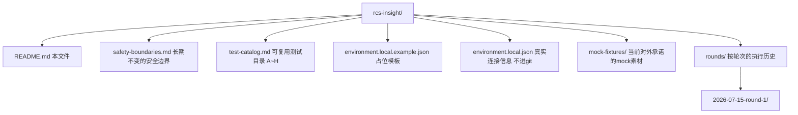

# RCS Insight

**RCS Insight** 是针对本项目所用 RCS 实例（斯坦德 **RIoT**）的**持续性现场环境验证套件**：对着一台真实上线的测试车，反复验证 RIoT 真实接口行为（状态机语义、边界/异常路径），产出可复核的证据，供 [`riot-sdk`](../riot-sdk/) 的设计与 mock、以及业务文档里对 RIoT 行为的假设参考。

## 1. 这个项目是什么、为什么不放进 riot-sdk

- [`riot-sdk`](../riot-sdk/) 是**给应用层调用 RIoT 的客户端库**（C#/Python 两套，Kiota 生成 + 手写鉴权 + 薄封装）。它关心「怎么把 swagger 变成好用的强类型代码」。
- **RCS Insight 关心的是另一件事**：RIoT 这个**真实部署系统本身**到底怎么表现——swagger 文档往往只列出字段和枚举，不写「什么条件触发什么状态转移」「异常输入会不会被系统悄悄兜底成危险行为」。这些答案只能靠对着真车实测拿到，而且**只能测一次是不够的**（见下一节）。
- 因此两者是消费关系而不是包含关系：RCS Insight 产出的 fixture、发现的真实行为，会被 `riot-sdk` 的单测/文档引用；`riot-sdk` 本身不需要知道这些证据具体怎么测出来的。放在 `rcs/` 下与 `riot-sdk`、`riot_swagger`、`riot_documents` 平级，而不是 `riot-sdk/docs/` 里的一份资料。

## 2. 为什么会反复测——这不是一次性项目

现场环境不是静止的，下面任何一种变化都值得重新跑一轮 RCS Insight，并把新一轮的结果与历史轮次对比：

- **RIoT 平台升级**：现场 RIoT 版本变了，之前记录的状态机行为（例如 `interrupt` 落到 `PAUSED` 还是 `HANG`）可能跟着变，需要重新验证而不是假设"上次测过就一直对"。
- **多仓位 AGV 项目接入新场景/新站点**：新的地图、新的业务流程会用到之前没验证过的接口组合。
- **riot-sdk 补新模块**：以后要生成 `fcs`/`ithings`/完整 `security` 等模块的客户端时，需要现场真实证据而不是继续猜 swagger 里含糊的描述。
- **怀疑 fixture 过期**：`mock-fixtures/`（见 §5）里的素材代表"某个时间点验证过的真实行为"，如果怀疑它已经不代表现场当前行为，应该重新跑一轮而不是继续信任旧证据。

正因为要反复跑，这个项目的结构特意把**「测什么/怎么测」的固定资产**和**「哪一轮跑出了什么结果」的执行历史**分开（见 §4），历史不会被下一轮覆盖，方便回答"RIoT 升级前后，这个接口的行为变了吗"这类问题。

## 3. 和仓库里其他资料的关系

| 资料 | 关系 |
|---|---|
| [`../riot-sdk/`](../riot-sdk/) | 本项目的验证结果反哺它的设计/文档/mock；本项目不依赖它，可以用裸 HTTP 调用（也可以用它的客户端类交叉核对，见 test-catalog.md 里 A1 反例的做法） |
| [`../01-rcs-intro.md`](../01-rcs-intro.md) | RCS/RIoT 是什么、怎么用网页端和 API 访问的入门介绍；本项目假定读者已看过这份 |
| [`../../glossary/terminology-glossary.md`](../../glossary/terminology-glossary.md) | 全项目术语表；本项目内部术语（如 `procState`、`orderState`）直接沿用 RIoT swagger/SDK 里的英文字段名，不重新翻译 |
| [`../../requirement-documents/05-test-cases/`](../../requirement-documents/05-test-cases/) | 那些是从 Use Case / FR **派生的业务功能测试用例**（测本项目自己的业务逻辑）；RCS Insight 是**平台/集成层验证**（测 RIoT API 本身的行为），两者层级不同、互不替代 |

## 4. 目录结构

| 路径 | 是否进 git | 会不会随轮次变化 | 用途 |
|---|---|---|---|
| `README.md` | 是 | 不会 | 本文件：定位、流程、协作协议 |
| [`safety-boundaries.md`](./safety-boundaries.md) | 是 | 不会 | 写操作的安全边界，任何一轮都必须遵守 |
| [`test-catalog.md`](./test-catalog.md) | 是 | 不会（除非 RIoT 接口本身变了） | 可复用的测试卡片定义：意图/前置条件/程序/预期结果/反例/风险/人工干预 |
| `environment.local.example.json` | 是 | 不会 | 连接字段占位模板 |
| `environment.local.json` | **否**（`*.local.json`） | 会随环境更新 | 真实 IP / 账号密码 / 测试车 key |
| [`mock-fixtures/`](./mock-fixtures/) | 是（脱敏） | 会累积，但不是"这一轮"专属 | 跨轮次持续维护的、当前确认有效的 mock 素材，供 `riot-sdk` 单测引用 |
| `rounds/<date>-round-N/` | 是（脱敏） | **每轮新建一个**，历史不覆盖 | 该轮的批准范围、实际执行结果、原始抓取产物 |

## 5. 如何开始一轮新的验证

1. 读本文件 + [`safety-boundaries.md`](./safety-boundaries.md)（安全边界不随轮次变化，必须先读）。
2. 读 [`environment.local.json`](./environment.local.json)（基址、账号、测试车 key、当前在线状态——开新一轮前先确认这些还准确，不准确就先更新）。
3. 打开 [`test-catalog.md`](./test-catalog.md)，决定本轮范围：哪些卡片测、哪些跳过、是否需要用户一次性批准写操作。
4. 新建 `rounds/<今天日期>-round-<序号>/`，按 [`rounds/2026-07-15-round-1/round-plan.md`](./rounds/2026-07-15-round-1/round-plan.md) 的格式写本轮范围与批准记录。
5. 按 `test-catalog.md` 的依赖顺序图逐条执行，结果写进本轮的 `execution-log.md`；原始请求/响应存进本轮的 `runs/`。
6. 出现 `test-catalog.md` 卡片标注"人工干预"的阻塞点时，按 §6 握手流程处理，不要跳过。
7. 收尾时：把本轮确认稳定、有代表性的 fixture 复制一份到顶层 [`mock-fixtures/`](./mock-fixtures/)（不带轮次日期），供 `riot-sdk` 长期引用；同时保留 `rounds/<本轮>/runs/` 里的原始版本作审计留痕。
8. 如果本轮发现某条卡片描述的预期已经过时（例如 RIoT 升级后行为变了），回来更新 `test-catalog.md`，而不是只在某一轮的 `execution-log.md` 里记一下就算了——`test-catalog.md` 是要给下一轮用的。

## 6. 人工干预协议

现场测试里，凡是 **API 做不到、或做了也不安全** 的步骤，一律走「等待人工」，不要在聊天里临时含糊喊一句。这条协议本身不随轮次变化。

### 6.1 职责划分

| 默认归谁 | 典型事项 |
|---|---|
| **AI / 脚本（先走接口）** | 登录、只读查询、指定测试车创建/取消/中断订单、单车 disable/enable、记录状态变化 |
| **需要用户干预** | 急停复位、手自动模式、物理挪车/清障、车端重新定位、UI 上只有人能确认的异常处置、安全确认（周围是否有人/其他车）、目的站是否干扰产线的最终拍板 |

**原则**：能用 API 完成的不甩给人；接口搞不定或涉及人身/产线安全时，升级人工，并停住后续写操作。

### 6.2 标准握手流程

1. **AI 停住**：本轮 `round-plan.md` 里该条状态改为 `等待人工`；`execution-log.md` 对应条目写  
   `等待人工：<要做什么>；完成后请回复：<建议回复话术>；复查接口：<用哪个接口复查>`。
2. **会话里同步说一句**：明确编号（如 E1）、要用户做什么、做完回什么。
3. **用户做完只回一句即可**，例如：`急停已复位，车在 12 站空闲` / `已在 UI 取消挂起订单`。
4. **AI 复查**：用只读接口确认前置条件已满足，把用户的操作摘要补进 `execution-log.md`，状态改为 `执行中`/`通过`，再继续。
5. **等待期间**：不发起新的写操作；不把"本轮已批准某类写操作"理解成可以跳过人工确认。

人工干预**不等于**重新批准 API 范围——写操作的批准范围记在每一轮的 `round-plan.md` 里；人工只覆盖现场/安全侧动作。

### 6.3 卡片字段约定

`test-catalog.md` 每张卡片有 **「人工干预」** 行：

- `无`：本条正常路径不需要人；中途出意外仍可临时升级为 `等待人工`。
- `可能需要：…`：已知常见阻塞点，触发后按 §6.2 停住。

## 7. 快速链接

- [`safety-boundaries.md`](./safety-boundaries.md) — 安全边界
- [`test-catalog.md`](./test-catalog.md) — 测试目录（A~H 全部卡片）
- [`mock-fixtures/README.md`](./mock-fixtures/README.md) — mock fixture 使用与晋升约定
- [`rounds/2026-07-15-round-1/`](./rounds/2026-07-15-round-1/) — 第一轮（迁移自 `riot-sdk/docs/live-test/`，含已完成的 A1）
