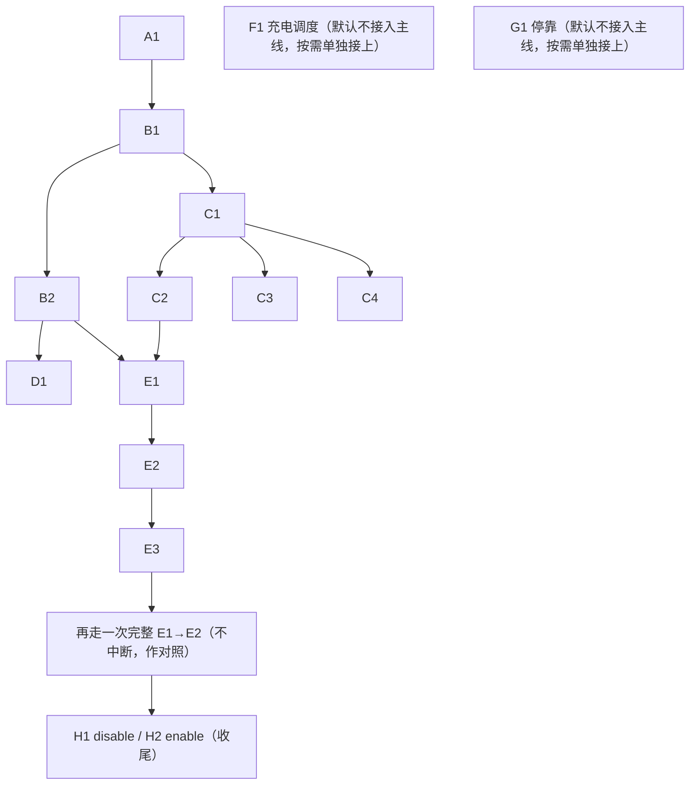

# 测试目录（Test Catalog）

本文件是**可复用**的测试定义：意图、前置条件、程序、预期结果、反例、风险等级、人工干预可能性。这些内容不随任何一轮验证变化——除非 RIoT 接口本身的真实行为变了，才需要回来更新本文件。

**具体某一轮跑到哪一步、结果是什么，不在本文件里**，见 [`rounds/<该轮>/round-plan.md`](./rounds/) 和 [`rounds/<该轮>/execution-log.md`](./rounds/)。

约定：下文 `{{baseUrl}}` / `{{testVehicleKey}}` 均从 [`environment.local.json`](./environment.local.json) 读取；业务成功以响应 `code == 0`（或现场一致的成功码）为准；订单命名建议带 `rcs-insight-<编号>-<timestamp>` 前缀，便于事后检索。

---

## 1. 总览表

| 类别 | 编号 | 测试项 | 只读/写 |
|---|---|---|---|
| A 鉴权连通性 | A1 | 登录拿 token | 只读 |
| B 设备/车辆状态 | B1 | 设备列表查到测试车+在线状态字段 | 只读 |
| B 设备/车辆状态 | B2 | `getVehicleInfo`：位置/电量/任务状态 | 只读 |
| C 地图/站点/路网 | C1 | 地图列表 `mapInfo/all` | 只读 |
| C 地图/站点/路网 | C2 | 有效站点 `stations/{mapId}` | 只读 |
| C 地图/站点/路网 | C3 | 边/路网 `edges/{mapId}` | 只读 |
| C 地图/站点/路网 | C4 | 地图关系 Map Relation | 只读 |
| D 调度只读 | D1 | 路径成本 `getRouteCostsBy` | 只读 |
| E 移动订单 | E1 | 创建一个移动订单 | 写 |
| E 移动订单 | E2 | 监控订单直到到站 | 只读（依赖 E1） |
| E 移动订单 | E3 | 对进行中订单做 interrupt | 写 |
| F 充电调度 | F1 | 指定该车充电 | 写 |
| G 停靠 | G1 | 空闲返停靠点 | 写 |
| H 启停设备 | H1 | disable 测试车 | 写 |
| H 启停设备 | H2 | enable 测试车（收尾） | 写 |

某一轮要测哪些、跳过哪些、批准到什么程度，记在该轮的 `round-plan.md` 里（会从本表复制一份并加状态列）。

---

## 2. 依赖顺序图



**排序理由**：A/B/C/D 只读、互不影响，先摸清字段；E1 需要 C2 有效站点和 B2 车辆当前状态才能选安全目的地；E3 验证完后补一次不中断完整流程作对照；H 放最后，因为 disable 会挡住后续接单。F1/G1 默认不接入主线，是否本轮测由 `round-plan.md` 决定。

---

## 3. 已核实状态枚举（来自 swagger / Kiota 注释，非猜测）

这些不是根据经验猜的，是直接读 `rcs/riot-sdk/csharp/RIoT.Sdk.Generated/**` 里 Kiota 生成代码上保留的 XML doc 注释找到的——这些注释原样来自 `rcs/riot_swagger/{order,task}.json` 里各字段的 `description`。下面卡片的"预期结果"直接引用这份表。

| 来源 | 字段/枚举 | 取值 |
|---|---|---|
| `OrderRecordObject.OrderState` | `orderState` | 1 QUEUEING, 2 CANCELLED, 3 EXECUTING, 4 FAILED, 5 SUCCESS, 6 DELETED, 7 PAUSED, 8 SUSPENDED, 9 HANG, 10 队列优先执行 |
| `OrderRecordObject.OrderType` | `orderType` | 1 NORMAL, 2 CHARGE, 3 CMD（停靠）, 4 MAINTAIN |
| `VehicleTaskInfo_procState` | `procState` | `AWAITING_ORDER`, `IDLE`, `PROCESSING_ORDER`, `INNER_PAUSE`, `IN_CANCEL`, `USER_FORCE_IDLE`, `USER_FORCE_IDLE_FINISHED`, `INNER_FORCE_IDLE`, `UNAVAILABLE` |
| `OrderCommandDTOObject_commandType` | 订单命令 | `CMD_ORDER_CANCEL`, `CMD_ORDER_HELD`, `CMD_ORDER_REJECTED`, `CMD_ORDER_CONTINUE_FROM_HANG` / `_HELD` / `_REJECTED`, `CMD_ORDER_JUMP_FROM_HANG` |

**已知缺口**：枚举只说明「有哪些状态」，未写清转移条件（例如 `interrupt` 会落到 `PAUSED` 还是 `HANG`）。这部分依赖 E1→E2→E3 的实测记录（见各轮 `execution-log.md`），一旦某一轮观察到确定的转移规律，应回来更新本节，把"已知缺口"变成"已核实"。

---

## 4. 卡片字段模板

每条卡片固定包含下列字段（顺序勿打乱）：

```
#### <编号> <名称>
- 测试意图：…
- 前置条件：…
- 测试程序：…
- 预期结果：…
- 反例/边界（负面路径）：…（无则写「无」并说明为何这条不需要）
- 风险等级：只读 / 写-可逆 / 写-需人工复核
- 人工干预：无 | 可能需要：…（触发则按 README §6 停住）
```

**这些字段都是目录级别的固定设计，不含任何具体某一轮的执行结果**——执行结果、时间戳、真实调用摘要，记在对应轮次的 `execution-log.md` 里，通过编号对应回本文件的卡片。

「人工干预」写法：

- `无`：正常路径不需要人；中途出意外仍可按 [`README.md`](./README.md) §6 临时升级为 `等待人工`。
- `可能需要：…`：已知常见阻塞点，触发即在当轮改状态并停写操作。

「反例/边界」写法（见 [`mock-fixtures/README.md`](./mock-fixtures/README.md) 了解反例产物如何变成 mock 素材）：

- 每条反例写清楚「输入什么」+「期待的失败表现」（业务失败码 / 4xx，而不是 500、崩溃、或误伤其它车/订单）。
- 反例的核心价值是**安全边界验证**：对写接口（E1/E3/H1/H2），反例专门测「传一个不存在/不合法的 key 会不会被系统悄悄兜底到别的车」——这类反例本身风险极低（预期是失败、不产生真实副作用），但一旦系统行为不符合预期就是重大发现，必须记下来即使标「失败」，并按 [`safety-boundaries.md`](./safety-boundaries.md) 处理。
- 反例执行后同样落一份 fixture（命名与 schema 见 `mock-fixtures/README.md`），作为以后写 SDK 单测时「异常路径 mock」的素材，不止是「正常路径 mock」的补充。

---

#### A1 登录拿 token

- **测试意图**：确认现场鉴权可用，后续所有调用有有效 Bearer token；对应 SDK `POST /api/auth/v1/admin/login`。
- **前置条件**：本机可访问 `baseUrl`；账号密码见 `environment.local.json`。
- **测试程序**（只读）：
  1. `POST {{baseUrl}}/api/auth/v1/admin/login`，body 含 username / password。
  2. 或跑既有冒烟：`RIOT_SMOKE=1` + 同组环境变量后执行 `riot-sdk/scripts/smoke-csharp.ps1` / `smoke-python.ps1`（冒烟还会顺带打设备列表）。
- **预期结果**：返回非空 access token（及 refresh 若有）；HTTP 成功；无 401/502。
- **反例/边界**：
  1. 密码错误（用户名对、密码错）→ 期待：登录不成功，不应返回可用 token。
  2. （可选）缺失字段/空 body → 期待 4xx 或业务失败码。
- **风险等级**：只读
- **人工干预**：可能需要：本机到现场网络不通 / 浏览器也登不上时，由用户确认 VPN/现场网络或账号是否变更。

---

#### B1 设备列表查到测试车 + 在线状态

- **测试意图**：在全局设备列表中唯一定位测试车，确认在线/启用相关字段，避免写操作打到别的车。
- **前置条件**：A1 通过。
- **测试程序**（只读）：
  1. `GET {{baseUrl}}/api/device/v1/devices`（可分页）。
  2. 在结果中按 `deviceKey == {{testVehicleKey}}` 过滤。
  3. 可选：`GET /api/device/v1/runtime/status/{{testVehicleKey}}` 交叉确认在线。
- **预期结果**：能查到该 key；记录在线/启用相关字段原值（字段名以实际返回为准，常见如 online / enable / status）；与 `environment.local.json` 中 `testVehicleOnline` 一致或可解释。
- **反例/边界**：
  1. 查一个不存在的 `deviceKey`（如拼错/随机字符串）→ 期待：空结果或明确"未找到"，不应 500，也不应模糊匹配到其它设备。
- **风险等级**：只读
- **人工干预**：可能需要：列表显示离线时，由用户现场确认车上电/联网，或更新 `environment.local.json` 的在线状态说明。

---

#### B2 getVehicleInfo：位置 / 电量 / 任务状态

- **测试意图**：拿到调度视角下的车辆任务态与本体状态，供 E1 选目的地、判断是否空闲可接单。
- **前置条件**：B1 通过；车已上线。
- **测试程序**（只读）：
  1. `GET {{baseUrl}}/api/task/v1/task/getVehicleInfo/{{testVehicleKey}}` → `VehicleTaskInfo`（重点：`procState`、`processingOrder`、`enable`、当前 `orderTask`/`orderSequence` 若有）。
  2. 补充：`GET {{baseUrl}}/api/task/vehicles/getVehicleInfoByDeviceKey?deviceKey={{testVehicleKey}}`（或等价 query）→ 关注 `Vehicle`：`battery`、`currentStation`、`precisePosition`、`locationState`、`connected`/`aliveState`。
- **预期结果**：`code == 0`；`procState` 为已知枚举之一（期望偏 `IDLE` / `AWAITING_ORDER`，若已是 `PROCESSING_ORDER` 须先记清当前订单再决定是否继续 E）；电量、当前站/坐标有可读值；记下 **map 相关线索**（若本接口无 mapId，则结合 C1 列表与车当前站所属地图再定 `appointMapId`）。
- **反例/边界**：
  1. `getVehicleInfo/{deviceKey}` 传不存在的 key → 期待：业务失败码或空结果，绝不应返回其它车的信息（防串车）。
- **风险等级**：只读
- **人工干预**：可能需要：急停未复位、手自动模式不对、定位丢失、车非空闲且 API 无法安全收尾时，由用户改车态/UI 处置；完成后回复当前站与是否空闲。

---

#### C1 地图列表 mapInfo/all

- **测试意图**：拿到现场有效地图列表，确定测试车所在/可调度的 `mapId`。
- **前置条件**：A1 通过（B1 建议已完成）。
- **测试程序**（只读）：`GET {{baseUrl}}/api/imap/v1/mapInfo/all`。
- **预期结果**：`code == 0`；至少一条有效地图；记录候选 `mapId` / 地图名列表，标注后续 E1 拟用的那一个。
- **反例/边界**：
  1. 不带 Authorization 直接请求 → 期待 `401`，验证地图数据不会被未鉴权请求读到。
- **风险等级**：只读
- **人工干预**：无

---

#### C2 有效站点 stations/{mapId}

- **测试意图**：为 E1 选出**安全、短距、不干扰产线**的目的站点；对应多仓位场景下「站点是否有效」的基础数据。
- **前置条件**：C1 通过；已选定 `mapId`（优先与 B2 车辆当前站一致的地图）。
- **测试程序**（只读）：`GET {{baseUrl}}/api/imap/v1/mapInfo/stations/{{mapId}}`。
- **预期结果**：返回有效站点列表；从中选出 E1 目的站（建议：与当前站不同、同图、距离近、非充电/关键产线独占站——若无法从字段判断，选相邻空闲站并在执行日志注明选择理由）；记录 `stationId`（及名称若有）。
- **反例/边界**：
  1. 传一个不存在的 `mapId`（如 `0` 或超大数字）→ 期待：空列表或业务失败码，不应报错崩溃、不应"默认兜底返回全部地图站点"。
- **风险等级**：只读
- **人工干预**：可能需要：无法从字段判断「是否干扰产线」时，由用户对候选目的站做最终安全拍板（回复可用的 stationId/站名）。

---

#### C3 边 / 路网 edges/{mapId}

- **测试意图**：确认路网边数据可查，后续理解路径成本 / 多仓位连通性时有底。
- **前置条件**：C1 通过；同一 `mapId`。
- **测试程序**（只读）：`GET {{baseUrl}}/api/imap/v1/mapInfo/edges/{{mapId}}`。
- **预期结果**：`code == 0`；边列表非空（或明确空但可解释）；抽查与 C2 站点连通相关的边字段结构。
- **反例/边界**：
  1. 传不存在的 `mapId` → 期待：空列表或业务失败码，同 C2。
- **风险等级**：只读
- **人工干预**：无

---

#### C4 地图关系 Map Relation

- **测试意图**：摸清多仓位/多地图如何组织（地图关系），对应项目「多仓位」组织方式。
- **前置条件**：C1 通过。
- **测试程序**（只读）：
  1. `GET {{baseUrl}}/api/imap/v1/mapRelation/all`
  2. 必要时再 `GET /api/imap/v1/mapRelation/`（分页查询）。
- **预期结果**：`code == 0`；记录关系条目条数与关键字段（关联的 mapId 等）；即使为空也算通过（说明现场可能单图），在执行日志注明。
- **反例/边界**：无（纯列表查询，无可构造的有意义反例；异常路径已被 C1/C2 的鉴权与非法 mapId 覆盖）。
- **风险等级**：只读
- **人工干预**：无

---

#### D1 路径成本 getRouteCostsBy

- **测试意图**：只读验证调度路由接口；为 E1 目的地选择提供成本参考（可选辅助）。
- **前置条件**：B2、C2 通过；已知车辆 key 与目标站点。
- **测试程序**（只读）：`POST {{baseUrl}}/api/task/v1/route/getRouteCostsBy`，body 按 swagger `获取车辆列表到达指定站点的代价` 填：包含测试车 key 与 C2 选定站点（字段名以 schema 为准，实测时把完整 body 记入执行日志）。
- **预期结果**：`code == 0`；返回中能看到该车到目标站的代价/是否可达；若不可达则换 C2 另一站点并更新 E1 计划目的地。
- **反例/边界**：
  1. body 里车辆 key 或站点 id 传无效值 → 期待：明确"不可达"/业务失败，不应静默返回代价为 0 或伪造出一条可达路径。
- **风险等级**：只读
- **人工干预**：无（若持续不可达，升级到 C2 的人工选站）

---

#### E1 创建一个移动订单

- **测试意图**：验证指定车辆创建 NORMAL 工作订单；确认 `appointVehicleKey` 生效、不会派到别的车。
- **前置条件**：B2 车空闲或可接单（`procState` 为 `IDLE`/`AWAITING_ORDER` 等）；C2 已选定同图安全目的站；当轮写操作已获批准（见该轮 `round-plan.md`）。
- **测试程序**（写）：
  1. `POST {{baseUrl}}/api/task/v1/order`，body 为 `OrderDTO`，至少包含：
     - `appointVehicleKey`: `{{testVehicleKey}}`（必须）
     - `appointMapId`: C1/C2 选定地图
     - `orderType`: `NORMAL`（工作订单，对应 orderType=1）
     - `mission`: 至少一段移动，`mapId` + `destination` = C2 站点 id（字段见 `MissionDTO`）
     - `orderName` / `upperId`: 带可识别前缀如 `rcs-insight-E1-{{timestamp}}`，便于事后检索
  2. 记录返回的 `orderId` / orderKey。
- **预期结果**：`code == 0`；拿到订单标识；随后用订单详情或 B2 复查，`executeVehicleKey`（或等价）为本测试车；`orderState` 进入 `1 QUEUEING` 或 `3 EXECUTING`；车侧 `procState` 趋向 `PROCESSING_ORDER` 或 `AWAITING_ORDER`（视调度节奏）。
- **反例/边界**（**安全边界核心验证**——预期都是"创建失败"，不产生真实副作用，风险实际很低）：
  1. `appointVehicleKey` 指向一个**不存在或已离线**的 key → 期待：创建失败/报错，**绝不能被系统"自动兜底"派给测试车之外任何其它在线车**（这是 `safety-boundaries.md` 第 1 条的直接验证，一旦系统真派了车，是严重发现，必须立刻记录并升级人工，不再继续 E 系列）。
  2. `appointMapId` 与 `mission` 里站点不属于同一地图 → 期待：创建失败，不应派车走错图。
- **风险等级**：写-可逆（可用 cancel / interrupt 收尾；勿用全局清理接口）
- **人工干预**：可能需要：发单前确认车旁无人/无障碍、车已自动模式；若车被非本轮订单占用且 API 取消失败，由用户在 UI 清障后再发；**若反例 1 真的派车给了别的车，立刻停止并等待人工介入**。

---

#### E2 监控订单直到到站

- **测试意图**：观察订单状态机真实流转到完成；验证轮询/查询路径可用。
- **前置条件**：E1 成功并持有 `orderId`。
- **测试程序**（只读，依赖 E1）：
  1. 轮询其一或组合：
     - `GET /api/order/v1/orderRecord/detailByOrderId/{{orderId}}`
     - `GET /api/order/v1/orderRecord?executeVehicleKey={{testVehicleKey}}&...`
     - `GET /api/task/v1/task/getVehicleInfo/{{testVehicleKey}}`
  2. 间隔建议 2–5s，直到终态或超时（超时阈值实测时写明，建议 ≤ 数分钟；超时则记失败并考虑 cancel）。
- **预期结果**：`orderState` 最终为 `5 SUCCESS`；过程中可出现 `1 QUEUEING` → `3 EXECUTING`；完成后车 `procState` 回到 `IDLE` / `AWAITING_ORDER`；目的站与 E1 一致或可解释。
- **反例/边界**：无独立反例（本条是纯监控；异常路径——中断、越权、无效订单——分别由 E3 与 E1 的反例覆盖）。
- **风险等级**：只读（监控本身）
- **人工干预**：可能需要：车中途被挡/急停/交通管制导致长时间不前进时，由用户现场处置或确认可 cancel；AI 先尝试 API cancel，失败再等用户。

---

#### E3 对进行中订单做 interrupt

- **测试意图**：**重点验证未知语义**——`POST /api/task/v1/order/interrupt` 实际把 `orderState` / `procState` 打到哪（`PAUSED` vs `HANG` 等），以及是否需后续 `CMD_ORDER_CONTINUE_FROM_*` 才能恢复。
- **前置条件**：再创建一笔短距移动订单（同 E1 约束），且订单已进入 `3 EXECUTING`、车在移动中（勿等 SUCCESS）。
- **测试程序**（写）：
  1. 创建订单（同 E1，`orderName` 带 `rcs-insight-E3-...`）。
  2. 确认 `orderState == 3 EXECUTING` 后立刻：`POST {{baseUrl}}/api/task/v1/order/interrupt`，body `InterruptOrderDtoObject`：
     - `orderId`: 当前订单
     - `pause`: `true`（先测暂停车辆语义；完整 body 记入执行日志）
     - `missions`: 按现场需要可空或附后续 mission——**第一次建议最小字段**，以观察默认行为
  3. 立即查订单详情 + `getVehicleInfo`，记录 `orderState`、`procState`。
  4. 若落入可恢复态，按需用 `POST /api/task/v1/order/command/{{orderKey}}` 发 `CMD_ORDER_CONTINUE_FROM_HELD` / `CMD_ORDER_CONTINUE_FROM_HANG` 或 `CMD_ORDER_CANCEL` 收尾，**避免车长期挂起**。
  5. E3 结束后：再跑一次**完整 E1→E2（不中断）**作对照，确认车恢复正常（见顺序图 `E1b`）。
- **预期结果**：interrupt 调用 `code == 0`；状态变化被完整记录（这是本条通过的核心判据，而非事先猜死终态）。收尾后车回到可接单；对照 E1→E2 能再次 SUCCESS。
- **反例/边界**：
  1. 对一个**已是终态**（SUCCESS/CANCELLED）的订单发 interrupt → 期待：业务失败，不应报成功、不应影响测试车当前其它订单。
  2. 传一个**不存在**的 `orderId` → 期待：报错，不应误中断测试车正在执行的其它订单。
- **风险等级**：写-需人工复核（状态机语义以实测为准；必须善后）
- **人工干预**：可能需要：interrupt/command 后车长期挂起或现场不安全时，由用户 UI/车端强制恢复；善后完成前不进入对照 E1→E2。

---

#### F1 指定该车充电

- **测试意图**：验证 `POST /api/task/v1/order/charge/{vehicleKey}` 为指定车生成充电订单（`orderType=2 CHARGE`）。
- **前置条件**：车空闲；现场有可用充电站；本条写操作已获用户单独授权。
- **测试程序**（写）：`POST {{baseUrl}}/api/task/v1/order/charge/{{testVehicleKey}}`（body 若 schema 需要则按 swagger 补全）。
- **预期结果**：`code == 0`；出现充电订单且执行车为本车；后续可观察到充电相关状态（勿强行打断其他车）。
- **反例/边界**：`vehicleKey` 传不存在设备 → 期待报错，不误发给其它车。
- **风险等级**：写-需人工复核
- **人工干预**：可能需要：确认充电桩空闲、线缆/对接安全。
- **默认不接入主线**：是否某一轮测这条，由该轮 `round-plan.md` 决定；默认跳过，需要用户单独授权才执行。

---

#### G1 空闲返停靠点

- **测试意图**：验证一键停靠 `POST /api/task/vehicles/park` 仅作用于测试车（或可按 key 限定的 body）。
- **前置条件**：车空闲；确认请求不会变成「全部车辆停靠」；本条写操作已获用户单独授权。
- **测试程序**（写）：`POST {{baseUrl}}/api/task/vehicles/park`，body 必须能限定到 `{{testVehicleKey}}`（schema 为自由 object——**实测前先只读确认 UI/文档等价参数**；若无法单车限定则放弃调用）。
- **预期结果**：仅测试车生成停靠类订单/行为（`orderType=3 CMD` 若产生订单）；其他车无变化。
- **反例/边界**：body 里 key 传不存在设备 → 期待报错，不误停其它车。
- **风险等级**：写-需人工复核
- **人工干预**：可能需要：无法用 API 单车限定时放弃调用，改由用户确认 UI 是否有单车停靠入口。
- **默认不接入主线**：是否某一轮测这条，由该轮 `round-plan.md` 决定；默认跳过，需要用户单独授权才执行。

---

#### H1 disable 测试车

- **测试意图**：验证单车禁用后不再接单；确认 path 级 `deviceKey` 生效、不影响其他车。
- **前置条件**：E 系列（含对照 E1→E2）已完成；车当前无进行中订单（或已终态）。
- **测试程序**（写）：`POST {{baseUrl}}/api/device/v1/devices/disable/{{testVehicleKey}}`。
- **预期结果**：`code == 0`；随后 B1/B2 可见该车为禁用；尝试（可选、仅本车）创建订单应失败或不再被调度；**其他车状态不变**。
- **反例/边界**（**安全边界核心验证**）：
  1. `deviceKey` 传一个不存在的设备 → 期待：报错，**绝不能误禁用测试车之外的其它任何车**；若真的影响了其它车，立刻停止、走人工升级并立即用 enable 恢复受影响的车。
- **风险等级**：写-可逆（必须立刻做 H2）
- **人工干预**：无（若 disable 后异常，优先 H2 enable；仍失败再等用户 UI 恢复；反例出现误伤其它车则立刻升级人工）

---

#### H2 enable 测试车（收尾）

- **测试意图**：恢复测试车可用，作为收尾，避免留下禁用状态。
- **前置条件**：H1 已执行。
- **测试程序**（写）：`POST {{baseUrl}}/api/device/v1/devices/enable/{{testVehicleKey}}`。
- **预期结果**：`code == 0`；车重新 enable；`procState` 回到可接单类状态；结束时测试车可用。
- **反例/边界**：
  1. `deviceKey` 传不存在的设备 → 期待：报错，不影响测试车或其它车的启用状态（与 H1 反例对称）。
- **风险等级**：写-可逆
- **人工干预**：可能需要：API enable 失败时由用户在 UI 重新启用，避免测试车留下禁用。

---

## 5. 与其他资料的关系

- 接口路径来自 `rcs/riot_swagger/{auth,device,task,order,imap}.json`，并与 `riot-sdk` Kiota 生成代码路径一致。
- 业务场景→接口映射沿用 `riot-sdk` 搭建时已核对的结果，本文件不重复全量映射。
- 不修改 `rcs/02-riot-api-and-operations-overview.md`（另一个尚未启动的计划涉及的文档，本项目不动）。
- `riot-sdk` 冒烟最小联调见 [`../riot-sdk/docs/smoke-test.md`](../riot-sdk/docs/smoke-test.md)——那份验证的是"SDK 能不能跑通"，本目录验证的是"RIoT 真实行为是什么"，两者互补。
