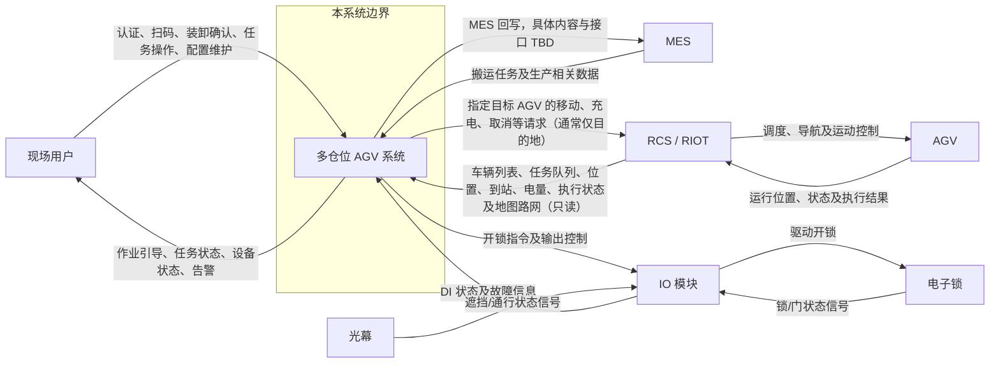

# 系统上下文与边界 System Context

## 1. 文档目的

本文档从外部视角说明多仓位 AGV 系统（以下简称“本系统”）与现场用户、MES、RCS/RIOT、AGV 及格口硬件之间的关系，用于统一项目参与方对系统职责、接口方向和边界的理解。

本系统包括本地服务、业务应用、操作界面、本地数据库及其接口服务。图中的 MES、RCS/RIOT、AGV、IO 模块、电子锁和光幕均不属于本系统。

## 2. Context Diagram

## 3. 外部交互说明

### 3.1 现场用户

- 现场操作人员通过本系统完成身份认证、扫码、装料、取料、交接确认及相关任务操作。
- 管理和维护人员通过本系统查看任务与设备状态、处理异常、查询日志，并在授权范围内维护配置。
- 各类用户的具体职责和权限见 [[stakeholders-and-user-classes|干系人与用户角色清单]]。

### 3.2 MES

- 本系统从 MES 获取搬运任务及任务生成、校验所需的生产数据，并在本地完成解析、去重和任务转换。
- 当前阶段本系统只读查询 MES，不做任何回写。未来是否回写留作远期评估事项，评审确认前不得实现 MES 写操作。
- MES 是生产业务数据的权威来源，本系统不替代 MES 管理生产工艺或生产主数据。

### 3.3 RCS/RIOT 与 AGV

- 本系统只与 RCS/RIOT 交互，从 RCS/RIOT 获取可接入车辆及运行状态；本系统根据业务任务选择具体 AGV，再通过 RCS/RIOT 下达移动、充电、取消等请求。
- 本系统可从 RCS/RIOT **只读同步**地图站点与可通行路径（路网拓扑），在本地缓存后用于分配时的最短路径成本估计（见 [[uc-045-sync-map-topology-from-riot|UC-045]]、[[br-015-path-cost-and-dispatch-ranking|BR-015]]）。向 RCS/RIOT 下发移动请求时通常**只指定目标站点（目的地）**，不指定途经中间路程；本地路径成本估计不替代、不下发、不覆盖 RCS/RIOT 的真实导航。
- RCS/RIOT 负责连接和管理 AGV，并负责接收指定车辆的任务、路径规划、交通管制、导航及运动控制；RCS/RIOT 不负责本系统业务任务与具体 AGV 的分配决策。
- AGV 负责实际移动和任务执行，并通过 RCS/RIOT 上报运行状态与执行结果。
- 本系统不直接连接、控制或调用 AGV 本体接口。

### 3.4 IO 模块、电子锁与光幕

- 本系统直接连接 IO 模块，通过 IO 模块下发开锁或输出控制指令，并读取 DI 状态和故障信息。
- IO 模块负责连接电子锁和光幕等末端器件；电子锁、门状态及光幕信号通过 IO 模块与本系统交互。
- 本系统不直接连接电子锁或光幕，其控制和状态读取均以 IO 模块为边界。

### 3.5 流程引擎与能力适配器

- 流程引擎位于本系统内部，只编排 [[workflow-step-catalog|预置流程步骤目录]] 中固定的 MES、RCS/RIOT、IO 和人工能力适配器；适配器复用既有受控业务能力，不提供脚本、SQL 或任意 API 入口。
- 模板由 [[uc-025-maintain-workflow-template|UC-025]] 维护，按 [[uc-026-select-template-and-create-workflow-instance|UC-026]]、[[br-004-workflow-template-matching|BR-004]] 匹配并依 [[br-005-workflow-template-versioning|BR-005]] 固化快照；[[uc-027-execute-workflow-steps|UC-027]] 仅按 [[br-006-workflow-step-execution|BR-006]] 顺序调用适配器，异常和只读进度分别见 [[uc-028-handle-workflow-step-exception|UC-028]]、[[uc-029-view-workflow-instance-progress|UC-029]]。
- 引入流程模板不改变本图的系统边界、接口方向或责任划分。模板不能替代 MES 的生产业务职责、RCS/RIOT 的调度导航职责、IO 模块的末端器件职责或现场人员的授权操作。
- 模板、条件跳过、重试和人工处置均不得绕过原子能力自身的权限、幂等、业务状态、仓门/光幕和移动安全联锁；安全状态不明确时必须阻断。

## 4. 系统边界总结

### 4.1 本系统负责

- MES 任务和相关生产数据的接入、校验、去重及本地任务创建。
- 本地搬运任务的编排、状态管理、异常处理、日志记录和追溯。
- 从 RCS/RIOT 接入车辆，维护本地车辆档案、调度配置、启停和归档状态。
- 只读同步 RCS/RIOT 地图路网（站点与可通行路径），用于派车排序中的路径成本估计；不接管导航或向 RCS/RIOT 下发途经约束。
- 根据本地业务、安全和车辆条件选择具体 AGV，绑定任务后向 RCS/RIOT 下达请求并监控执行状态。
- 现场作业流程、用户权限、扫码校验、任务看板及操作引导。
- 多仓位业务状态管理，以及通过 IO 模块执行格口控制和安全联锁。
- 在不改变外部职责的前提下，通过预置 MES、RCS/RIOT、IO 和人工能力适配器执行受限流程编排、版本快照、进度与异常审计。

### 4.2 外部系统或设备负责

- MES：生产业务数据、工序状态及 MES 侧接口能力。
- RCS/RIOT：AGV 本体连接、车辆信息和运行状态提供、路径规划、交通管制、导航和运动控制。
- AGV：物理移动、充电及搬运任务的实际执行。
- IO 模块：电子锁输出驱动及锁、门、光幕等现场信号采集。

### 4.3 本系统明确不负责

- 不直接连接或控制 AGV，不承担 AGV 底层通信、导航、路径规划和交通管制；但负责本地业务任务与具体 AGV 的选择和绑定。本地可基于只读路网估算最短路径成本以辅助派车排序，该估计不等于替代 RCS/RIOT 路径规划。
- 不直接连接或驱动电子锁、光幕等末端器件。
- 不替代 MES 管理生产工艺、生产计划或生产主数据。
- 当前阶段不做任何 MES 回写；未来若评审启用回写，须另行定义受控接口，评审前不得实现写操作。
- 不允许流程模板改变外部系统职责、调用未预置接口，或绕过任何业务规则、权限和安全联锁。
