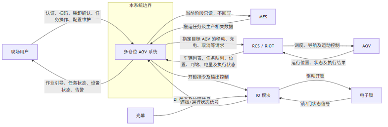

# 宿迁长电多仓位 AGV 系统 — 需求讨论稿

| 项目 | 内容 |
| --- | --- |
| 版本 | 草稿 |
| 日期 | 2026-07-14 |
| 用途 | 供宿迁长电客户讨论、对齐业务理解与待确认事项；非正式合同文本，不作为验收或商务承诺依据 |

---

## 1. 阅读说明

本文档面向业务与现场管理读者，用业务语言说明多仓位 AGV 系统打算解决什么问题、覆盖哪些范围、现场如何作业，以及当前仍需与贵方确认的事项。

**如何使用「待确认问题清单」**

- 各场景末尾的「待确认」列出尚未拍板或需贵方补充的问题。
- 讨论时可直接在清单上勾选、批注或补充新问题。
- 确认结果将回写到后续正式需求与实现计划中；本稿本身不随讨论实时修订为合同条款。

**场景如何组织**

- 第 6 章按业务领域组织场景（用例），同一领域内按作业顺序排列。
- 本稿覆盖现场装卸、仓位硬件、车队、派车、充电、映射、流程引擎、权限、日志、安全联锁与停靠等全部已建模场景。
- 每个场景统一采用：目标 → 正常情况 → 异常与处理 → 待确认。
- 第 7 章集中列出待确认问题，建议开会时按该清单逐条决策。

---

## 2. 项目背景与目标

### 2.1 背景

半导体封装车间内，产品和物料需要在工序、机台、暂存区之间持续流转。目前主要靠人工与小推车：人员需在机台附近巡线寻找待转运产品，装上小推车后再送到下一工序或暂存点，同时还要兼顾从暂存点送料到机台。半导体产品偏重，人员长时间往复搬运易疲劳，并存在摔料（产品落地导致整批报废）风险。

物料侧：机台数量多且分散，物料员往往要兼顾大量机台；机台操作员常需自行到物料间索取物料，对人机双方都是负担。客户希望引入机器人，把「人跟着料跑」变为「人在定点收发、机器人跑路」。

### 2.2 业务目标

1. 降低人工搬运强度，减少长距离、重复性搬运。
2. 降低摔料、错放、漏送等搬运风险。
3. 提升产品和物料送达下一工序、机台或暂存位置的及时性。
4. 规范车间内部物流，提升流转效率。
5. 提升可追溯性：记录任务来源、起终点、执行时间与状态。
6. 减少人员在产线与机台区域之间频繁穿梭，降低现场管理与安全风险。
7. 将搬运由人工经验驱动转为系统任务驱动，提高作业标准化。
8. 为后续与 MES、调度系统等进一步集成预留基础。

### 2.3 成功指标（试运行导向）

| 指标 | 目标 |
| --- | --- |
| 主要搬运场景 | 能稳定完成产品收取、产品派送、物料派送等 |
| 任务成功率 | ≥ 98% |
| 因错送/漏送/失败导致的异常率 | ≤ 2% |
| 任务从产生到机器人开始执行的平均响应 | ≤ 3 分钟 |
| 机台叫料后 10 分钟内送达比例 | ≥ 90% |
| 任务记录 | 均可追溯任务编号、起终点、执行时间与状态 |
| 现场作业 | 人员能按系统流程完成发起、收料、取料与异常处理 |
| 人工进线搬运频率 | 上线后明显下降 |

### 2.4 业务风险摘要

- 现场未按系统流程发起、收料、取料，导致系统利用率不足。
- MES、调度系统与本系统之间任务或状态不同步，造成下发失败或搬运不及时。
- 通道、机台、暂存区等现场环境变化，影响路线与稳定性。
- 堵路、取放失败等异常若处理不及时，影响正常流转。
- 人员不信任机器人而继续依赖人工搬运，影响目标达成。
- 产品、位置、任务状态数据不准，导致错送、漏送或无法追溯。

---

## 3. 系统范围与边界

### 3.1 系统上下文示意

上图从外部视角说明：本系统与现场用户、MES、调度系统（RCS/RIOT）、AGV、IO 模块及仓位门锁/光幕之间的职责边界。图中 MES、调度系统、AGV 本体、IO 模块、电子锁与光幕均不属于本系统软件边界。

### 3.2 本系统负责什么

- 从 MES **只读**接入搬运任务及相关生产数据，完成校验、去重并生成本地任务。
- 本地搬运任务的编排、状态管理、异常处理、日志与追溯。
- 选择具体 AGV、绑定业务任务，再向调度系统下达移动、充电、取消等请求，并监控执行状态。
- 现场作业引导：身份核验、扫码、装卸确认、任务看板与权限。
- 多仓位业务状态管理；通过 IO 模块做格口控制与安全联锁（不直连锁/光幕）。
- 在不改变外部职责的前提下，用预置流程步骤做受限编排（认证、扫码、硬件、移动等）。

### 3.3 本系统不负责什么

| 边界 | 说明 |
| --- | --- |
| 不直接控制 AGV 导航 | 路径规划、交通管制、导航与运动控制由调度系统（RCS/RIOT）负责；本系统只选车、下请求、跟状态 |
| 不直接接电子锁/光幕 | 只连接 IO 模块；开锁与门锁/光幕信号均经 IO 模块 |
| 当前阶段只读 MES、不回写 | 不做任何 MES 写操作；是否回写留作远期评估，评审确认前不得实现 |
| 不替代 MES | 不管理生产工艺、计划或生产主数据 |
| 不开发移动端 | 现场以操作台/工控界面为主 |

### 3.4 五类搬运任务业务含义

| 序号 | 业务含义 | 起点 → 终点 |
| --- | --- | --- |
| 1 | 装片完工送派工待送区 | 装片机台 → 焊线/键合派工待送区 |
| 2 | 装片完工送烘箱 | 装片机台 → 烘箱间 |
| 3 | 焊线/键合完工送关卡 | 焊线或键合机台 → 人工质检关卡区 |
| 4 | 焊线/键合完工送三光 | 焊线或键合机台 → 三光区 |
| 5 | 派工待送区叫料送机台 | 派工待送区 → 指定焊线/键合机台 |

说明：关卡区与三光区当前按公共区域交付，不要求送到区内具体机台。第 5 类（机台叫料）业务优先级最高。派工待送区、烘箱间、关卡区、三光区四个固定终点站点在地图建好后配置，程序不写死地图值。

---

## 4. 干系人与角色

### 4.1 现场操作类（R-01～R-09）

| 编号 | 角色 | 职责（业务语言） |
| --- | --- | --- |
| R-01 | 装片设备操作员 | 装片机台上下料，配合 AGV 在装片工位装弹匣/花篮 |
| R-02 | 烘烤设备操作员 | 烘烤间收料、入站配合 |
| R-03 | WIP 搬运员 | 装片完工到焊线氮气柜、氮气柜到焊线/键合机台之间的交接确认 |
| R-04 | 关卡检验员 | 焊线/键合完工送关卡氮气柜后的接收与检验 |
| R-05 | 清洗操作员 | 清洗架物料上下架，配合送焊线机台 |
| R-06 | 焊线设备操作员 | 焊线机台上下料 |
| R-07 | 键合设备操作员 | 键合机台上下料 |
| R-08 | AOI 检验员 | AOI 设备上下料及检验确认 |
| R-09 | 班组长 | 现场任务协调、高风险特批（如装料核验特批）；任务取消审批职责是否保留待与现场约定对齐 |

约定摘要：采用员工个人账号，刷工牌追溯到人；R-03 与 R-05 可由同一批人兼任但角色分开授权；高风险权限（强制放行、异常关闭、装料特批等）不授予兼任人员，由班组长执行。

### 4.2 管理/决策类（R-10 / R-14）

| 编号 | 角色 | 职责（业务语言） |
| --- | --- | --- |
| R-10 | 生产管理者 / 车间主任 | 关注任务效率、异常统计、跨班组协调与生产决策 |
| R-14 | 生产流程管理员 | 只读查看流程执行进度、等待/异常原因及关联任务；不改任务、不调优先级、不维护流程模板 |

### 4.3 技术支持类（R-11～R-13、R-15）

| 编号 | 角色 | 职责（业务语言） |
| --- | --- | --- |
| R-11 | 设备/电气维护人员 | IO 模块、电子锁、光幕等硬件维护 |
| R-12 | IT/软件维护人员 | AGV 应用与 MES 接口（本系统侧）排查；可维护 AREA—站点映射与流程模板 |
| R-13 | AGV 运维/调度管理员 | 从调度系统接入车辆，维护本地调度配置、启停、归档、映射与调度平台配置；可维护流程模板 |
| R-15 | 厂内 IT 人员 | MES 侧接口地址/账号/权限与联调协调；服务器、操作台、AGV 与 MES 之间的网络连通；是否登录本系统待确认 |

约定摘要：R-11/R-12/R-13 可一人兼任但权限分开；高风险维护需再次刷卡并留审计。MES 对接故障：R-15 查企业侧与网络，R-12 查本系统接口侧。

---

## 5. 业务规则摘要

下列规则用客户可读短段概括，细节以内部需求库为准。

### BR-001 派车范围与复合停靠

一次派车可以同时带上多个相邻站点的搬运任务，判定标准是「任务是否已被分进本次派车集合」，不是「物理上离当前停靠点近不近」。只有起点、终点已成功解析并冻结的任务才能进入派车范围。允许在同一行程里「送一批、取一批」（复合停靠）；顺路取货可适当延迟当前配送，最大延迟阈值可配置。若上游任务（如送往派工待送区）尚未卸完，而下游叫料任务已出现，不取消上游，下游先等待上游卸货完成后再进入可派车。取货前若 MES 侧任务已消失，须立即从路线中拿掉；已取货的任务不可丢弃。

### BR-002 可派车条件与第 5 类优先

AGV 须同时满足：已接入且未归档、本地已启用、调度侧在线且无移动任务、本地无未完成作业、全部仓门关闭、安全/设备状态正常、电量不低于接单阈值、服务区域覆盖本次任务、仓位能力满足装载要求。任一关键状态读不到或不确定时，按「不可派车」处理。通过硬条件后排序时，第 5 类（派工待送区 → 指定机台）优先级最高；任务长时间无车响应（约 1～3 分钟可配置）可提升优先级。调度侧显示「空闲」不等于本系统可再派新任务——车可能正停在站点等人装卸。

### BR-003 AREA 到站点

MES 位置编码（AREA）需解析为调度地图上的站点名。系统维护「站点主数据（来自地图同步）」和「站点名对应哪些 AREA」两层关系：多数站点名可按命名规则自动拆出 AREA，少数命名不规范的用人工覆盖记录（需二次认证与审计）。一个 AREA 同一时间只能对应一个站点名，冲突必须上报、不得系统随便挑一个。任务创建时冻结站点名；向调度下发时再按站点名现查数字站点号。解析失败或冲突的任务进入位置异常，不得派车。

### BR-004～BR-006 流程模板（简述）

系统用已发布的流程模板编排「认证、扫码、开门、移动」等步骤。匹配按搬运类型、任务来源、物料类型、起终点等维度，结果必须唯一；无匹配或多匹配时阻断，不得盲目执行。模板有草稿/已发布/已停用；发布后内容不可改，任务绑定创建当时的版本快照，新版本只影响之后新建的任务。执行只支持顺序、有条件跳过、有限重试、等待外部事件；不支持并行、循环或现场写脚本。强制安全步骤不可跳过；状态不明时一律阻断。

### BR-007 充电排队

选哪根充电桩由本系统决定，调度系统只负责把车开到指定点。多车抢少桩时按电量优先：电量更低的车优先获得空闲桩；正在充电的车不可被抢占。占用/电量/站点有效性读不清时，本轮不参与选桩。

### BR-008 仓位模型版本

多仓位「型号」按版本发布：草稿 → 已发布 → 停用。接入 AGV 时选定某一已发布版本，生成该车仓位实例并冻结；接入后不允许换型号换版本。确需变更须先归档旧档案，再按正确版本重新接入。新版本只影响之后新接入的车。

### BR-009 停靠点

空闲车回停靠点时，选点由本系统完成。多车抢少点时按先到先得排队，已停靠车辆不可被驱离。回停靠点优先级低于正常派车和人工充电：若空闲窗口已被派车或充电占用，本轮不再回停。

### BR-010 / BR-011 账号

系统始终保留唯一内置管理员账号（登录名固定），不可停用、改名或撤销其超级管理员角色；首次登录须强制改密码。普通本地账号：登录名 4～20 位、字母开头、仅字母数字下划线，创建后不可改名；密码 6～20 位且须同时含字母与数字，不得与登录名相同。密码只存哈希，日志与界面不得出现明文。

### BR-012 MES 幂等与对账

正式任务以「任务类型 + 子批号」去重，只能由 MES 只读查询产生，不提供人工建正式 MES 任务入口。系统按固定间隔轮询 MES 快照：完整成功才用于判断出现/消失；超时或失败时不建新任务、不批量取消。任务创建时冻结机台、AREA、时间与起终点，后续不以 MES 新值覆盖。取货前连续多轮查不到可自动取消并撤路线；**第一个仓门成功打开后进入装货边界，此后即使 MES 记录消失也不再自动取消**。某类任务数量异常骤降为零时暂停该类消失取消并报警，恢复后再自动解除。当前阶段只读 MES，禁止写操作。

### BR-013 多花篮

同一子批号可对应多个花篮，每篮占一个仓位；系统不追踪实体花篮条码，追溯到「子批号 + 花篮序号 + 仓位」。当前默认：重复扫描同一子批号时弹出「确认新增一篮」，确认后才开下一仓；员工点「该子批号装载完成」结束装载。装货与卸货均由系统开门，关门表示该仓位本次操作完成。

### BR-014 五类任务与固定站点

五类任务含义见第 3.4 节。取货必须在任务声明的起点完成；在装片机台不得收取起点属于焊线/键合或派工待送区的产品。AGV 到达焊线/键合机台且条件允许时，可「送一批、取一批」。关卡与三光任务互斥；第 5 类优先级最高，并与 BR-001 的上下游等待规则配合。

---

## 6. 场景说明

本章按业务领域说明现场与系统如何协作。每个场景给出目标、正常情况、异常与处理，以及讨论用的待确认问题。

## 6.1 现场装卸操作

### UC-001 放入完工批次产品到仓位

**目标：** AGV 到站后，现场操作员扫描（或手动输入）子批号，系统打开空闲仓位，操作员放入完工产品并关门，完成起点站装载。

**正常情况：**

- 操作员已完成本次到站的身份核验并建立操作会话。
- 扫描或输入子批号；系统确认存在未完成、未取消的本地搬运任务，且该任务属于本次派车范围（允许装载相邻站点、已纳入本趟的任务）。
- 系统确认有足够空闲仓位（不含已禁用仓位），在确认车辆未在移动后开锁开门。
- 操作员确认仓内为空后放入产品并关门；光幕确认仓内确有产品；仓位记为已占用并关联子批号。
- 同一子批号多花篮时：再次扫描同一子批号 → 确认「新增一篮」→ 再开下一仓；装完后点「该子批号装载完成」。任务最终完成需另走「确认任务完成」。
- 第一个仓门成功打开后，即使 MES 侧记录随后消失，也不再自动取消该任务。

**异常与处理：**

- 子批号无有效任务、格式错误，或任务已完成/已取消：拒绝装载，提示核对后重试。
- 任务不属于本次派车范围：拒绝分配仓位，提示是否扫错或联系班组长协调。
- 空闲仓位不足：提示等待释放或联系班组长/仓位维护人员。
- 开锁失败：仓位异常锁定，有其他空仓则改仓；否则联系设备维护。
- 打开后发现仓内已有物：异常锁定并核实后再恢复。
- 长时间不关门：超时告警提醒关门。
- 关门后光幕未检测到产品：要求重开确认并补放。
- 关门后发现放错或数量不符：走「取出存错产品」纠错后再装。

**待确认：**

- 仓门长时间不关时，除现场告警外是否还需自动升级（标记任务异常、通知班组长等）及阈值。

---

### UC-002 确认任务完成

**目标：** 操作员在本趟到站完成所需装载和/或卸货后，点击「确认完成」，将相关进行中任务显式标记为已完成（系统不会仅因开关门自动完成任务）。

**正常情况：**

- 至少有一个仓位已完成装载或卸货且仓门已关好。
- 点击「确认完成」；系统核验待确认仓位门状态与光幕正常后，一次性将本站所有符合条件的进行中任务改为已完成，并记录操作人与时间。
- 同一趟到站可能既卸货又装货：只需点一次确认，覆盖本站全部待确认内容。
- 确认完成不依赖 MES 在线，也不回写 MES。
- 若操作会话已因开门进入锁定阶段，确认完成同时结束会话。

**异常与处理：**

- 尚无可确认的装载/取出内容：拒绝确认，提示先完成装卸。
- 仓门未关好或光幕异常：拒绝确认，先处理好再点。
- 误点确认：系统不支持撤销；需联系班组长做后续补救（另排任务等）。

**待确认：**

- 无（误确认后的补救流程属现场管理约定，不在本场景系统流程内）。

---

### UC-003 到达指定站点

**目标：** 系统确认 AGV 已到达目标站点后，更新本地车辆状态为「已到站」，并将操作界面自动切到该站装卸界面，供后续装载、卸货、取消等操作使用。

**正常情况：**

- 调度侧到站状态已被本系统监控流程确认并传递到站事件。
- 系统将车辆状态由「移动中」更新为「已到站」。
- 操作面板自动跳转到本站装卸界面（操作员在本场景中无需操作，只需感知界面变化）。

**异常与处理：**

- 到站前的调度下发、导航、轮询通信异常由派车与监控相关场景处理；本场景起点已是「到站已确认」。
- 本地状态更新失败、界面跳转失败等细节待补充。

**待确认：**

- 本地状态更新失败或界面跳转失败时的现场提示与恢复方式。

---

### UC-005 取出仓位中存错的产品

**目标：** 装载关门之后、任务确认完成之前，若发现某子批号放错（批号错、数量错、损坏等），操作员可整批取出该子批号占用的全部仓位，将仓位与任务数据回滚到误装之前，便于重装或保持空闲。

**正常情况：**

- 操作员选择子批号并发起取出；系统确认相关仓位均为已占用，且任务尚未确认完成。
- 一次性打开该子批号全部仓位（不支持只取其中部分仓位）；确认车辆未移动后开锁。
- 操作员取出全部产品并关门；光幕确认仓内无残留后，仓位回滚为空闲，清除映射；任务仍为进行中，可重新正确装载。
- 不需要班组长审批；可不填取出原因，但记录操作人、子批号、仓位与时间。可反复纠错。

**异常与处理：**

- 仓位状态不符或任务已确认完成：拒绝取出；若已确认后才发现错放，需走另行退料/异常流程（超出本场景）。
- 部分仓门开锁失败：失败仓位异常锁定，其余仓位仍可取；联系设备维护后重试。
- 打开后某仓实际为空：该仓异常锁定并核实；其他仓可继续取。
- 关门后光幕仍检测到残留：要求重开取尽直至清空。

**待确认：**

- 任务已确认完成后才发现存错时的退料/异常处理流程（是否单独建场景）。

---

### UC-006 到站后取消运送任务

**目标：** AGV 到站后、尚未对该任务装任何货之前，操作员判断某待处理任务已不再需要本车运送（例如已由人工送走），可从列表取消该任务。

**正常情况：**

- 在装卸界面查看待处理任务列表，选中任务点「取消运送」。
- 系统确认任务仍为新建或进行中，且名下没有任何已占用仓位。
- 任务改为已取消，从可装载列表移除，并记录操作人与时间；不回写 MES。
- 取消不打开仓门，不结束操作会话；不需要班组长审批（与角色清单中「取消审批」表述是否对齐，见待确认）。

**异常与处理：**

- 任务已完成或已取消：拒绝，并刷新列表。
- 任务已装载部分或全部仓位：拒绝直接取消；须先取出存错产品清空仓位后再取消，或仅纠错重装而不取消。

**待确认：**

- 到站取消是否仍需班组长审批（与班组长职责描述对齐）。
- 若该任务已向调度下发移动指令，取消后是否联动向调度发取消、以及调度队列如何清理。
- 与「应搬物料实际不存在」类状态判定的边界是否需再统一表述。

---

### UC-010 终点站取出产品存料

**目标：** AGV 到达终点站后，系统自动打开「目标站为本站且已占用」的仓位，操作员取出产品放到现场位置（烘箱、氮气柜、机台等）；不扫码（货已在车上、任务已明确）。

**正常情况：**

- 到站后系统列出本站待取仓位/任务，确认车辆未移动后自动开门。
- 操作员核对仓内产品与记录一致后取出并放到现场，关门；光幕确认仓内已空，仓位恢复空闲。
- 多仓位逐个取出；本趟若还有装载任务，装载走 UC-001。全部装卸完成后点「确认完成」（UC-002），任务才变为已完成。
- 当前阶段任务完成只保存在本系统，不回写 MES。

**异常与处理：**

- 开锁失败：该仓异常锁定，其他待取仓不受影响；联系设备维护后重试。
- 打开后无货或与记录不符：异常锁定并核实原因后再处理。
- 关门后光幕仍检测到残留：转入「取料不彻底时重新打开仓位」处理，取尽后再继续。

**待确认：**

- 确认完成后才发现拿错/漏拿时，是否需要类似起点站纠错的重新打开流程（产品可能已离车）。
- 是否存在「到站后发现本站暂不收这批货」的取消场景（概率预期较低）。

---

### UC-043 现场人员身份核验与操作会话管理

**目标：** AGV 到站后，操作员刷工牌（或输工号），经 MES 核验身份与岗位权限后建立本趟操作会话；会话内装卸可不重复验身，但每次操作仍记到具体人员。

**正常情况：**

- 刷工牌或输工号 → MES 返回有效身份且岗位权限满足本站场景 → 建立与本趟 AGV/站点绑定的会话（初始为「未开始仓门操作」）。
- 会话内执行装载、纠错取出、终点取料、残留重开等时复用会话；首次开门后会话进入「仓门操作已锁定」。
- 取消运送可在任意阶段执行，不改变会话阶段、不结束会话。
- 锁定后唯一正常结束方式是「确认任务完成」；未开门前可主动「结束会话」以便换人再验身。
- 同一终端同时只允许一个有效会话；现场工牌会话与管理端本地账号登录相互独立。

**异常与处理：**

- 身份不存在或 MES 无法返回结果：不建会话，提示核验失败（不暴露是否账号不存在等细节）。
- 身份有效但岗位权限不足：不建会话，提示权限不足，联系班组长或有权限人员。
- 已锁定时尝试手动结束会话：拒绝，须先确认完成。

**待确认：**

- 是否需要空闲超时自动结束会话（当前不设超时，人不操作也不会自动登出）。

---

### UC-044 取料关门后检测到残留产品时重新打开仓位

**目标：** 终点取料关门后，若光幕仍检测到仓内有货，系统要求重新开门取尽残留，直至光幕确认清空，再回到正常取料流程。

**正常情况：**

- 系统提示「取出未完成」，在确认车辆未移动后重新开门。
- 操作员取出残留并关门；光幕确认清空后，仓位恢复为空闲，记录本次处理，返回终点取料流程继续。
- 由光幕自动触发，不提供操作员主动「重开」入口；复用当前操作会话，不重复验身。

**异常与处理：**

- 再次关门后仍检测到残留：继续要求重开，直至清空；反复失败时上报班组长或设备维护，排查光幕误报或产品卡滞。

**待确认：**

- 无（关门且光幕已通过之后才发现问题的处理，不在本场景范围）。

---

## 6.2 仓位与硬件

### UC-011 查看仓位监控看板

**目标：** 班组长或生产管理者随时查看各车全部仓位的实时状态，辅助现场协调与异常发现。

**正常情况：**

- 打开看板，按车/仓位列出空闲、已占用、异常锁定、已禁用等状态。
- 展示仓门开关状态及光幕读取结果。
- 已占用仓位同时显示子批号、任务号、目标站、任务状态。
- 支持定时或手动刷新；可按车、站点或状态筛选。

**异常与处理：**

- 刷新时服务异常：提示刷新失败，保留上次成功数据并标注最后刷新时间，持续重试。

**待确认：**

- 展示字段清单、界面布局、自动刷新周期。
- 是否按车间/产线过滤可见范围。
- 已禁用仓位在看板上的展示方式。

---

### UC-014 启用/禁用仓位

**目标：** 将空闲仓位标记为不可用，避免业务流程再分配装货；或恢复为可用。

**正常情况：**

- 在仓位列表中选择一个或多个仓位，执行禁用或启用。
- 仅当仓位为「空闲」时可禁用；已占用或异常锁定则跳过并提示。
- 仅当仓位为「已禁用」时可启用，恢复为空闲。
- 批量操作时各仓位独立校验，互不影响；记录操作人、结果与时间。

**异常与处理：**

- 对非空闲仓位点禁用：跳过并提示需先释放仓位。
- 对非禁用仓位点启用：跳过并提示当前状态不符。

**待确认：**

- 执行禁用/启用的操作角色（班组长、生产管理者或维护人员等）。
- 已禁用仓位在监控看板上的标识方式。
- 是否支持跨车批量及批量数量上限。

---

### UC-015 仓门开锁开启测试

**目标：** 维护人员在不走装卸业务流程的前提下，验证某仓位开锁指令能否正常弹开门。

**正常情况：**

- 在维护界面选择仓位，下发开锁指令。
- 现场观察门是否正常弹开，维护人员手动关门。
- 记录测试结果（维护人、仓位、正常/异常、时间）。
- 建议测试前禁用仓位，测完再启用，避免与业务抢用。

**异常与处理：**

- 指令下发失败：判为异常，排查通信后重测。
- 门未能弹开：标记异常锁定，暂停业务分配，修复后重测并恢复启用。

**待确认：**

- 维护操作角色是否确定为设备/电气维护人员。
- 测试前禁用仓位是否改为强制要求。

---

### UC-016 仓位光幕功能测试

**目标：** 在仓门已打开时，验证光幕能否正确反映「有遮挡」与「无遮挡」。

**正常情况：**

- 读取并确认空仓时显示「无遮挡」。
- 放入测试物或手遮挡后，状态变为「有遮挡」。
- 移除遮挡后，状态恢复「无遮挡」。
- 记录测试结果。

**异常与处理：**

- 空仓却显示有遮挡：先清异物，仍异常则锁定仓位并排查硬件。
- 有遮挡仍显示无遮挡，或移除后仍显示有遮挡：判为光幕异常，锁定仓位并修复后重测。

**待确认：**

- 维护操作角色。
- 测试前禁用仓位是否改为强制要求。

---

### UC-017 仓门开关状态识别测试

**目标：** 验证系统读取的门状态信号与门实际开/关是否一致。

**正常情况：**

- 打开门后，系统显示「开启」。
- 关闭门后，系统显示「关闭」。
- 记录测试结果。

**异常与处理：**

- 门已开但信号仍显示关闭，或门已关仍显示开启：判为传感器/反馈异常，锁定仓位并修复后重测。

**待确认：**

- 维护操作角色。
- 门状态信号来自电子锁反馈还是独立门磁，是否需在文档中细化。

---

### UC-018 点位映射表核对测试

**目标：** 双向核对「软件配置的 IO 点位」与「物理仓位」是否一一对应正确。

**正常情况：**

- 方向一：按配置对某仓位下发开锁，现场目视确认弹开的是否为同一物理仓位。
- 方向二：手动触发某物理仓位的光幕或门状态，在软件侧核对读到的仓位编号是否一致。
- 两个方向均通过则映射正确；可逐仓或按车批量核对。

**异常与处理：**

- 任一方向不一致：标记「映射异常」，暂停该仓业务分配，修正配置或接线后重新核对。

**待确认：**

- 维护与映射修正分别由设备维护还是 IT 执行。
- 是否提供批量自动辅助核对手段。

---

### UC-039 维护仓位—IO 点位映射配置

**目标：** IT 维护人员为每个仓位录入或调整开锁输出、门状态输入、光幕输入等 IO 映射。

**正常情况：**

- 选择仓位实例，填写开锁、门状态、光幕等点位（模块与通道）。
- 系统校验必填项完整、同一通道不重复占用。
- 保存后状态为「待核对」，需再做点位映射核对测试后方可视为可用。
- 记录变更人、前后内容、时间与原因。

**异常与处理：**

- 通道被占用或必填缺失：拒绝保存并提示冲突/缺失项。

**待确认：**

- 「待核对」状态下仓位能否参与业务装货。
- 设备/电气维护人员是否需要独立的系统操作权限，还是仅现场协同。
- 是否支持批量导入；高风险变更是否需二次认证。
- 仓位规格（尺寸、最大载重等）由谁配置、配置入口在哪里。

---

## 6.3 AGV 车队管理

### UC-013 启用/禁用 AGV

**目标：** 控制某台车是否还能被系统派发新的搬运或充电任务。

**正常情况：**

- 点禁用时：若调度侧无在执行任务，立即变为已禁用；若有任务在执行，先进入「禁用待生效」，任务完成后再变为已禁用。
- 点启用：清除禁用标记，恢复可派车/可充电。
- 不中断当前已下发的任务；不联动调度平台做设备级断电/暂停。
- 记录操作审计。

**异常与处理：**

- 重复禁用或对在用车点启用：提示当前状态，忽略重复操作。

**待确认：**

- 操作角色是否仅限 AGV 运维/调度管理员，或扩展至班组长/生产管理者。
- 是否需联动调度平台做设备级禁用。
- 车队看板是否展示禁用/禁用待生效状态。

---

### UC-019 从 RCS 接入 AGV

**目标：** 将调度平台已有车辆纳入本系统管理，建立本地档案与调度配置。

**正常情况：**

- 从调度平台车辆列表选择未接入车辆（不在本平台创建车辆）。
- 填写本地名称、车型、服务区域、最低接单电量、调度权重等。
- 独立选择多仓位模型已发布版本，系统自动生成仓位实例。
- 新车默认「已禁用」，检查完成后再手动启用。
- 记录接入审计。

**异常与处理：**

- 无法获取完整车辆列表：不允许手工编造车辆编号，提示接口异常。
- 所选模型版本非已发布：拒绝保存。
- 车辆已存在：拒绝重复接入。
- 配置不完整或不合法：逐项提示修正。

**待确认：**

- 已归档车辆是否允许恢复、恢复后是否沿用原档案。
- 新接入当天是否必须完成 IO 映射录入。

---

### UC-020 维护 AGV 调度配置

**目标：** 调整已接入车辆的本地调度参数（不含更换仓位结构）。

**正常情况：**

- 车辆须已禁用、无未完成作业、全部仓门关闭方可修改。
- 可改：本地名称、调度车辆映射、车型、服务区域、最低接单电量、权重、备注。
- 仓位结构只读展示（来自接入时绑定的模型快照，不可在此修改）。
- 保存后车辆仍保持禁用，需另行启用；记录变更审计。

**异常与处理：**

- 未完全停用、有作业或仓门未关：拒绝保存。
- 车辆映射冲突、外部车辆不存在或配置不合法：拒绝并列出冲突项。

**待确认：**

- 仅改备注是否可免除「须先禁用」条件。
- 「最低接单电量」与充电策略中「触发/完成阈值」的数值关系。

---

### UC-021 归档 AGV

**目标：** 对不再参与业务的车辆进行软删除，保留全部历史。

**正常情况：**

- 须已禁用、无进行中任务/作业、调度队列为空、仓门全关、安全状态正常。
- 二次确认后标记为已归档，退出日常列表与派车候选。
- 不删除调度平台车辆，不物理删除本地历史。

**异常与处理：**

- 未禁用、有未结束业务、队列非空或安全状态异常：拒绝归档并说明原因。

**待确认：**

- 归档后是否允许恢复启用。
- 调度平台车辆编号被其他车复用时的处理规则。

---

### UC-022 查看 AGV 车队与可分配状态

**目标：** 运维人员查看每辆车的综合状态及「能否派新任务」及原因。

**正常情况：**

- 展示本地配置、启停/归档、调度在线/电量/队列、仓门光幕安全状态。
- 按业务规则计算「可分配/不可分配」及组合原因（如已禁用、电量不足、门状态未知等）。
- 可查看归档车辆历史信息，但不显示为可分配。
- 本场景只读，不修改任何数据。

**异常与处理：**

- 外部或 IO 状态读失败：标为过期/未知，该车判为不可分配并告警。

**待确认：**

- 状态刷新周期、过期阈值、告警去重策略。

---

### UC-038 维护多仓位 AGV 模型

**目标：** 定义多仓位车的仓位布局（几个面、每仓位置与规格），供接入车辆时选用。

**正常情况：**

- 按面与网格定义仓位编号、位置、跨格、尺寸与最大载重。
- 草稿可编辑；发布生成不可变版本；停用后不可用于新接入。
- 发布/停用须二次认证；新版本只影响之后新接入的车，已接入车绑定快照不变。
- 车型与多仓位模型独立选择，不做强制绑定。

**异常与处理：**

- 编号重复、仓位重叠、规格缺失、认证失败或保存失败：拒绝发布并回滚。

**待确认：**

- 无（核心规则已确认；面/仓位数量不设上限）。

---

## 6.4 搬运任务与派车

### UC-007 从 MES 同步生成搬运任务

**目标：** 定时从 MES 只读拉取五类搬运候选，生成本地任务并与 MES 快照对账。

**正常情况：**

- 用合并查询一次拉取五类任务，默认每轮间隔约 10 秒（合并查询性能实测约 3 秒级，已通过）。
- 按「任务类型 + 子批号」去重；新建或刷新「最后见到」时间。
- 解析 AREA 得到起终点站点名并冻结；任务创建时冻结机台、区域、时间与起终点。
- 取货前连续多轮完整查询仍不见该任务：自动取消并撤销相关取货路线。
- 第一个仓门成功打开后进入装货边界，此后即使 MES 记录消失也不再自动取消。
- 当前阶段只读 MES，不回写任何状态。
- 记录每轮同步日志与统计。

**异常与处理：**

- MES 查询超时/失败/不完整：本轮不建新任务、不累计消失、不批量取消；连续多轮失败升级报警。
- 机台号为空、同一机台对应多个区域、同一子批号同轮命中多类型（含关卡与三光互斥）等：阻断性数据异常，不得自动择一创建。
- AREA 无法解析或冲突：任务进入位置异常，不得派车；不因后续 MES 补全自动恢复。
- 某类任务数量从正常非零骤降至零：暂停该类「消失取消」并报警（异常骤降保护），恢复后自动解除。
- 已取消任务再次出现：转人工确认，不自动恢复。
- MES 中断期间：已装货任务继续本地执行；未装货但已派车的任务暂停前往，待恢复后再确认。

**待确认：**

- 无（核心规则已确认：五类合并查询、幂等键、装货边界、不回写、位置异常不派车、异常骤降保护）。

---

### UC-008 向 RIOT 下发移动任务

**目标：** 当某车调度侧队列清空后，将下一批待执行站点行驶指令下发给调度平台。

**正常情况：**

- 每台车调度侧同时只允许 0 或 1 条移动任务；待处理搬运任务积压在本地。
- 队列变空且存在可派「新建」任务、车辆未禁用时，确定本次任务集合并下发。
- 涉及本地任务状态由「新建」变为「进行中」；记录下发日志。
- 派车范围划分由独立规则负责，本场景只管「确定后如何下发」。

**异常与处理：**

- 触发时发现队列实际非空：不下发，记录异常待排查。
- 下发失败/超时：自动重试，达阈值告警；本地任务保持「新建」不误标为进行中。
- 与手动充电、回停靠点竞争同一「空闲窗口」：谁先完成谁生效，不排队抢占。

**待确认：**

- 到站后人工取消任务时，是否需联动向调度平台发取消指令及队列清理方式。
- 下发失败重试次数与间隔。

---

### UC-009 持续监听移动任务直到 AGV 到站

**目标：** 下发移动任务后持续查询调度状态，直到确认车辆已到目标站。

**正常情况：**

- 移动任务下发后开始轮询调度平台。
- 读到「已到达目标站点」后，将到站事件交给后续「到达指定站点」处理（更新状态、切换工控界面）。

**异常与处理：**

- 轮询通信异常：告警并持续重试；恢复前本地保持「移动中」，不误标已到站。

**待确认：**

- 轮询重试次数与间隔。

---

### UC-023 将搬运任务分配给 AGV

**目标：** 为待处理搬运任务选择具体 AGV 并建立绑定，再触发下发。

**正常情况：**

- 新任务产生、某车变为可分配、或原分配释放时触发。
- 先按派车范围规则确定本次任务集合（含复合停靠、上下游等待、顺路取货可延迟配送）。
- 再过滤：已启用、未归档、调度在线且队列空、无本地未完成作业、仓门全关、安全正常、电量达标、服务区域与仓位能力满足。
- 排序时第 5 类叫料任务优先，并结合等待时长、距离、电量等；原子绑定一台车。
- 绑定后任务仍为「新建」，待下发成功才变「进行中」；无合格车辆则保持未分配等待。
- 关键状态读不到时按「不可派车」处理。

**异常与处理：**

- 关键状态读不到：该车不参与候选。
- 并发绑定冲突：放弃本次写入并重新评估。

**待确认：**

- 无车辆响应时提升优先级的默认分钟数（约 1～3 分钟可配置，需拍板默认值）。
- 除第 5 类外，其余任务类型优先级权重公式。
- 顺路取货相对当前配送的最大延迟阈值。
- 无车可派时的告警阈值与频率。
- 是否需要管理员人工改派及权限审计流程。

---

### UC-042 处理 AGV 途中故障并改派或终止关联任务

**目标：** 车辆在途故障或长时间离线时，安全处置车上关联的搬运任务。

**正常情况：**

- 运维进入故障处理界面，查看该车全部未完成任务及各自装货状态（以「第一个仓门是否已打开」为装货边界）。
- 将车辆标记为故障/不可用，不再自动派新任务。
- 尚未开始装货的任务：回退为可重新分配，改派其他可用车。
- 已开始装货未送达的任务：选择「等待修复继续」或「人工取出产品后终止原任务」。

**异常与处理：**

- 调度接口不可达：提示无法确认真实状态，可基于现场判断强制标记。
- 改派时无可用车：任务保持待分配并告警运力不足。
- 终止后产品如何继续送达需现场与系统另行约定。

**待确认：**

- 故障状态是复用「禁用」还是新增独立「故障」状态。
- 故障判定是系统自动还是必须人工确认；超时阈值。
- 本操作的权限边界（是否需二次认证或班组长审批）。
- 等待修复的最长时长及超时后是否强制终止。
- 已装货任务终止后产品的接力运输机制；应急开锁是否绕过移动安全联锁。

---

## 6.5 AGV 充电

### UC-012 空闲状态下手动派车充电

**目标：** 运维人员在车辆调度空闲时，主动派车前往充电桩充电。

**正常情况：**

- 选中空闲车（调度队列空），点「手动充电」。
- 系统从该车配置的候选充电桩中按规则选桩，向调度平台下发充电类移动任务。
- 电量达到完成阈值后自动结束充电，队列变空后可再次参与派车，无需人工点停止。
- 不要求仓位必须空闲（车上可有在运产品）。
- 与自动派车、回停靠点竞争空闲窗口：被抢先则拒绝本次充电请求。

**异常与处理：**

- 点充电时车已不空闲、已禁用、接口异常或下发失败：拒绝并提示；失败可重试或告警。

**待确认：**

- 调度平台是否提供「移动到指定点并充电」的专用接口形态。
- 充电完成阈值具体数值。
- 充电中途异常（桩故障、电量不升、车辆失联）的处理机制。
- 是否在监控看板展示「充电中」状态。

---

### UC-037 维护 AGV 充电策略配置

**目标：** 为每辆车配置可用充电桩集合及触发充电、充电完成的电量阈值。

**正常情况：**

- 从调度地图已同步的充电桩类型站点中勾选候选集合（不可手填任意编号）。
- 设置触发充电阈值（低电量）与完成阈值（充满），且触发须小于完成。
- 保存后供手动/自动充电时使用；已在充电的车不受本次修改影响。
- 记录配置变更审计。

**异常与处理：**

- 地图同步失败：只允许查看已有配置，禁止改候选桩。
- 阈值为空、不合法或触发≥完成：拒绝保存。

**待确认：**

- 保存配置前是否要求车辆先禁用。
- 触发充电阈值与「最低接单电量」之间是否需数值约束。
- 按单车还是按车型/分组批量维护。

---

## 6.6 AREA—站点映射

### UC-024 维护 AREA—地图站点映射

**目标：** 维护 MES 区域编码与调度地图站点的对应关系；默认靠地图同步与命名规则自动派生，本场景主要处理少量例外覆盖。

**正常情况：**

- 同步地图站点主数据，并按命名规则（站点名由 1～3 个区域码下划线拼接）自动拆出 AREA 归属。
- 只读查看自动解析结果、显式覆盖记录、无法解析项与冲突项（须逐条列出原因，不能只有数量）。
- 对命名不规范、无法自动拆分的站点，新增/修改/停用显式覆盖（1～3 个区域码）；只能从已同步站点中选择，不能手填任意站名。
- 变更须二次认证；只影响之后新建任务，已有任务沿用创建时冻结的站点名。
- 一个区域同一时间只能对应一个站点名，冲突必须拒绝保存。

**异常与处理：**

- 站点同步失败：只读查看缓存，禁止改覆盖记录。
- 区域码格式不符、站点不在地图、区域已被其他站占用：拒绝保存并提示冲突。
- 认证失败或并发修改冲突：不生效，需重新确认。

**待确认：**

- 地图站点列表同步方式与刷新周期。
- 四个固定区域（派工待送区、烘箱间、关卡区、三光区）的具体站点名（地图建好后配置）。
- 命名不规范站点的显式覆盖清单由谁维护、上线前是否需要一次性梳理。
- 位置异常任务在覆盖修正后是否允许人工恢复。

---

## 6.7 流程引擎

### UC-025 维护流程模板

**目标：** 从预置步骤目录选配步骤与顺序，配置匹配条件，发布可供任务使用的流程版本。

**正常情况：**

- 配置搬运类型、任务来源、物料类型、起终点等匹配条件；通配须显式选「任意」。
- 排列固定顺序步骤；可配置条件允许跳过、有限重试、等待外部事件等受限参数。
- 不支持脚本、任意接口、并行、循环或动态分支；强制安全步骤不可跳过。
- 草稿可保存；发布/停用须二次认证；已发布内容不可改，只能新版本或停用。
- 发布只影响之后新建实例，历史实例仍用创建时快照。

**异常与处理：**

- 匹配条件冲突、步骤未知、含禁止能力、安全校验失败、认证或事务失败：拒绝发布并回滚。

**待确认：**

- 无。

---

### UC-026 选择模板并创建流程实例

**目标：** 对每条 MES 候选或业务任务，自动匹配唯一流程模板并创建带版本快照的流程实例。

**正常情况：**

- 标准化候选字段，解析并冻结起终点站点；不把空值或未知当「任意」。
- 从已发布模板中按规则唯一匹配；原子创建实例、步骤实例与不可变模板快照。
- 创建后实例为待执行，本场景不执行具体步骤；后续模板变更不改写已建实例。

**异常与处理：**

- 字段标准化失败或站点解析失败：进入模板匹配异常或位置异常，不派车、不开锁。
- 无匹配或多匹配：阻断，等待授权人工覆盖或修正模板配置。
- 有权限的 IT/调度人员可二次认证后对单个实例选手动覆盖模板（不改全局规则）。
- 持久化失败：整单回滚，不产生半成品实例。

**待确认：**

- 无。

---

### UC-027 执行流程步骤

**目标：** 按实例快照逐步执行预置步骤（认证、扫码、派车、装卸等），推进流程进度。

**正常情况：**

- 一次只推进一个步骤；通过受控适配器调用既有业务能力，不重复定义其规则。
- 支持顺序执行、条件允许跳过、有限重试、等待外部事件。
- 记录每步输入输出、尝试次数与审计。
- 流程「完成」不自动等同搬运任务「完成」；业务状态仅由预置业务步骤按状态机变更。

**异常与处理：**

- 快照无效、关键状态未知、强制步骤被误配跳过、外部调用失败或结果未知：暂停或转异常处置，不盲目重发。
- 流程状态与业务任务状态不得错误联动。

**待确认：**

- 无。

---

### UC-028 处理流程步骤异常

**目标：** 步骤失败、超时、结果未知或安全阻断时，自动重试或授权人工处置。

**正常情况：**

- 先按快照做有限自动重试；对可能已产生副作用的步骤先对账再决定是否重试。
- 自动恢复失败后告警，向有权限的 IT/调度人员展示证据与允许的操作项。
- 人工可选：重试当前步、规则允许时跳过、或安全终止整个流程实例（须二次认证与原因）。
- 安全联锁、身份认证、站点解析、幂等等关键步骤不可人工跳过。

**异常与处理：**

- 对账仍不确定：保持暂停，不得认定成功或盲目重发。
- 认证失败、重试不安全、请求跳过强制步骤、处置失败：拒绝操作并保持阻断。

**待确认：**

- 无。

---

### UC-029 查看流程实例进度

**目标：** IT、调度或生产流程管理员只读查看流程执行到哪一步、等待/失败原因及关联任务。

**正常情况：**

- 按实例、任务、子批号、车辆、模板版本、状态、时间等筛选。
- 展示绑定的模板版本、匹配证据、步骤时间线、等待/重试/异常及人工处置审计。
- 外部状态（MES、调度、IO）标注「当前/过期/未知」，不把过期值当实时安全依据。
- 有导出权限时可导出脱敏进度报告；本场景不修改任务、模板或流程。

**异常与处理：**

- 无权限、数据不完整、快照无法验证、关联标识冲突：拒绝或明确标未知，不猜测关联。

**待确认：**

- 无（生产流程管理员仅只读，无配置与处置入口）。

---

## 6.8 用户与权限

说明：本章账号均为管理配置端本地账号，与现场工控机刷工牌相互独立；现场装卸仍刷工牌经 MES 验身。

### UC-030 维护用户账号

**目标：** IT 维护人员在管理配置端创建、修改、启用或停用本地个人账号。

**正常情况：**

- 新建账号：登录名、姓名等；登录名唯一且符合格式；凭据设置完成前不可登录。
- 可修改展示资料；登录名创建后不可改。
- 停用：撤销其活动会话，历史审计保留；不物理删除账号。
- 内置管理员账号由系统初始化，不经过本场景的创建/改名/停用。
- 不创建、不绑定现场工牌。

**异常与处理：**

- 登录名重复、格式错误或保留名冲突：拒绝创建。
- 凭据初始化失败：账号不可登录。
- 并发修改冲突或保存失败：回滚并提示刷新。

**待确认：**

- 无。

---

### UC-031 维护角色与权限

**目标：** IT 维护自定义角色，并从系统预置权限目录中为角色勾选权限组合。

**正常情况：**

- 新建/修改角色名称、说明与权限集合；校验依赖关系与职责分离。
- 复制角色、停用角色（停用后不可再分配给新用户）。
- 权限项由系统功能发布提供，页面不能自创权限代码。
- 现场工牌岗位权限由 MES 返回，不在本地角色中维护。
- 内置「超级管理员」角色不可编辑、不可停用。

**异常与处理：**

- 名称重复、权限未知/已退役、职责冲突、并发修改或事务失败：拒绝保存。

**待确认：**

- 维护类角色（设备/电气维护人员）与班组长在仓位测试、禁用仓位、故障处置等操作上的权限边界。
- 厂内 IT 人员是否需要登录本系统（管理配置端）。

---

### UC-032 为用户分配角色

**目标：** IT 为管理配置端本地账号授予或撤销一个或多个启用角色。

**正常情况：**

- 展示用户当前角色及每项权限来源；多角色权限为并集。
- 授权/撤销须填写原因并记录审计；撤销后相关敏感操作令牌失效。
- 可为停用账号预配角色，启用并登录后才生效。
- 不通过本场景授予内置超级管理员角色；不要求现场操作员先绑本地账号。

**异常与处理：**

- 用户不可管理、角色已停用、越权授权、职责冲突或事务失败：拒绝整单操作。

**待确认：**

- 无。

---

### UC-033 登录与会话管理

**目标：** 管理配置端用户使用本地账号登录，建立有时效的管理会话并在每次请求时校验权限。

**正常情况：**

- 输入登录名与密码；统一提示失败信息，不泄露账号是否存在。
- 成功后读取当前角色权限，建立会话（含空闲与绝对超时）。
- 已有有效会话可直接进入；支持主动注销与超时注销。
- 不处理工控机刷工牌；工牌会话与本地管理会话相互独立。

**异常与处理：**

- 凭据错误、账号停用/锁定：不建会话。
- 连续失败达阈值：临时锁定并记安全事件。
- 认证成功但无任何管理权限：不进入功能，提示联系管理员。
- 会话期间账号停用或权限撤销：下次请求拒绝，停用则整会话撤销。

**待确认：**

- 无（高风险配置类操作登录后仍须各自场景的二次认证）。

---

## 6.9 日志与审计

### UC-034 查询与导出审计日志

**目标：** 有权限的管理人员跨功能域检索安全与合规类审计记录，必要时脱敏导出。

**正常情况：**

- 按时间、操作人、功能域、对象、动作、结果、风险级别等筛选。
- 覆盖：本地账号/角色/登录、配置变更、工牌现场操作、扫码装卸、MES 与调度交互、人工异常处置等。
- 详情区分本地账号操作与工牌操作（后者展示 MES 人员与岗位结论，不建本地账号关联）。
- 凭据、令牌、完整敏感报文脱敏；查询与导出行为本身记入审计。
- 只读，不提供编辑或删除审计入口。

**异常与处理：**

- 无权限、条件非法、数据不完整、无法脱敏、导出超范围或归档不可达：拒绝或明确标「不完整」，不把无数据等同于未发生。

**待确认：**

- 生产管理者、IT、调度运维各自可见审计数据域的具体划分（由角色权限配置）。

---

### UC-035 查询物料存取历史记录

**目标：** 生产相关人员按子批号、仓位、任务等查询历史装取料事件，服务日常追溯与交接核对。

**正常情况：**

- 与审计日志共用查询入口下的「物料存取」视图。
- 展示装载、取出、取消、异常锁定/解除等；含操作时间、工牌操作人、车/仓、子批号、任务号、结果。
- 可从仓位看板、任务或告警反查；有导出权限时可导出。
- 聚焦生产语义，权限可比审计更宽松，范围由角色配置。

**异常与处理：**

- 无权限、条件无效、来源事件缺失、导出失败：拒绝并标数据不完整。

**待确认：**

- 无。

---

### UC-036 查询与实时查看系统技术日志

**目标：** 维护与 IT 人员查询或订阅 IO、应用、MES/调度接口等技术日志，用于排障。

**正常情况：**

- 按组件、级别、时间、关键字或追踪标识查历史日志；可订阅实时流持续监看。
- 展示错误码、请求/响应摘要、重试次数等诊断信息；凭据类仍脱敏。
- 与审计、物料历史共用入口不同视图；日志不可通过本场景修改删除。

**异常与处理：**

- 无组件权限、条件过大、存储不可达、脱敏失败、订阅建立失败或推送中断：拒绝或标中断/不完整，并提示最后可用时间。

**待确认：**

- 具体组件清单与各维护角色可见的组件范围（由部署与权限配置持续调整）。

---

## 6.10 安全联锁

### UC-004 仓门安全联锁

**目标：** 保证「有仓门开着」与「车在移动」不能同时成立，覆盖全部业务与维护开门场景。

**正常情况：**

- 开门前：任何开锁/开门前必须先查车是否静止；移动中一律拒绝开门。
- 开门期间：任一门开启则持续监控；若车开始移动：若是本系统下发的任务则暂停，全部门关好后恢复原任务；若非本系统任务或无法判断来源则取消该移动任务。
- 联锁事件记入追溯日志。

**异常与处理：**

- 无法确认车是否移动（通信异常）：拒绝开门（安全优先）。
- 开门期间轮询异常：告警并持续重试。
- 暂停/取消/恢复指令失败或车未及时停下：紧急告警。

**待确认：**

- 开门因「车在移动」被拒绝时，工控界面具体提示文案及与各装卸场景异常提示的统一方式。
- 维护场景开门是否同样强制走开门前核验。
- 联锁失败（暂停/取消指令失败、车未及时停下）时，是否下发紧急停止。

---

## 6.11 AGV 停靠点

### UC-040 维护 AGV 停靠点配置

**目标：** 为每辆车配置空闲时可自动返回的候选停靠点集合。

**正常情况：**

- 从调度地图已同步的站点中勾选候选停靠点（不可手填编号）；集合不能为空。
- 保存后供空闲回停逻辑使用；已在停靠中的车不受本次修改影响。
- 记录配置审计。

**异常与处理：**

- 地图同步失败：只读已有配置，禁止修改候选集合。
- 未选任何停靠点：拒绝保存。

**待确认：**

- 候选停靠点是否必须是地图中专门的「停靠点」类型，还是可复用其他站点。
- 按单车还是按车型/分组维护。
- 保存前是否要求车辆先禁用。

---

### UC-041 空闲 AGV 自动返回停靠点

**目标：** 车辆调度队列变空且未被派车或充电占用时，自动前往配置的停靠点等待。

**正常情况：**

- 队列变空即判断；若已在候选停靠点上则不再移动。
- 按规则从候选集合中选空闲停靠点并下发移动任务；多车抢少点时排队等待，已停靠车不被驱离。
- 优先级低于自动派车与手动充电；被抢先则放弃本次回停，等下次空闲再判。
- 记录下发日志。

**异常与处理：**

- 车已禁用、已被派车/充电抢先、无空闲停靠点、下发失败：不下发或加入等待队列/告警重试。

**待确认：**

- 派车、充电、回停三者对同一「空闲事件」的互斥机制，避免同时下发冲突指令。
- 前往停靠点途中是否复用「监听到站」逻辑。
- 下发失败达阈值后是否提供人工重试；禁用后重新启用是否立即补判回停。

---

## 7. 待客户确认的问题清单

下列问题汇总自各场景「待确认」，按对设计与验收的影响分组，便于讨论时逐项拍板。

### 7.1 建议优先讨论（影响设计/验收）

| 序号 | 问题 | 关联场景/说明 |
| --- | --- | --- |
| 1 | 任务长时间无车辆响应时，提升优先级的默认分钟数取多少？ | 派车排序（约 1～3 分钟可配置） |
| 2 | 除第 5 类（叫料送机台）外，其余任务类型的优先级权重如何定？ | 派车排序 |
| 3 | 顺路取货相对当前配送的最大延迟阈值取多少？ | 复合停靠/派车范围 |
| 4 | 仓位规格（尺寸、最大载重等）由谁配置、配置入口在哪里？ | 仓位模型/硬件 |
| 5 | IT 是否提供花篮数量相关接口，还是继续采用「重复扫码确认新增一篮」兜底？ | 多花篮装载 |
| 6 | 四个固定区域（派工待送区、烘箱间、关卡区、三光区）的具体站点名是什么？ | 地图建好后配置，程序不写死 |
| 7 | 命名不规范、无法自动拆分的站点，显式覆盖清单由谁维护、上线前是否一次性梳理？ | AREA—站点映射 |
| 8 | UC-042 故障处置的操作权限边界、是否需二次认证/班组长审批，以及等待修复超时后如何处理？ | 途中故障改派/终止 |
| 9 | UC-004 联锁失败（暂停/取消指令失败、车未及时停下）时，是否下发紧急停止？ | 安全联锁 |
| 10 | UC-006 到站取消运送后，是否联动向调度平台撤销移动指令（及队列如何清理）？ | 到站取消 |
| 11 | 维护类角色（设备/电气维护）与班组长在仓位测试、禁用、故障处置等操作上的权限边界如何划分？ | 角色与权限 |
| 12 | 厂内 IT 人员是否需要登录本 AGV 系统（管理配置端）？ | 角色与权限 |
| 13 | 是否存在「终点站到站后暂不收这批货」的拒收/取消场景？ | 终点卸货 |
| 14 | 确认任务完成后才发现拿错/漏拿/存错时，纠错或退料流程如何约定？ | 确认完成之后的补救 |

### 7.2 可边开发边定

| 序号 | 问题 | 关联场景/说明 |
| --- | --- | --- |
| 1 | 仓位看板、车队看板的自动刷新周期与状态过期阈值 | 监控类界面 |
| 2 | 各类告警阈值、去重策略、升级通知对象 | 同步失败、无车可派、联锁等 |
| 3 | 监控看板展示字段清单、界面布局、筛选维度 | UI 细节 |
| 4 | IO 映射、停靠点、充电策略等是否支持批量导入及导入格式 | 配置维护 |
| 5 | 调度平台「移动到指定点并充电」专用接口形态与联调细节 | 充电 |
| 6 | 下发/轮询失败的重试次数与间隔 | 移动任务下发与监听 |
| 7 | 维护测试前是否强制禁用仓位；门状态信号来源细化表述 | 硬件测试 |
| 8 | 审计可见数据域、技术日志组件清单的细部分配 | 日志与审计 |

### 7.3 已关闭事项（供对齐，勿再争议）

| 事项 | 结论 |
| --- | --- |
| MES 回写 | 当前阶段不做 MES 回写；是否回写留作远期评估 |
| 任务幂等键 | 幂等键 = 任务类型 + 子批号 |
| 多花篮兜底 | 花篮兜底 = 重复扫码确认新增一篮 |
| AREA 解析 | AREA 解析 = 两表（站点主数据 + AREA 归属）+ 命名规则自动派生；少数用显式覆盖 |
| 上线基线时间 | 上线基线时间 2026-08-01 |
| 合并查询性能 | 五类任务合并 SQL 性能实测已通过（约 3 秒级） |

---

## 8. 附录：术语表

| 术语 | 说明 |
| --- | --- |
| 子批号 | MES 为每批产品分配的唯一编号；现场扫码或手输均以此为准，是搬运任务去重和追溯的核心标识 |
| AREA | MES 中的机台区域编码，用于判断产品在哪片区域、应去哪个地图站点 |
| EQP | MES 中的机台/设备位置编码，与 AREA 一起确定取货或送料的具体机台站点 |
| 站点 | AGV 调度地图上的停靠与作业点位，车辆按站点行驶和装卸 |
| 仓位 | AGV 上单个载货格口（本项目一车 8 个），用于装金属篮/花篮 |
| 光幕 | 检测仓位内是否有遮挡物的传感器，用于确认已装货或已取空 |
| 电子锁 | 每个仓位的电控锁，系统下发开锁指令，并有开关状态反馈 |
| RIOT/RCS | 斯坦德 AGV 调度平台（机器人控制系统）；本系统选车、下指令，由它负责路径与运动 |
| 搬运任务 | 从 MES 同步到本系统、需由 AGV 完成的物料运输业务任务 |
| 移动任务 | 下发给调度平台的一条 AGV 行驶指令（去某站、充电、回停靠点等） |
| 流程模板 | 预置步骤按固定顺序编成的作业流程配置，用于串联认证、扫码、开门、派车等步骤 |
| 派工待送区 | 装片完工后产品暂存的固定区域，供焊线/键合工序叫料；也是第 5 类「叫料送机台」任务的起点 |
| 关卡 | 焊线/键合完工后送往的人工质检关卡区；与「送三光」任务互斥 |
| 三光 | 焊线/键合完工后送往的三光检测区（公共区域，不要求送到区内具体机台） |
| 工控机 | 现场触控操作终端，负责装卸引导、扫码及通过 IO 模块控制仓位门锁 |
| 管理配置端 | 服务器提供的 Web 管理后台，供 IT、调度等角色维护账号、配置、车队与审计；与工控机现场界面、工牌登录相互独立 |

---

— 文档结束 —

起草日期 2026-07-14
